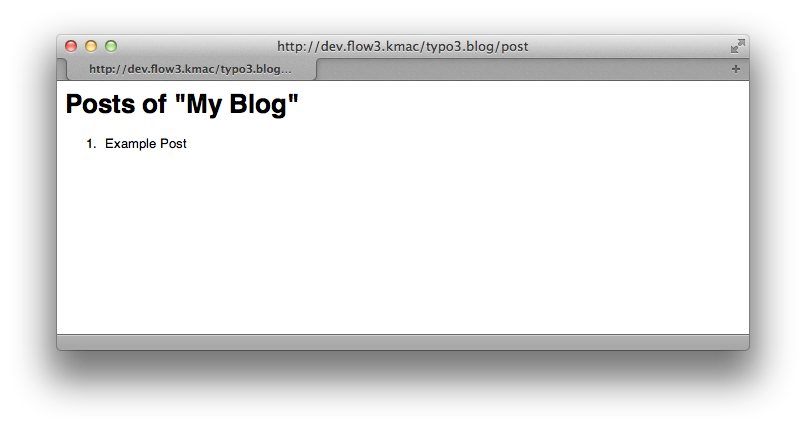

==========
Controller
==========

Now that we have the first models and repositories in place we can almost move forward to
creating our first controller.
There are two types of controllers in Flow:

* ``ActionControllers`` are triggered by regular HTTP requests, and
* ``CommandControllers`` are usually invoked via the Command Line Interface.

Setup Controller
================

The ``SetupCommandController`` will be in charge of creating a ``Blog`` object, setting a title
and description and storing it in the ``BlogRepository``::

.. code-block:: none

	./flow kickstart:commandcontroller Acme.Blog Blog

The kickstarter created a very basic command controller containing only one command, the ``exampleCommand``::

*Classes/Acme/Blog/Command/BlogCommandController.php*:

.. code-block:: php

	<?php
	namespace Acme\Blog\Command;

	/*                                                                        *
	 * This script belongs to the Flow package "Acme.Blog".                   *
	 *                                                                        *
	 *                                                                        */

	use Neos\Flow\Annotations as Flow;

	/**
	 * @Flow\Scope("singleton")
	 */
	class BlogCommandController extends \Neos\Flow\Cli\CommandController {

		/**
		 * An example command
		 *
		 * The comment of this command method is also used for Flow's help screens. The first line should give a very short
		 * summary about what the command does. Then, after an empty line, you should explain in more detail what the command
		 * does. You might also give some usage example.
		 *
		 * It is important to document the parameters with param tags, because that information will also appear in the help
		 * screen.
		 *
		 * @param string $requiredArgument This argument is required
		 * @param string $optionalArgument This argument is optional
		 * @return void
		 */
		public function exampleCommand($requiredArgument, $optionalArgument = NULL) {
			$this->outputLine('You called the example command and passed "%s" as the first argument.', array($requiredArgument));
		}

	}

Let's replace the example with a ``setupCommand`` that can be used to create the first blog from the command line::

*Classes/Acme/Blog/Command/BlogCommandController.php*:

.. code-block:: php

	<?php
	namespace Acme\Blog\Command;

	/*                                                                        *
	 * This script belongs to the Flow package "Acme.Blog".                   *
	 *                                                                        *
	 *                                                                        */

	use Acme\Blog\Domain\Model\Blog;
	use Acme\Blog\Domain\Model\Post;
	use Acme\Blog\Domain\Repository\BlogRepository;
	use Acme\Blog\Domain\Repository\PostRepository;
	use Neos\Flow\Annotations as Flow;
	use Neos\Flow\Cli\CommandController;

	/**
	 * @Flow\Scope("singleton")
	 */
	class BlogCommandController extends CommandController {

		/**
		 * @Flow\Inject
		 * @var BlogRepository
		 */
		protected $blogRepository;

		/**
		 * @Flow\Inject
		 * @var PostRepository
		 */
		protected $postRepository;

		/**
		 * A command to setup a blog
		 *
		 * With this command you can kickstart a new blog.
		 *
		 * @param string $blogTitle the name of the blog to create
		 * @param boolean $reset set this flag to remove all previously created blogs and posts
		 * @return void
		 */
		public function setupCommand($blogTitle, $reset = FALSE) {
			if ($reset) {
				$this->blogRepository->removeAll();
				$this->postRepository->removeAll();
			}

			$blog = new Blog($blogTitle);
			$blog->setDescription('A blog about Foo, Bar and Baz.');
			$this->blogRepository->add($blog);

			$post = new Post();
			$post->setBlog($blog);
			$post->setAuthor('John Doe');
			$post->setSubject('Example Post');
			$post->setContent('Lorem ipsum dolor sit amet, consectetur adipisicing elit.' . chr(10) . 'Sed do eiusmod tempor incididunt ut labore et dolore magna aliqua. Ut enim ad minim veniam, quis nostrud exercitation ullamco laboris nisi ut aliquip ex ea commodo consequat.');
			$this->postRepository->add($post);

			$this->outputLine('Successfully created a blog "%s"', [$blogTitle]);
		}

	}

You can probably figure out easily what the ``setupCommand`` does – it empties the ``BlogRepository`` and
``PostRepository`` if the ``--reset`` flag is set, creates a new ``Blog`` object and adds it to the ``BlogRepository``.
In addition a sample blog post is created and added to the ``PostRepository`` and blog. Note that if you had omitted the
lines::

	$this->blogRepository->add($blog);

and ::

	$this->postRepository->add($post);

the blog and the post would have been created in memory but not persisted to
the database.

Using the blog and post repository sounds plausible, but where do you get the
repositories from?

*Classes/Acme/Blog/Command/BlogCommandController.php*:

.. code-block:: php

	/**
	 * @Flow\Inject
	 * @var BlogRepository
	 */
	protected $blogRepository;

The property declarations for ``$blogRepository`` (and ``$postRepository``) is marked with
an ``Inject`` annotation. This signals to the object framework: I need the blog
repository here, please make sure it's stored in this member variable. In effect Flow
will inject the blog repository into the ``$blogRepository`` property right after your
controller has been instantiated. And because the blog repository's scope is *singleton*
[#]_, the framework will always inject the same instance of the repository.

There's a lot more to discover about **Dependency Injection** and we recommend
that you read the whole chapter on :doc:`objects <../PartIII/ObjectManagement>` in :doc:`../PartIII/index` once you
start with your own coding.

To create the required database tables we now use the command line support to generate the
tables for our package:

.. code-block:: none

	./flow doctrine:migrationgenerate

.. code-block:: none

	Do you want to move the migration to one of these Packages?
	  [0] Don't Move
	  [1] Neos.Eel
	  [2] Neos.Flow
	  [3] Neos.Fluid
	  [3] Neos.Kickstart
	  [4] Neos.Welcome
	  [5] Acme.Blog

Hit a key to move the new migration to the ``Acme.Blog`` package (in this example key "5") and press <ENTER>.
You will now find the generated migration in *Migrations/Mysql/Version<YYYYMMDDhhmmss>.php*.
Whenever you auto-generate a migration take a few minutes to verify that it contains (only) the changes you want
to apply. In this case the migration should look like this:

.. code-block:: php

	<?php
	namespace Neos\Flow\Persistence\Doctrine\Migrations;

	use Doctrine\DBAL\Migrations\AbstractMigration,
		Doctrine\DBAL\Schema\Schema;

	/**
	 * Initial migration, creating tables for the "Blog" and "Post" domain models
	 */
	class Version20150714161019 extends AbstractMigration {

		/**
		 * @param Schema $schema
		 * @return void
		 */
		public function up(Schema $schema) {
			$this->abortIf($this->connection->getDatabasePlatform()->getName() != "mysql");

			$this->addSql("CREATE TABLE acme_blog_domain_model_blog (persistence_object_identifier VARCHAR(40) NOT NULL, title VARCHAR(80) NOT NULL, description VARCHAR(150) NOT NULL, PRIMARY KEY(persistence_object_identifier)) DEFAULT CHARACTER SET utf8 COLLATE utf8_unicode_ci ENGINE = InnoDB");
			$this->addSql("CREATE TABLE acme_blog_domain_model_post (persistence_object_identifier VARCHAR(40) NOT NULL, blog VARCHAR(40) DEFAULT NULL, subject VARCHAR(255) NOT NULL, date DATETIME NOT NULL, author VARCHAR(255) NOT NULL, content LONGTEXT NOT NULL, INDEX IDX_EF2000AAC0155143 (blog), PRIMARY KEY(persistence_object_identifier)) DEFAULT CHARACTER SET utf8 COLLATE utf8_unicode_ci ENGINE = InnoDB");
			$this->addSql("ALTER TABLE acme_blog_domain_model_post ADD CONSTRAINT FK_EF2000AAC0155143 FOREIGN KEY (blog) REFERENCES acme_blog_domain_model_blog (persistence_object_identifier)");
		}

		/**
		 * @param Schema $schema
		 * @return void
		 */
		public function down(Schema $schema) {
			$this->abortIf($this->connection->getDatabasePlatform()->getName() != "mysql");

			$this->addSql("ALTER TABLE acme_blog_domain_model_post DROP FOREIGN KEY FK_EF2000AAC0155143");
			$this->addSql("DROP TABLE acme_blog_domain_model_blog");
			$this->addSql("DROP TABLE acme_blog_domain_model_post");
		}
	}

Now you can execute all pending migrations to update the database schema:

.. code-block:: none

	./flow doctrine:migrate

And finally you can try out the ``setupCommand``:

.. code-block:: none

	./flow blog:setup "My Blog"

and the CLI should respond with:

.. code-block:: none

	Successfully created a blog "My Blog"

This is all we need for moving on to something more visible: the blog posts.

Basic Post Controller
=====================

Now let us add some more code to *.../Classes/Acme/Blog/Controller/PostController.php*:

.. code-block:: php

	<?php
	namespace Acme\Blog\Controller;

	/*                                                                        *
	 * This script belongs to the Flow package "Acme.Blog".                   *
	 *                                                                        *
	 *                                                                        */

	use Acme\Blog\Domain\Repository\BlogRepository;
	use Acme\Blog\Domain\Repository\PostRepository;
	use Neos\Flow\Annotations as Flow;
	use Neos\Flow\Mvc\Controller\ActionController;
	use Acme\Blog\Domain\Model\Post;

	class PostController extends ActionController {

		/**
		 * @Flow\Inject
		 * @var BlogRepository
		 */
		protected $blogRepository;

		/**
		 * @Flow\Inject
		 * @var PostRepository
		 */
		protected $postRepository;

		/**
		 * Index action
		 *
		 * @return string HTML code
		 */
		public function indexAction() {
			$blog = $this->blogRepository->findActive();
			$output = '
				<h1>Posts of "' . $blog->getTitle() . '"</h1>
				<ol>';

			foreach ($blog->getPosts() as $post) {
				$output .= '<li>' . $post->getSubject() . '</li>';
			}

			$output .= '</ol>';

			return $output;
		}

		// ...

	}

The ``indexAction`` retrieves the active blog from the ``BlogRepository`` and
outputs the blog's title and post subject lines [#]_. A quick look
at http://dev.tutorial.local/acme.blog/post [#]_ confirms that the
``SetupController`` has indeed created the blog and post:

	Output of the indexAction

Create Action
=============

In the ``SetupController`` we have seen how a new blog and a post can be
created and filled with some hardcoded values. At least the posts should,
however, be filled with values provided by the blog author, so we need to pass
the new post as an argument to a ``createAction`` in the ``PostController``:

*Classes/Acme/Blog/Controller/PostController.php*:

.. code-block:: php

	// ...

	/**
	 * Creates a new post
	 *
	 * @param Post $newPost
	 * @return void
	 */
	public function createAction(Post $newPost) {
		$this->postRepository->add($newPost);
		$this->addFlashMessage('Created a new post.');
		$this->redirect('index');
	}

The ``createAction`` expects a parameter ``$newPost`` which is the ``Post`` object
to be persisted. The code is quite straight-forward: add the post to the repository,
add a message to some flash message stack and redirect to the index action.
Try calling the ``createAction`` now by accessing
http://dev.tutorial.local/acme.blog/post/create:

.. figure:: Images/CreateActionWithoutArgument.png
	:alt: Create action called without argument
	:class: screenshot-fullsize

	Create action called without argument

Flow analyzed the new method signature and automatically registered ``$newPost`` as a
required argument for ``createAction``. Because no such argument was
passed to the action, the controller exits with an error.

So, how do you create a new post? You need to create some HTML form which
allows you to enter the post details and then submits the information to the
``createAction``. But you don't want the controller rendering such a
form – this is clearly a task for the view!

-----

.. [#]	Remember, *prototype* is the default object scope and because the
		``BlogRepository`` does contain a ``Scope`` annotation, it has the
		singleton scope instead.
.. [#]	Don't worry, the action won't stay like this – of course later we'll
		move all HTML rendering code to a dedicated view.
.. [#]	The *acme.blog* stands for the package *Acme.Blog* and *post* specifies the
		controller *PostController*.
