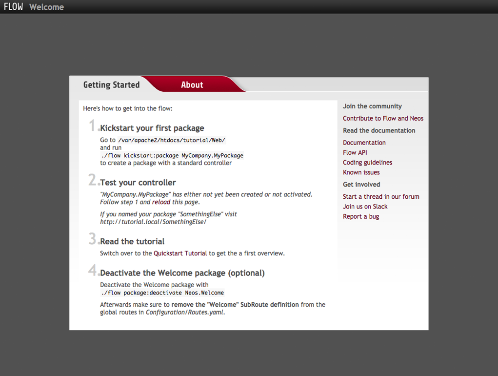

============
Installation
============

Flow Download
=============

Flow uses `Composer`_ for dependency management, which is a separate command line tool.
Install it by following the `installation instructions <https://getcomposer.org/download/>`_
which boil down to this in the simplest case:

.. code-block:: none

	curl -s https://getcomposer.org/installer | php

.. note::
	Feel free to install the composer command to a global location, by moving
	the phar archive to e.g. */usr/local/bin/composer* and making it executable.
	The following documentation assumes ``composer`` is installed globally.

Then use `Composer`_ in a directory which will be accessible by your web server to download
and install all packages of the Flow Base Distribution. The following command will
clone the 3.0.0 version, include development dependencies and keep git metadata for future use:

.. code-block:: none

 composer create-project --keep-vcs neos/flow-base-distribution tutorial 3.0.0

.. note::
	Throughout this tutorial we assume that you installed the Flow distribution in
	*/var/apache2/htdocs/tutorial* and that */var/apache2/htdocs* is the document root
	of your web server. On a Windows machine you might use *c:\\xampp\\htdocs* instead.

To update all dependencies, run this from the top-level folder of the distribution:

.. code-block:: none

	composer update

Directory Structure
===================

Let's take a look at the directory structure of a Flow application:

======================	===================================================================================
Directory				Description
======================	===================================================================================
Configuration/			Application specific configuration, grouped by contexts
Data/					Persistent and temporary data, including caches, logs, resources and the database
Packages/				Contains sub directories which in turn contain package directories
Packages/Framework/		Packages which are part of the official Flow distribution
Packages/Application/	Application specific packages
Packages/Libraries/		3rd party libraries
Web/					Public web root
======================	===================================================================================

A Flow application usually consists of the above directories. As you see, most
of them contain data which is specific to your application, therefore upgrading
the Flow distribution is a matter of updating *Packages/Framework/*  and
*Packages/Libraries/* when a new release is available.

Flow is a package based system which means that all code, documentation and
other resources are bundled in packages. Each package has its own directory
with a defined sub structure. Your own PHP code and resources will usually end
up in a package residing below *Packages/Application/*.

File Permissions
================

Most of the directories and files must be readable and writable for the user
you're running Flow with. This user will usually be the same one running your
web server (``httpd``, ``www``, ``_www`` or ``www-data`` on most Unix based systems). However it
can and usually will happen that Flow is launched from the command line by a
different user. Therefore it is important that both, the web server user and
the command line user are members of a common group and the file permissions
are set accordingly.

We recommend setting ownership of directories and files to the web server's
group. All users who also need to launch Flow must also be added this group.
But don't worry, this is simply done by changing to the Flow base directory
and calling the following command (this command must be called as super user):

.. code-block:: none

	sudo ./flow core:setfilepermissions john www-data www-data

.. note::

	Setting file permissions is not necessary and not possible on Windows machines.
	For Apache to be able to create symlinks, you need to use Windows Vista (or
	newer) and Apache needs to be started with Administrator privileges.

Now that the file permissions are set, all users who plan using Flow from the
command line need to join the web server's group. On a Linux machine this can
be done by typing:

.. code-block:: none

	sudo usermod -a -G www-data john

On a Mac you can add a user to the web group with the following command:

.. code-block:: none

	sudo dscl . -append /Groups/_www GroupMembership johndoe

You will have to exit your shell / terminal window and open it again for the
new group membership to take effect.

.. note::
	In this example the web user was ``_www`` and the web group
	is called ``_www`` as well (that's the case on a Mac using
	`MacPorts <https://www.macports.org/>`_ ). On your system the user or group
	might be ``www-data``, ``httpd`` or the like - make sure to find out and
	specify the correct user and group for your environment.

Web Server Configuration
========================

As you have seen previously, Flow uses a directory called *Web* as the public
web root. We highly recommend that you create a virtual host which points to
this directory and thereby assure that all other directories are not accessible
from the web. For testing purposes on your local machine it is okay (but not
very convenient) to do without a virtual host, but don't try that on a public
server!

Setting Up a Virtual Host
-------------------------

Assuming that you chose Apache 2 as your web server, simply create a new virtual
host by adding the following directions to your Apache configuration
(``conf/extra/httpd-vhosts.conf`` on many systems; make sure it is actually
loaded with ``Include`` in ``httpd.conf``):

*httpd.conf*:

.. code-block:: none

	<VirtualHost *:80>
		DocumentRoot /var/apache2/htdocs/tutorial/Web/
		ServerName dev.tutorial.local
	</VirtualHost>

This virtual host will later be accessible via the URL http://dev.tutorial.local.

.. note::
	Flow runs per default in the ``Development`` context. That's why the *ServerName*
	in this example is  *dev.*tutorial.local. Later you will add another virtual
	host for the ``Production`` context. The concept of contexts is explained in the
	next section *Configuration*.

Because Flow provides an ``.htaccess`` file with ``mod_rewrite`` rules in it,
you need to make sure that the directory grants the neccessary rights:

*httpd.conf*:

.. code-block:: none

	<Directory /var/apache2/htdocs/tutorial/>
		AllowOverride FileInfo Options=MultiViews
	</Directory>

The way Flow addresses resources on the web makes it incompatible with the ``MultiViews``
feature of Apache. This needs to be turned off, the default ``.htaccess`` file distributed
with Flow contains this code already

.. code-block:: none

	<IfModule mod_negotiation.c>

		# prevents Apache's automatic file negotiation, it breaks resource URLs
		Options -MultiViews

	</IfModule>

Important: Disallow execution of server-side scripts below `Web/_Resources`. If users
can upload (PHP) scripts they can otherwise be executed on the server. This should almost
never be allowed, so make sure to disable PHP (or other script handlers) for anything below
`Web/_Resources`.

The `.htaccess` file placed into the `Web/_Resources` folder does this for Apache when
`.htaccess` is evaluated. Another way is to use this in the configuration:

.. code-block:: none

	<Directory /var/apache2/htdocs/tutorial/Web/_Resources>
		AllowOverride None
		SetHandler default-handler
		php_flag engine off
	</Directory>

For nginx and other servers use similar configuration.

Configure a Context
-------------------

As you'll learn soon, Flow can be launched in different **contexts**, the most
popular being ``Production``, ``Development`` and ``Testing``. Although there
are various ways to choose the current context, the most convenient is to setup
a dedicated virtual host defining an environment variable. Just add the
following virtual host to your Apache configuration:

*httpd.conf*:

.. code-block:: none

	<VirtualHost *:80>
		DocumentRoot /var/apache2/htdocs/tutorial/Web/
		ServerName tutorial.local
		SetEnv FLOW_CONTEXT Production
	</VirtualHost>

You'll be able to access the same application running in ``Production``
context by accessing the URL http://tutorial.local. What's left is telling
your operating system that the invented domain names can be found on your local
machine. Add the following line to your */etc/hosts* file
(*C:\windows\system32\drivers\etc\hosts* on Windows):

*hosts*:

.. code-block:: none

	127.0.0.1 tutorial.local dev.tutorial.local

.. tip::
	If you decided to skip setting up virtual hosts earlier on, you can
	enable the ``Production`` context by editing the ``.htaccess`` file in the
	``Web`` directory and remove the comment sign in front of the ``SetEnv``
	line:

*.htaccess*:

.. code-block:: none

	# You can specify a default context by activating this option:
	SetEnv FLOW_CONTEXT Production

Welcome to Flow
---------------

Restart Apache and test your new configuration by accessing
http://dev.tutorial.local in a web browser. You should be greeted by Flow's
welcome screen:

	The Flow Welcome screen

.. tip::
	If you get in trouble during the installation ask for help `at discuss.neos.io
	<https://discuss.neos.io/>`_.

.. _Composer:             https://getcomposer.org
