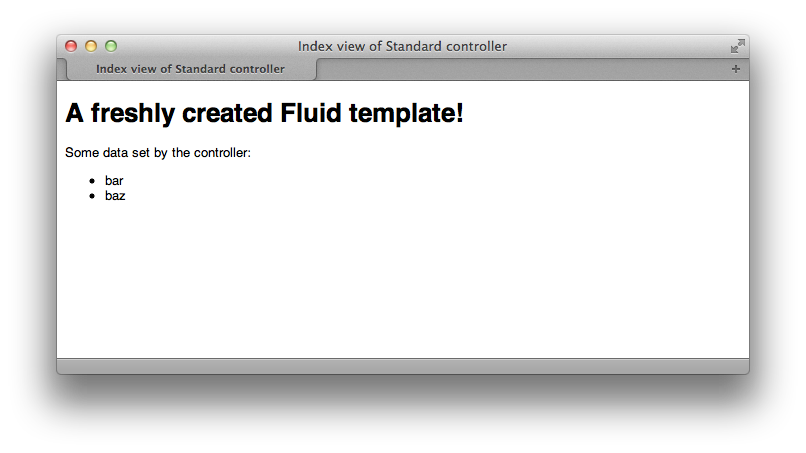

=========
Kickstart
=========

Flow makes it easy to start with a new application. The ``Kickstarter`` package provides
template based scaffolding for generating an initial layout of packages, controllers,
models and views.

.. note::

	At the time of this writing these functions are only available through Flow's command
	line interface. This might change in the future as a graphical interface to the
	kickstarter is developed.

Command Line Tool
=================

The script *flow* resides in the main directory of the Flow distribution.
From a shell you should be able to run the script by entering ``./flow``:

.. code-block:: none

	./flow
	Flow 3.0.0 ("Development" context)
	usage: ./flow <command identifier>

	See './flow help' for a list of all available commands.

To get an overview of all available commands, enter ``./flow help``:

.. code-block:: none

	./flow help
	Flow 3.0.0 ("Development" context)
	usage: ./flow <command identifier>

	The following commands are currently available:

	PACKAGE "NEOS.FLOW":
	-------------------------------------------------------------------------------
	* flow:cache:flush                         Flush all caches
	  cache:warmup                             Warm up caches

	  configuration:show                       Show the active configuration
	                                           settings
	  configuration:listtypes                  List registered configuration types
	  configuration:validate                   Validate the given configuration
	  configuration:generateschema             Generate a schema for the given
	                                           configuration or YAML file.

	* flow:core:setfilepermissions             Adjust file permissions for CLI and
	                                           web server access
	* flow:core:migrate                        Migrate source files as needed
	* flow:core:shell                          Run the interactive Shell

	  database:setcharset                      Convert the database schema to use
	                                           the given character set and
	                                           collation (defaults to utf8 and
	                                           utf8_unicode_ci).

	  doctrine:validate                        Validate the class/table mappings
	  doctrine:create                          Create the database schema
	  doctrine:update                          Update the database schema
	  doctrine:entitystatus                    Show the current status of entities
	                                           and mappings
	  doctrine:dql                             Run arbitrary DQL and display
	                                           results
	  doctrine:migrationstatus                 Show the current migration status
	  doctrine:migrate                         Migrate the database schema
	  doctrine:migrationexecute                Execute a single migration
	  doctrine:migrationversion                Mark/unmark a migration as migrated
	  doctrine:migrationgenerate               Generate a new migration

	  help                                     Display help for a command

	  package:create                           Create a new package
	  package:delete                           Delete an existing package
	  package:activate                         Activate an available package
	  package:deactivate                       Deactivate a package
	  package:list                             List available packages
	  package:freeze                           Freeze a package
	  package:unfreeze                         Unfreeze a package
	  package:refreeze                         Refreeze a package

	  resource:publish                         Publish resources
	  resource:clean                           Clean up resource registry

	  routing:list                             List the known routes

	  security:importpublickey                 Import a public key
	  security:importprivatekey                Import a private key
	  security:showeffectivepolicy             Shows a list of all defined
	                                           privilege targets and the effective
	                                           permissions for the given groups.
	  security:showunprotectedactions          Lists all public controller actions
	                                           not covered by the active security
	                                           policy
	  security:showmethodsforprivilegetarget   Shows the methods represented by the
	                                           given security privilege target

	  server:run                               Run a standalone development server

	  typeconverter:list                       Lists all currently active and
	                                           registered type converters

	PACKAGE "NEOS.KICKSTARTER":
	-------------------------------------------------------------------------------
	  kickstart:package                        Kickstart a new package
	  kickstart:actioncontroller               Kickstart a new action controller
	  kickstart:commandcontroller              Kickstart a new command controller
	  kickstart:model                          Kickstart a new domain model
	  kickstart:repository                     Kickstart a new domain repository

	* = compile time command

	See './flow help <commandidentifier>' for more information about a specific command.

Depending on your Flow version you'll see more or less the above available
commands listed.

Kickstart the package
=====================

Let's create a new package **Blog** inside the Vendor namespace **Acme** [#]_:

.. code-block:: none

	./flow kickstart:package Acme.Blog

The kickstarter will create three files:

.. code-block:: none

	Created .../Acme.Blog/Classes/Controller/StandardController.php
	Created .../Acme.Blog/Resources/Private/Layouts/Default.html
	Created .../Acme.Blog/Resources/Private/Templates/Standard/Index.html

and the directory *Packages/Application/Acme.Blog/* should now contain the
skeleton of the future ``Blog`` package:

.. code-block:: none

	cd Packages/Application/
	find Acme.Blog

	Acme.Blog
	Acme.Blog/Classes
	Acme.Blog/Classes/Controller
	Acme.Blog/Classes/Controller/StandardController.php
	Acme.Blog/composer.json
	Acme.Blog/Configuration
	Acme.Blog/Documentation
	Acme.Blog/Meta
	Acme.Blog/Resources
	Acme.Blog/Resources/Private
	Acme.Blog/Resources/Private/Layouts
	Acme.Blog/Resources/Private/Layouts/Default.html
	Acme.Blog/Resources/Private/Templates
	Acme.Blog/Resources/Private/Templates/Standard
	Acme.Blog/Resources/Private/Templates/Standard/Index.html
	Acme.Blog/Tests
	Acme.Blog/Tests/Functional
	Acme.Blog/Tests/Unit

Switch to your web browser and check at http://dev.tutorial.local/acme.blog if the
generated controller produces some output:

	A freshly created Fluid template

.. tip::
	If you get an error at this point, like a "404 Not Found" this could be
	caused by outdated cache entries. Because Flow should be running in
	``Development`` context at this point, it is supposed to detect changes to
	code and resource files, but this seems to sometimes fail... Before you go
	crazy looking for an error on your side, **try reloading the page** and if
	that doesn't work you can **clear the cache manually** by executing the
	``./flow flow:cache:flush --force`` command.

Kickstart Controllers
=====================

If you look at the drawing of our overall model you'll notice that you need controllers
for the most important domain model, being ``Post``.
For the ``PostController`` we know that we'll need some standard actions, so let's
have them created as well:

.. code-block:: none

	./flow kickstart:actioncontroller --generate-actions --generate-related Acme.Blog Post

resulting in:

.. code-block:: none

	Created .../Acme.Blog/Classes/Domain/Model/Post.php
	Created .../Acme.Blog/Tests/Unit/Domain/Model/PostTest.php
	Created .../Acme.Blog/Classes/Domain/Repository/PostRepository.php
	Created .../Acme.Blog/Classes/Controller/PostController.php
	Omitted .../Acme.Blog/Resources/Private/Layouts/Default.html
	Created .../Acme.Blog/Resources/Private/Templates/Post/Index.html
	Created .../Acme.Blog/Resources/Private/Templates/Post/New.html
	Created .../Acme.Blog/Resources/Private/Templates/Post/Edit.html
	Created .../Acme.Blog/Resources/Private/Templates/Post/Show.html
	As new models were generated, don't forget to update the database schema with the respective doctrine:* commands.

.. tip::
	To see a full description of the kickstart commands and its options, you can
	display more details with ``./flow help kickstart::actioncontroller``.

Once complete (in the Controller chapter), this new controller will be accessible via http://dev.tutorial.local/acme.blog/post

Please delete the file ``StandardController.php`` and its corresponding template
directory as you won't need them for our sample application [#]_.

Kickstart Models and Repositories
=================================

The kickstarter can also generate models and repositories, as you have seen above
when using the ``--generate-related`` option while kickstarting the ``PostController``.
Of course that can also be done specifically with the ``kickstart:model`` command.

Before we do this, you should have a look at the next section on models and repositories.

.. [#]	A "vendor namespace" is used to avoid conflicts with other packages. It is common to use the name of the
		company/organization as namespace. See :doc:`Part III - Package Management <../PartIII/PackageManagement>` for
		some more information on package keys.

.. [#]	If you know you won't be using the StandardController, you can create a
		completely empty package with the ``package:create`` command.
