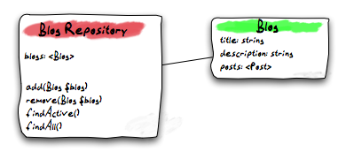
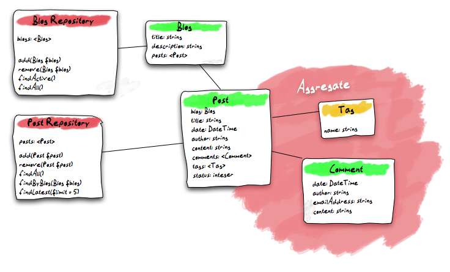

====================
Model and Repository
====================

Usually this would now be the time to write a database schema which contains
table definitions and lays out relations between the different tables. But
Flow doesn't deal with tables. You won't even access a database manually nor
will you write SQL. The very best is if you completely forget about tables and
databases and think only in terms of objects.

.. tip:: **Code Examples**

    To see the full-scale code of the Blog as used by some of us, take a look at
    the `Blog example package <https://github.com/neos/Acme.Blog>`_ in
    our Git repository.

Domain models are really the heart of your application and therefore it is
vital that this layer stays clean and legible. In a Flow application a model
is just a plain old PHP object [#]_. There's no need to write a schema
definition, subclass a special base model or implement a required interface.
All Flow requires from you as a specification for a model is a proper
documented PHP class containing properties.

All your domain models need a place to live. The directory structure and filenames follow
the conventions of our :ref:`Coding Guidelines <ch-php-coding-guidelines>` which basically
means that the directories reflect the classes' namespace while the filename is identical
to the class name.
The base directory for the domain models is ``Classes/<VendorName>/<PackageName>/Domain/Model/``.

Blog Model
==========

The code for your ``Blog`` model can be kickstarted like this:

.. code-block:: none

	./flow kickstart:model Acme.Blog Blog title:string \
	description:string 'posts:\Doctrine\Common\Collections\Collection'

That command will output the created file and a hint:

.. code-block:: none

	Created .../Acme.Blog/Classes/Acme/Blog/Domain/Model/Blog.php
	Created .../Acme.Blog/Tests/Unit/Domain/Model/BlogTest.php
	As a new model was generated, don't forget to update the database schema with the respective doctrine:* commands.

Now let's open the generated ``Blog.php`` file and adjust it slightly:

- Add basic validation rules, see :doc:`Part III - Validation <../PartIII/Validation>` for background information
- Add extended meta data for the ORM, see :doc:`Part III - Persistence <../PartIII/Persistence>`
- Replace the ``setPosts()`` setter by dedicated methods to add/remove single posts

The resulting code should look like this:

*Classes/Acme/Blog/Domain/Model/Blog.php*:

.. code-block:: php

	<?php
	namespace Acme\Blog\Domain\Model;

	/*                                                                        *
	 * This script belongs to the Flow package "Acme.Blog".                   *
	 *                                                                        *
	 *                                                                        */

	use Doctrine\Common\Collections\ArrayCollection;
	use Doctrine\Common\Collections\Collection;
	use Neos\Flow\Annotations as Flow;
	use Doctrine\ORM\Mapping as ORM;

	/**
	 * A blog that contains a list of posts
	 *
	 * @Flow\Entity
	 */
	class Blog {

		/**
		 * @Flow\Validate(type="NotEmpty")
		 * @Flow\Validate(type="StringLength", options={ "minimum"=3, "maximum"=80 })
		 * @ORM\Column(length=80)
		 * @var string
		 */
		protected $title;

		/**
		 * @Flow\Validate(type="StringLength", options={ "maximum"=150 })
		 * @ORM\Column(length=150)
		 * @var string
		 */
		protected $description = '';

		/**
		 * The posts contained in this blog
		 *
		 * @ORM\OneToMany(mappedBy="blog")
		 * @ORM\OrderBy({"date" = "DESC"})
		 * @var Collection<Post>
		 */
		protected $posts;

		public function __construct(string $title)
		{
			$this->posts = new ArrayCollection();
			$this->title = $title;
		}

		public function getTitle(): string
		{
			return $this->title;
		}

		public function setTitle(string $title): void
		{
			$this->title = $title;
		}

		public function getDescription(): string
		{
			return $this->description;
		}

		public function setDescription(string $description): void {
			$this->description = $description;
		}

		public function getPosts(): Collection
		{
			return $this->posts;
		}

		/**
		 * Adds a post to this blog
		 */
		public function addPost(Post $post): void
		{
			$this->posts->add($post);
		}

		/**
		 * Removes a post from this blog
		 */
		public function removePost(Post $post): void
		{
			$this->posts->removeElement($post);
		}

	}

.. tip::

	The `@Flow\…` and `@ORM\…` strings in the code are called *Annotations*.
	They are namespaced like PHP classes, so for the above code to work you
	**must** add a line like::

		use Doctrine\ORM\Mapping as ORM;

	to the files as well. Add it right after the `use` statement for the Flow
	annotations that is already there.

As you can see there's nothing really fancy in it, the class mostly consists of
getters and setters. Let's take a closer look at the model line-by-line:

*Classes/Acme/Blog/Domain/Model/Blog.php*:

.. code-block:: php

	namespace Acme\Blog\Domain\Model;

This namespace declaration must be the very first code in your file.

*Classes/Acme/Blog/Domain/Model/Blog.php*:

.. code-block:: php

	use Doctrine\Common\Collections\ArrayCollection;
	use Doctrine\Common\Collections\Collection;
	use Neos\Flow\Annotations as Flow;
	use Doctrine\ORM\Mapping as ORM;

These `use` statements import PHP namespaces to the current scope. They are not required but
can make the code much more readable.
Look at the `PHP manual <https://php.net/manual/en/language.namespaces.php>`_ to read more about
PHP namespaces.

*Classes/Acme/Blog/Domain/Model/Blog.php*:

.. code-block:: php

	/**
	 * A blog that contains a list of posts
	 *
	 * @Flow\Entity
	 */

On the first glance this looks like a regular comment block, but it's not. This
comment contains **annotations** which are an important building block in
Flow's configuration mechanism.

The annotation marks this class as an entity. This is an important piece
of information for the persistence framework because it declares that

- this model is an **entity** according to the concepts of Domain-Driven
  Design
- instances of this class can be persisted (i.e. stored in the database)
- According to DDD, an entity is an object which has an identity, that
  is even if two objects with the same values exist, their identity matters.

The model's properties are implemented as regular class properties:

*Classes/Acme/Blog/Domain/Model/Blog.php*:

.. code-block:: php

	/**
	 * @Flow\Validate(type="NotEmpty")
	 * @Flow\Validate(type="StringLength", options={ "minimum"=3, "maximum"=80 })
	 * @ORM\Column(length=80)
	 * @var string
	 */
	protected $title;

	/**
	 * @Flow\Validate(type="StringLength", options={ "maximum"=150 })
	 * @ORM\Column(length=150)
	 * @var string
	 */
	protected $description = '';

	/**
	 * The posts contained in this blog
	 *
	 * @ORM\OneToMany(mappedBy="blog")
	 * @ORM\OrderBy({"date" = "DESC"})
	 * @var Collection<Post>
	 */
	protected $posts;

Each property comes with a ``@var`` annotation which declares its type. Any type is fine,
be it simple types (like ``string``, ``integer``, or ``boolean``) or classes (like ``\DateTime``,
``\ACME\Foo\Domain\Model\Bar\Baz``, ``Bar\Baz``, or an imported class like ``Baz``).

The ``@var`` annotation of the ``$posts`` property differs a bit from the remaining
comments when it comes to the type. This property holds a list of ``Post`` objects
contained by this blog – in fact this could easily have been an array. However, an array
does not allow the collection to be persisted by Doctrine 2 properly. We therefore use a
``Collection`` [#]_ instance (which is a ``Doctrine\Common\Collections\Collection``, but
we imported it to make the code more readable). The class name bracketed by the
less-than and greater-than signs gives an important hint on the content of the collection
(or array). There are a few situations in which Flow relies on this information.

The ``OneToMany`` annotation is Doctrine 2 specific and provides more detail on the
type association a property represents. In this case it tells Doctrine that a ``Blog`` may
be associated with many ``Post`` instances, but those in turn may only belong to one
``Blog``. Furthermore the ``mappedBy`` attribute says the association is bidirectional and
refers to the property ``$blog`` in the ``Post`` class.

The ``OrderBy`` annotation is regular Doctrine 2 functionality and makes sure the
posts are always ordered by their date property when the collection is loaded.

The ``Validate`` annotations tell Flow about limits that it should enforce for a property.
This annotation will be explained in the :doc:`Validation <Validation>` chapter.

The remaining code shouldn't hold any surprises - it only serves for setting and
retrieving the blog's properties. This again, is no requirement by Flow - if you don't
want to expose your properties it's fine to not define any setters or getters at all. The
persistence framework can use other ways to access the properties' values.

Post Model
==========

We need a model for the posts as well, so kickstart it like this:

.. code-block:: none

	./flow kickstart:model --force Acme.Blog Post \
		'blog:Blog' \
		title:string \
		date:\DateTime \
		author:string \
		content:string

Note that we use the ``--force`` option to overwrite the model - it was created along with
the Post controller earlier because we used the ``--generate-related`` flag.

Adjust the generated code as follows:

*Classes/Acme/Blog/Domain/Model/Post.php*:

.. code-block:: php

	<?php
	namespace Acme\Blog\Domain\Model;

	/*                                                                        *
	 * This script belongs to the Flow package "Acme.Blog".                   *
	 *                                                                        *
	 *                                                                        */

	use Neos\Flow\Annotations as Flow;
	use Doctrine\ORM\Mapping as ORM;

	/**
	 * @Flow\Entity
	 */
	class Post {

		/**
		 * @Flow\Validate(type="NotEmpty")
		 * @ORM\ManyToOne(inversedBy="posts")
		 * @var Blog
		 */
		protected $blog;

		/**
		 * @Flow\Validate(type="NotEmpty")
		 * @var string
		 */
		protected $subject;

		/**
		 * The creation date of this post (set in the constructor)
		 *
		 * @var \DateTime
		 */
		protected $date;

		/**
		 * @Flow\Validate(type="NotEmpty")
		 * @var string
		 */
		protected $author;

		/**
		 * @Flow\Validate(type="NotEmpty")
		 * @ORM\Column(type="text")
		 * @var string
		 */
		protected $content;

		/**
		 * Constructs this post
		 */
		public function __construct()
		{
			$this->date = new \DateTime();
		}

		/**
		 * @return Blog
		 */
		public function getBlog(): ?Blog
		{
			return $this->blog;
		}

		public function setBlog(Blog $blog): void
		{
			$this->blog = $blog;
			$this->blog->addPost($this);
		}

		public function getSubject(): string
		{
			return $this->subject;
		}

		public function setSubject(string $subject): void
		{
			$this->subject = $subject;
		}

		public function getDate(): \DateTimeInterface
		{
			return $this->date;
		}

		public function setDate(\DateTime $date): void
		{
			$this->date = $date;
		}

		public function getAuthor(): string
		{
			return $this->author;
		}

		public function setAuthor(string $author): void
		{
			$this->author = $author;
		}

		public function getContent(): string
		{
			return $this->content;
		}

		public function setContent(string $content): void
		{
			$this->content = $content;
		}

	}

Blog Repository
===============

According to our earlier statements regarding "Modeling", you need a repository for storing the blog:

	Blog Repository and Blog

A repository acts as the bridge between the holy lands of business logic
(domain models) and the dirty underground of infrastructure (data storage).
This is the only place where queries to the persistence framework take place -
you never want to have those in your domain models or controllers.

Similar to models the directory for your repositories is ``Classes/Acme/Blog/Domain/Repository/``.
You can kickstart the repository with:

.. code-block:: none

	./flow kickstart:repository Acme.Blog Blog

This will generate a vanilla repository for blogs containing this code:

*Classes/Acme/Blog/Domain/Repository/BlogRepository.php*:

.. code-block:: php

	<?php
	namespace Acme\Blog\Domain\Repository;

	/*                                                                        *
	 * This script belongs to the Flow package "Acme.Blog".                   *
	 *                                                                        *
	 *                                                                        */

	use Neos\Flow\Annotations as Flow;
	use Neos\Flow\Persistence\Repository;

	/**
	 * @Flow\Scope("singleton")
	 */
	class BlogRepository extends Repository
	{

		// add customized methods here

	}

There's no code you need to write for the standard cases because the base repository already
comes with methods like ``add``, ``remove``, ``findAll``, ``findBy*`` and ``findOneBy*`` [#]_ methods.
But for the sake of this demonstration lets assume we plan to have multiple blogs at some time. So lets
add a ``findActive()`` method that - for now - just returns the first blog in the repository:

.. code-block:: php

	<?php
	namespace Acme\Blog\Domain\Repository;

	/*                                                                        *
	 * This script belongs to the Flow package "Acme.Blog".                   *
	 *                                                                        *
	 *                                                                        */

	use Acme\Blog\Domain\Model\Blog;
	use Neos\Flow\Annotations as Flow;
	use Neos\Flow\Persistence\Repository;

	/**
	 * @Flow\Scope("singleton")
	 */
	class BlogRepository extends Repository
	{

		/**
		 * Finds the active blog.
		 *
		 * For now, only one Blog is supported anyway so we just assume that only one
		 * Blog object resides in the Blog Repository.
		 *
		 * @return Blog|null The active blog or null if none exists
		 */
		public function findActive(): ?Blog
		{
			$query = $this->createQuery();
			return $query->execute()->getFirst();
		}

	}

Remember that a repository can only store one kind of an object, in this case
blogs. The type is derived from the repository name: because you named this
repository ``BlogRepository`` Flow assumes that it's supposed to store
``Blog`` objects.

To finish up, open the repository for our posts (which was generated along with the Post
controller we kickstarted earlier) and add the following find methods to the generated
code:

- ``findByBlog()`` to retrieve all posts of a given blog
- ``findPrevious()`` to get the previous post within the current blog
- ``findNext()`` to get the next post within the current blog

The resulting code should look like:

*Classes/Acme/Blog/Domain/Repository/PostRepository.php*:

.. code-block:: php

	<?php
	namespace Acme\Blog\Domain\Repository;

	/*                                                                        *
	 * This script belongs to the Flow package "Acme.Blog".                   *
	 *                                                                        *
	 *                                                                        */

	use Acme\Blog\Domain\Model\Blog;
	use Acme\Blog\Domain\Model\Post;
	use Neos\Flow\Annotations as Flow;
	use Neos\Flow\Persistence\QueryInterface;
	use Neos\Flow\Persistence\QueryResultInterface;
	use Neos\Flow\Persistence\Repository;

	/**
	 * @Flow\Scope("singleton")
	 */
	class PostRepository extends Repository
	{

		/**
		 * Finds posts by the specified blog
		 *
		 * @param Blog $blog The blog the post must refer to
		 * @return QueryResultInterface The posts
		 */
		public function findByBlog(Blog $blog): QueryResultInterface
		{
			$query = $this->createQuery();
			return
				$query->matching(
					$query->equals('blog', $blog)
				)
				->setOrderings(array('date' => QueryInterface::ORDER_DESCENDING))
				->execute();
		}

		/**
		 * Finds the previous of the given post
		 *
		 * @param Post $post The reference post
		 * @return Post|null The previous post or null if the given $post is the first one
		 */
		public function findPrevious(Post $post): ?Post
		{
			$query = $this->createQuery();
			return
				$query->matching(
					$query->logicalAnd([
						$query->equals('blog', $post->getBlog()),
						$query->lessThan('date', $post->getDate())
					])
				)
				->setOrderings(array('date' => QueryInterface::ORDER_DESCENDING))
				->execute()
				->getFirst();
		}

		/**
		 * Finds the post next to the given post
		 *
		 * @param Post $post The reference post
		 * @return Post|null The next post or null if the given $post is the last one
		 */
		public function findNext(Post $post): ?Post
		{
			$query = $this->createQuery();
			return
				$query->matching(
					$query->logicalAnd([
						$query->equals('blog', $post->getBlog()),
						$query->greaterThan('date', $post->getDate())
					])
				)
				->setOrderings(array('date' => QueryInterface::ORDER_ASCENDING))
				->execute()
				->getFirst();
		}

	}

Tags and Comments
=================

Until now, we have all the basics for our blog to function. A blog consists of multiple posts that each consists of a
subject, content and some meta-data about the author and time of publishing.
If you recall though, we also modelled the post to be labelled with one or multiple tags and users to comment on posts.

Without thinking, we might be starting to just copy & paste the code from the blog -> post relation, since that is also
a 1:n relation. However, there are a few problems waiting for us, if we would go this route.
Remember how we found that the comments and tags are parts of the ``Post Aggregate``:

	The Post Aggregate

This means, that we should not have any means to directly access tags or comments outside of a post. Therefore they
should not have a repository. Also, since we never directly access either one, there is no reason we need to reach the
post they belong to. The access path is always in one direction starting from the post.
In the terms of data modelling, we have a unidirectional one-to-many relation.
As we learned earlier, Doctrine provides a ``OneToMany`` annotation. ``OneToMany`` relations in Doctrine are always bidirectional
and, even worse, the many side is the so called "owning side" [#]_ of the relation. This means, that to update the relation in any
way, the owning side entity needs to be persisted. This is not matching our domain model, where the post is the ``Aggregate Root``
and hence the entity we persist from. To make Doctrine work as we intend our domain model, we'd need to annotate the relation as a
``ManyToMany`` and add a unique constraint on the "one" side [#]_. Since this is not intuitive, Flow 7+ will translate a ``OneToMany``
relation without a specified ``mappedBy`` attribute to an according ``ManyToMany`` relation, so this modelling mismatch becomes transparent.

First, let's add models for the comment and tag:

.. code-block:: none

	./flow kickstart:model Acme.Blog Tag name:string
	./flow kickstart:model Acme.Blog Comment \
		date:\DateTime \
		author:string \
		emailAddress:string \
		content:string

Then adjust the post model code as follows:

*Classes/Acme/Blog/Domain/Model/Post.php*:

.. code-block:: php

	<?php
	namespace Acme\Blog\Domain\Model;

	/*                                                                        *
	 * This script belongs to the Flow package "Acme.Blog".                   *
	 *                                                                        *
	 *                                                                        */

	use Neos\Flow\Annotations as Flow;
	use Doctrine\ORM\Mapping as ORM;
  use Doctrine\Common\Collections;

	/**
	 * @Flow\Entity
	 */
	class Post {

		/**
		 * @Flow\Validate(type="NotEmpty")
		 * @ORM\ManyToOne(inversedBy="posts")
		 * @var Blog
		 */
		protected $blog;

		...

		/**
		 * @Flow\Validate(type="NotEmpty")
		 * @ORM\Column(type="text")
		 * @var string
		 */
		protected $content;

		/**
		 * @ORM\OneToMany
		 * @var Collection<Comment>
		 */
		protected $comments;

		/**
		 * @ORM\ManyToMany
		 * @var Collection<Tag>
		 */
		protected $tags;

		/**
		 * Constructs this post
		 */
		public function __construct()
		{
			$this->date = new \DateTime();
			$this->comments = new ArrayCollection();
		}

		...

		/**
		 * @return Collection<Comment>
		 */
		public function getComments(): Collection
		{
			return $this->comments;
		}

		public function addComment(Comment $comment): void
		{
			$this->comments->add($comment);
		}

		public function deleteComment(Comment $comment): void
		{
			$this->comments->remove($comment);
		}

		/**
		 * @return Collection<Tag>
		 */
		public function getTags(): Collection
		{
			return $this->tags;
		}

		public function addTag(Tag $tag): void
		{
			$this->tags->add($tag);
		}

		public function removeTag(Tag $tag): void
		{
			$this->tags->remove($tag);
		}

We dot not have a ``orphanRemoval=true`` on the tags relations. ``Orphan removal`` tells doctrine
to delete an entity, when the relation to it is unset, i.e. when the collections ``remove()`` method is invoked. Of course
we do not want to delete a tag from the database completely, when we just untag a single post, since another post might still
have this tag.

-----

.. [#]	We love to call them POPOs, similar to POJOs
		http://en.wikipedia.org/wiki/Plain_Old_Java_Object
.. [#]	https://www.doctrine-project.org/projects/doctrine-orm/en/latest/reference/association-mapping.html#collections
.. [#]	``findBy*`` and ``findOneBy*`` are magic methods provided by the base
		repository which allow you to find objects by properties. The
		``BlogRepository`` for example would allow you to call magic methods
		like ``findByDescription('foo')`` or ``findOneByTitle('bar')``.
.. [#]	https://www.doctrine-project.org/projects/doctrine-orm/en/latest/reference/unitofwork-associations.html#bidirectional-associations
.. [#]	https://www.doctrine-project.org/projects/doctrine-orm/en/latest/reference/association-mapping.html#one-to-many-unidirectional-with-join-table
