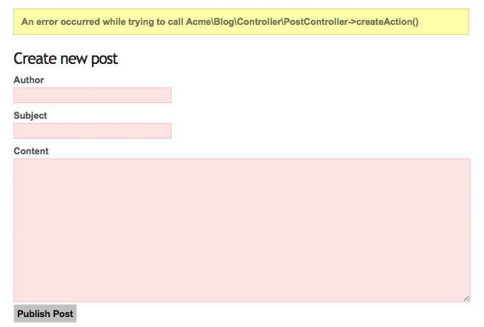

==========
Validation
==========

Hopefully the examples of the previous chapters made you shudder or at least
raised some questions. Although it's surely nice to have one-liners for actions
like ``create`` and ``update`` we need some more code to validate the incoming
values before they are eventually persisted and the outgoing content before it's
rendered to the browser.

You won't have to care too much about the latter if you're using Fluid to render
your View because, because it *escapes* your data *by default*.
As a result, even if the post subject contains the string
```` outputting it via ``{post.subject}`` will
result in the unaesthetic but harmless
``&lt;script&gt;alert(&quot;danger&quot;)&lt;/script&gt;``.

But most applications come with additional rules that apply to the domain model.
Maybe you want to make sure that a post subject must consist of at least 3 and
at maximum 50 characters for example.
But do you really want these checks in your action methods? Shouldn't we
rather separate the concerns [#]_ of the action methods (show, create,
update, ...) from others like validation, logging and security?

Fortunately Flow's validation framework doesn't ask you to add any additional
PHP code to your action methods. Validation has been extracted as a separated
concern which does it's job almost transparently to the developer.

Declaring Validation Rules
==========================

When we're talking about validation, we usually refer to validating **models**.
The rules defining how a model should be validated can be classified into
three types:

-   **Base Properties** – a set of rules defining the minimum requirements
    on the properties of a model which must be met before a model may
    be persisted.
-   **Base Model** – a set of rules or custom validator enforcing the
    minimum requirements on the combination of properties of a model which
    must be met before a model may be persisted.
-   **Supplemental** – a set of rules defining additional requirements on
    a model for a specific situation, for example for a certain
    action method.

.. note::
    Base model and supplemental rules are not covered by this tutorial.
    Detailed information is available in :doc:`Part III - Validation <../PartIII/Validation>`.

Rules for the base properties are defined directly in the model in form
of annotations:

*Classes/Acme/Blog/Domain/Model/Post.php*:

.. code-block:: php

    /**
     * @Flow\Validate(type="NotEmpty")
     * @Flow\Validate(type="StringLength", options={ "minimum"=3, "maximum"=50 })
     * @var string
     */
    protected $subject;

    /**
     * @Flow\Validate(type="NotEmpty")
     * @var string
     */
    protected $author;

    /**
     * @Flow\Validate(type="NotEmpty")
     * @ORM\ManyToOne(inversedBy="posts")
     * @var Blog
     */
    protected $blog;

The ``Validate`` annotations define one or more validation rules which should apply to a
property. Multiple rules can be defined in dedicated lines by further ``Validate``
annotations.

.. note::
    Per convention, every validator allows (passes) empty values, i.e. empty strings or
    NULL values. This is for achieving fields which are not mandatory, but if filled in,
    must satisfy a given validation. Consider an email address field for example which
    is not mandatory, but has to match an email pattern as soon as filled in.

    If you want to make a field mandatory at all, use the ``NotEmpty`` validator in addition,
    like in the example above.

    The technical background is the ``acceptsEmptyValues`` property of the AbstractValidator,
    being ``TRUE`` per default. When writing customized validators, it's basically possible
    to set this field to ``FALSE``, however this is not generally recommended due to the convention
    that every validator could principally be empty.

.. tip::
    Flow provides a range of built-in validators which can be found in the
    ``Flow\Validation\Validator`` sub package. The names used in the
    ``type`` attributes are just the unqualified class names of these validators.

    It is possible and very simple to program custom validators by implementing
    the ``Neos\Flow\Validation\Validator\ValidatorInterface``.
    Such validators must, however, be referred to by their fully qualified
    class name (i.e. including the namespace).

Make sure the above validation rules are set in your ``Post`` model, click on the
``Create a new post`` link below the list of posts and submit the *empty* form. If all went fine,
you should end up again in the **new post** form, with the tiny difference
that the text boxes for title and author are now framed in red:

    Validation errors shown in form

Displaying Validation Errors
============================

The validation rules seem to be in effect but the output could be a bit more
meaningful. We'd like to display a list of error messages for exactly this case when
the form has been submitted but contained errors.

Fluid comes with a specialized view helper which allows for iterating over
validation errors, the ``<f:form.validationResults>`` view helper.
We'll need validation results for the *create* and the *update* case, so let's put the
View Helper in a new partial ``FormErrors``::

*Resources/Private/Partials/FormErrors.html*:

.. code-block:: html

    <f:form.validationResults for="{for}">
        <f:if condition="{validationResults.flattenedErrors}">
            <dl class="errors">
                <f:for each="{validationResults.flattenedErrors}" key="propertyName" as="errors">
                    <dt>
                        {propertyName}:
                    </dt>
                    <dd>
                        <f:for each="{errors}" as="error">{error}</f:for>
                    </dd>
                </f:for>
            </dl>
        </f:if>
    </f:form.validationResults>

And include that partial to both, the ``New.html`` and the ``Edit.html`` templates just above the
form::

*Resources/Private/Templates/Post/New.html*:

.. code-block:: html

    <f:render partial="FormErrors" arguments="{for: 'newPost'}" />
    <f:form action="create" objectName="newPost">
    ...

and::

*Resources/Private/Templates/Post/Edit.html*:

.. code-block:: html

    <f:render partial="FormErrors" arguments="{for: 'post'}" />
    <f:form action="update" object="{post}" objectName="post">
    ...

Similar to the ``<f:for>`` view helper ``<f:form.validationResults>`` defines a loop
iterating over validation errors. The attribute ``as`` is optional and if it's
not specified (like in the above example) ``as="error"`` is assumed.

To clearly understand this addition to the template you need to know that
errors can be nested: There is a global error object containing the errors of
the different domain objects (such as ``newPost``) which contain errors for
each property which in turn can be multiple errors per property.

After saving the modified template and submitting the empty form again you
should see some more verbose error messages:

.. figure:: Images/CreateNewPostValidationError2.png
    :alt: More verbose validation errors shown in form
    :class: screenshot-detail

    More verbose validation errors shown in form

Validating Existing Data
========================

The validation rules are enforced as soon as the GET or POST arguments are mapped to the action's arguments.
But what if you add new validation rules when there are already persisted entities that might violate these?
For example if you had created a post with a subject of "xy" and added the ``StringLength`` annotation
afterwards?

Doing so would prevent you from invoking any of the actions for that particular post.
All you will see is an error message::

    Validation failed while trying to call Acme\Blog\Controller\PostController->showAction().

So the problem is that Flow tries to validate the ``$post`` argument for the
action although we don't need a valid post at this point.
What's important is that the post submitted to ``updateAction`` or ``createAction`` is
valid, but we don't really care about the ``showAction`` or ``editAction`` which only displays the post or a form.

There's a very simple remedy to this problem: don't validate the post. With one
additional annotation the whole mechanism works as expected:

*Classes/Acme/Blog/Controller/PostController.php*:

.. code-block:: php

    /**
     * Displays a single post
     *
     * @Flow\IgnoreValidation("$post")
     * @param Post $post
     * @return void
     */
    public function showAction(Post $post) {
        $this->view->assignMultiple([
            'post' => $post,
            'nextPost' => $this->postRepository->findNext($post),
            'previousPost' => $this->postRepository->findPrevious($post),
        ]);
    }

Now the ``showAction`` can be called even though ``$post`` is not valid.
You probably want to add the same annotation to the ``editAction`` and even the ``deleteAction`` so that
invalid posts can be fixed or removed.

-----

.. [#]  See also: `Separation of Concerns (Wikipedia)
        <http://en.wikipedia.org/wiki/Separation_of_concerns>`_
