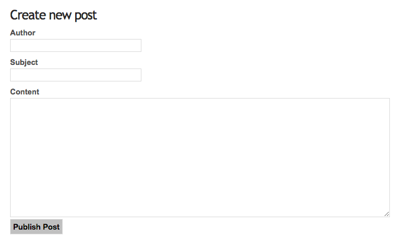

====
View
====

The view's responsibility is solely the visual presentation of data provided by
the controller. In Flow views are cleanly decoupled from the rest of the MVC framework.
This allows you to either take advantage of Fluid (Flow's template engine), write
your own custom PHP view class or use almost any other template
engine by writing a thin wrapper building a bridge between Flow's interfaces
and the template engine's functions.
In this tutorial we focus on Fluid-based templates as this is what you usually want to use.

Resources
=========

Before we design our first Fluid template we need to spend a thought on the
resources our template is going to use (I'm talking about all the images, style
sheets and javascript files which are referred to by your HTML code).
You remember that only the ``Web`` directory is accessible from the web, right?
And the resources are part of the package and thus hidden from the public.
That's why Flow comes with a powerful resource manager whose main task is to
manage access to your package's resources.

The deal is this: All files which are located in the **public resources directory**
of your package will automatically be mirrored to somewhere that is publicly accessible.
By default, Flow just symlinks those files to the public resources directory below the
``Web`` folder.

Let's take a look at the directory layout of
the *Acme.Blog* package:

.. table:: Directory structure of a Flow package

    ====================== ============================================================
    Directory              Description
    ====================== ============================================================
    *Classes/*             All the .php class files of your package
    *Documentation/*       The package's manual and other documentation
    *Resources/*           Top folder for resources
    *Resources/Public/*    Public resources - will be mirrored to the *Web* directory
    *Resources/Private/*   Private resources - won't be mirrored to the *Web* directory
    ====================== ============================================================


No matter what files and directories you create below ``Resources/Public/`` - all
of them will, by default, be symlinked to ``Web/_Resources/Static/Packages/Acme.Blog/`` on
the next hit.

.. tip::
    There are more possible directories in a package and we do have some
    conventions for naming certain sub directories. All that is explained in
    fine detail in :doc:`Part III <../PartIII/index>`.

.. important::
    For the blog example in this tutorial we created some style sheet to make it more appealing.
    If you'd like the examples to use those styles, then it's time to copy ``Resources/Public/``
    from the git repository (https://github.com/neos/Acme.Blog)
    to your blog's public resources folder (``Packages/Application/Acme.Blog/Resources/Public/``).

Layouts
=======

Fluid knows the concepts of *layouts*, *templates* and *partials*. Usually all of
them are just plain HTML files which contain special tags known by the Fluid
template view. The following figure illustrates the use of layout, template and
partials in our blog example:

.. figure:: Images/LayoutTemplatePartial.png
    :alt: Layout, Template and Partial
    :class: screenshot-fullsize

    Layout, Template and Partial


A Fluid layout provides the basic layout of the output which is supposed to be
shared by multiple templates. You will use the same layout throughout this
tutorial - only the templates will change depending on the current controller
and action. Elements shared by multiple templates can be extracted as a partial
to assure consistency and avoid duplication.

Let's build a simple layout for your blog. You only need to adjust the file called
``Default.html`` inside the ``Acme.Blog/Resources/Private/Layouts`` directory to contain
the following code:

*Resources/Private/Layouts/Default.html*:

.. code-block:: html

    <!DOCTYPE html>
    <html>
    <head lang="en">
        <meta charset="utf-8">
        <title>{blog.title} - Flow Blog Example</title>
        <link rel="stylesheet" href="../../Public/Styles/App.css" type="text/css" />
    </head>
    <body>

        <header>
            <f:if condition="{blog}">
                <f:link.action action="index" controller="Post">
                    <h1>{blog.title}</h1>
                </f:link.action>
                <p class="description">{blog.description -> f:format.crop(maxCharacters: 80)}</p>
            </f:if>
        </header>

        <div id="content">
            <f:flashMessages class="flashmessages" />
            <f:render section="MainContent" />
        </div>

        <footer>
            <a href="http://flow.neos.io">
                Powered by Flow
            </a>
        </footer>

    </body>
    </html>

.. tip::
    If you don't want to download the stylesheet mentioned above, you can import it directly from the
    github repository, replacing `../../Public/Styles./App.css`` with
    ``https://raw.githubusercontent.com/neos/Acme.Blog/master/Resources/Public/Styles/App.css``
    Of course you can also just remove the whole ``<link rel="stylesheet" ...`` line if you don't care
    about style.

On first sight this looks like plain HTML code, but you'll surely notice the
various ``<f: ... >`` tags. Fluid provides a range of view helpers which are
addressed by these tags. By default they live in the ``f`` namespace resulting
in tags like ``<f:if>`` or ``<f:link.action>``. You can define your own namespaces
and even develop your own view helpers, but for now let's look at what you used
in your layout:

The first thing to notice is ``<f:if>``, a Fluid tag in ``<body>``. This tag
instructs Fluid to render its content only if its condition is true. In this case,
``condition="{blog}"`` tells the ``<f:if>`` tag to render only if ``blog`` is set.

Look at that condition again, noting the curly braces: ``{blog}``. This is a variable
accessor. It is very similar to some Fluid markup that we skipped over in ``<head>``:

*Resources/Private/Layouts/Default.html*:

.. code-block:: html

    <title>{blog.title} - Flow Blog Example</title>

As you will see in a minute, Fluid allows your controller to define variables
for the template view. In order to display the blog's name, you'll need to make
sure that your controller assigns the current ``Blog`` object to the template
variable ``blog``. The value of such a variable can be inserted anywhere in
your layout, template or partial by inserting the variable name wrapped by
curly braces. However, in the above case ``blog`` is not a value you can output
right away – it's an object. Fortunately Fluid can display properties of an
object which are accessible through a getter function: to display the blog
title, you just need to note down ``{blog.title}`` and Fluid will internally call
the ``getTitle()`` method of the ``Blog`` instance.

We've looked at two kinds of Fluid syntax: tag-style view helpers (``<f:if>``),
and variable accessors (``{blog.title}``). Another kind of Fluid syntax is an
alternative way to address view helpers, the **view helper shorthand syntax**:

*Resources/Private/Layouts/Default.html*:

.. code-block:: html

    {blog.description -> f:format.crop(maxCharacters: 80)}

``{f:format.crop(...)}``` instructs Fluid to crop the given value (in this case the
Blog's description). With the ``maxCharacters`` argument the description will be
truncated if it exceeds the given number of characters. The generated HTML code
will look something like this:

*Resources/Private/Layouts/Default.html*:

.. code-block:: html

    This is a very long description that will be cropped if it exceeds eighty charac...

If you look at the remaining markup of the layout you'll find more uses of view
helpers, including ``flashMessages``. It generates an unordered list with
all flash messages. Well, maybe you remember this line in the ``createAction``
of our ``PostController``::

    $this->addFlashMessage('Created a new post.');

Flash messages are a great way to display success or error messages to
the user beyond a single request. And because they are so useful, Flow provides a
``FlashMessageContainer`` with some helper methods and Fluid offers the ``flashMessages``
view helper. Therefore, if you create a new post, you'll see the message *Your new post was
created* at the top of your blog index on the next hit.

There's only one view helper you need to know about before proceeding with our first template,
the **render** view helper:

*Resources/Private/Layouts/Default.html*:

.. code-block:: html

    <f:render section="MainContent" />

This tag tells Fluid to insert the section ``MainContent`` defined in the current
template at this place. For this to work there must be a section with the
specified name in the template referring to the layout – because that's the way
it works: A template declares which layout it is based on, defines sections
which in return are included by the layout. Confusing? Let's look at a
concrete example.

Templates
=========

Templates are, as already mentioned, tailored to a specific action. The action
controller chooses the right template automatically according to the current
package, controller and action - if you follow the naming conventions. Let's
replace the automatically generated template for the Post controller's index
action in ``Acme.Blog/Resources/Private/Templates/Post/Index.html`` with some more
meaningful HTML:

*Resources/Private/Templates/Post/Index.html*:

.. code-block:: html

    <f:layout name="Default" />

    <f:section name="MainContent">
        <f:if condition="{blog.posts}">
            <f:then>
                <ul>
                    <f:for each="{blog.posts}" as="post">
                        <li class="post">
                            <f:render partial="PostActions" arguments="{post: post}"/>
                            <h2>
                                <f:link.action action="show" arguments="{post: post}">{post.subject}</f:link.action>
                            </h2>
                            <f:render partial="PostMetaData" arguments="{post: post}"/>
                        </li>
                    </f:for>
                </ul>
            </f:then>
            <f:else>
                <p>No posts created yet.</p>
            </f:else>
        </f:if>
        <p>
            <f:link.action action="new">Create a new post</f:link.action><
        /p>
    </f:section>

There you have it: In the first line of your template there's a reference to
the "Default" layout. All HTML code is wrapped in a ``<f:section>`` tag. Even
though this is the way you usually want to design templates, you should know
that using layouts is not mandatory – you could equally put all your code into
one template and omit the ``<f:layout>`` and ``<f:section>`` tags.

The main job of this template is to display a list of the most recent posts.
An ``<f:if>`` condition makes sure that the list of posts is only rendered if
``blog`` actually contains posts. But currently the view doesn't know anything
about a blog - you need to adapt the the ``PostController`` to assign the current blog::

*Classes/Acme/Blog/Controller/PostController.php*:

.. code-block:: php

    /**
     * @return void
     */
    public function indexAction() {
        $blog = $this->blogRepository->findActive();
        $this->view->assign('blog', $blog);
    }

To fully understand the above code you need to know two facts:

-   ``$this->view`` is automatically set by the action controller and
    points to a Fluid template view.
-   if an action method returns ``NULL``, the controller will automatically
    call ``$this->view->render()`` after executing the action.

But soon you'll see that we need the current Blog in all of our actions, so how to assign it
to the view without repeating the same code over and over again?
With ease: We just assign it as soon as the view is initialized::

*Classes/Acme/Blog/Controller/PostController.php*:

.. code-block:: php

    /**
     * @param ViewInterface $view
     * @return void
     */
    protected function initializeView(ViewInterface $view) {
        $blog = $this->blogRepository->findActive();
        $this->view->assign('blog', $blog);
    }

    /**
     * @return void
     */
    public function indexAction() {
    }

The ``initializeView`` method is called before each action, so it provides a good opportunity
to assign values to the view that should be accessible from all actions.
But make sure only to use it for truly global values in order not to waste memory for unused data.

After creating the folder ``Resources/Private/Partials/`` add the following two partials::

*Resources/Private/Partials/PostMetaData.html*:

.. code-block:: html

    <p class="metadata">
        Published on {post.date -> f:format.date(format: 'Y-m-d')} by {post.author}
    </p>

*Resources/Private/Partials/PostActions.html*:

.. code-block:: html

    <ul class="actions">
        <li>
            <f:link.action action="edit" arguments="{post: post}">Edit</f:link.action>
        </li>
        <li>
            <f:form action="delete" arguments="{post: post}">
                <f:form.submit name="delete" value="Delete" />
            </f:form>
        </li>
    </ul>

The ``PostMetaData`` partial renders date and author of a post. The ``PostActions`` partial an *edit* link
and a button to *delete* the current post. Both are used as well in the list view (``indexAction``) as well
as in the detail view (``showAction``) of the post and Partials allow us to easily re-use the parts without
having to duplicate markup.

Now you should now see the list of recent posts by accessing http://dev.tutorial.local/acme.blog/post:

.. figure:: Images/PostIndex.png
    :alt: The list of blog posts
    :class: screenshot-fullsize

    The list of blog posts

To create new posts and edit existing ones from the web browser, we need to create Forms:

Forms
=====

Create a New Post
-----------------

Time to create a form which allows you to enter details for a new post.
The first component you need is the ``newAction`` whose sole purpose is
displaying the form:

*Classes/Acme/Blog/Controller/PostController.php*:

.. code-block:: php

    /**
     * Displays the "Create Post" form
     *
     * @return void
     */
    public function newAction() {
    }

No code? What will happen is this: the action controller selects the
``New.html`` template and assigns it to ``$this->view`` which will automatically
be rendered after ``newAction`` has been called. That's enough for displaying
the form. The current ``blog`` is already assigned in ``initializeView()`` allowing
the blog title and description to be rendered in our header (defined in ``Default.html``).
Otherwise those would be empty.

The second component is the actual form. Adjust the template  ``New.html`` in
the ``Resources/Private/Templates/Post/`` folder:

*Resources/Private/Templates/Post/New.html*:

.. code-block:: html

    <f:layout name="Default" />

    <f:section name="MainContent">
        <h2>Create new post</h2>
        <f:form action="create" objectName="newPost">
            <f:form.hidden property="blog" value="{blog}" />

            <label for="post-author">Author</label>
            <f:form.textfield property="author" id="post-author" />

            <label for="post-subject">Subject</label>
            <f:form.textfield property="subject" id="post-subject" />

            <label for="post-content">Content</label>
            <f:form.textarea property="content" rows="5" cols="30" id="post-content" />

            <f:form.submit name="submit" value="Publish Post" />
        </f:form>
    </f:section>

Here is how it works: The ``<f:form>`` view helper renders a form tag. Its
attributes are similar to the action link view helper you might have seen in
previous examples: ``action`` specifies the action to be called on submission
of the form, ``controller`` would specify the controller and ``package`` the
package respectively. If ``controller`` or ``package`` are not set, the URI
builder will assume the current controller or package respectively.
``objectName`` finally specifies **the name of the action method argument**
which will receive the form values, in this case "newPost".

It is important to know that the whole form is (usually) bound to one object
and that the values of the form's elements become property values of
this object. In this example the form contains (property) values for a
post object. The form's elements are named after the class properties of the
``Post`` domain model: ``blog``, ``author``, ``subject`` and ``content``.
Let's look at the ``createAction`` again:

.. note::

    Mind that ``newPost`` is not assigned to the view in this example. Assigning
    this object is only needed if you have set default values to your model
    properties. So if you for example have a ``protected $hidden = TRUE``
    definition in your model, a ``<f:form.checkbox property="hidden" />`` will not
    be checked by default, unless you instantiate ``$newPost`` in your index
    action and assign it to the view.

*Classes/Acme/Blog/Controller/PostController.php*:

.. code-block:: php

    /**
     * Creates a new post
     *
     * @param Post $newPost
     * @return void
     */
    public function createAction(Post $newPost) {
        $this->postRepository->add($newPost);
        $this->addFlashMessage('Created a new post.');
        $this->redirect('index');
    }

It's important that the ``createAction`` uses the type hint
``Post`` (which expands to ``\Acme\Blog\Domain\Model\Post``) and that it comes with a proper
``@param`` annotation because this is how Flow determines the type to which the submitted form
values must be converted. Because this action requires a ``Post`` it gets a post (object) -
as long as the property names of the object and the form match.

Time to test your new ``newAction`` and its template – click on the little plus
sign above the first post lets the ``newAction`` render this form:



    Form to create a new post

Enter some data and click the submit button:

.. figure:: Images/CreatedNewPost.png
    :alt: A new post has been created
    :class: screenshot-fullsize

    A new post has been created

You should now find your new post in the list of posts.

Edit a Post
-----------

While you're dealing with forms you should also create form for editing an
existing post. The ``editAction`` will display this form.

This is pretty straight forward: we already added a link to each post with the ``PostActions.html``
partial::

*Resources/Private/Templates/Post/Index.html*:

.. code-block:: html

    <ul class="actions">
        <li>
            <f:link.action action="edit" arguments="{post: post}">Edit</f:link.action>
        </li>
        <li>
            <f:form action="delete" arguments="{post: post}">
                <f:form.submit name="delete" value="Delete" />
            </f:form>
        </li>
    </ul>

This renders an "Edit" link that points to the ``editAction`` of the PostController.
Below is a little form with just one button that triggers the ``deleteAction()``.

.. note::

    The reason why the ``deleteAction()`` is invoked via a form instead of a link is
    because Flow follows the HTTP 1.1 specification that suggests that called "safe
    request methods" (usually GET or HEAD requests) should not change the server state.
    See :doc:`Part III - Validation <../PartIII/Validation>` for more details.
    The ``editAction()`` just displays the Post edit form, so it can be called via GET requests.

Adjust the template ``Templates/Post/Edit.html`` and insert the following HTML code:

*Resources/Private/Templates/Post/Edit.html*:

.. code-block:: html

    <f:layout name="Default" />

    <f:section name="MainContent">
        <h2>Edit post "{post.subject}"</h2>
        <f:form action="update" object="{post}" objectName="post">
            <label for="post-author">Author</label>
            <f:form.textfield property="author" id="post-author" />

            <label for="post-subject">Subject</label>
            <f:form.textfield property="subject" id="post-subject" />

            <label for="post-content">Content</label>
            <f:form.textarea property="content" rows="5" cols="30" id="post-content" />

            <f:form.submit name="submit" value="Update Post" />
        </f:form>
    </f:section>

Most of this should already look familiar. However, there is a tiny difference
to the ``new`` form you created earlier: in this edit form you added
``object="{post}"`` to the ``<f:form>`` tag. This attribute binds the variable
``{post}`` to the form and it simplifies the further definition of the
form's elements. Each element – in our case the text box and the text
area – comes with a ``property`` attribute declaring the name of the property
which is supposed to be displayed and edited by the respective element.

Because you specified ``property="author"`` for the text box, Fluid will fetch
the value of the post's ``author`` property and display it as the default value
for the rendered text box. The resulting ``input`` tag will also contain the
name ``"author"`` due to the ``property`` attribute you defined. The ``id``
attribute only serves as a target for the ``label`` tag and is not required
by Fluid.

What's missing now is a small adjustment to the PHP code displaying the edit form:

*Classes/Acme/Blog/Controller/PostController.php*:

.. code-block:: php

    /**
     * Displays the "Edit Post" form
     *
     * @param Post $post
     * @return void
     */
    public function editAction(Post $post) {
        $this->view->assign('post', $post);
    }

Enough theory, let's try out the edit form in practice. A click on the edit
link of your list of posts should result in a screen similar to this:

.. figure:: Images/EditPost.png
    :alt: The edit form for a post
    :class: screenshot-fullsize

    The edit form for a post

When you submit the form you call the ``updateAction``:

*Classes/Acme/Blog/Controller/PostController.php*:

.. code-block:: php

    /**
     * Updates a post
     *
     * @param Post $post
     * @return void
     */
    public function updateAction(Post $post) {
        $this->postRepository->update($post);
        $this->addFlashMessage('Updated the post.');
        $this->redirect('index');
    }

Quite easy as well, isn't it? The ``updateAction`` expects the edited post as
its argument and passes it to the repository's ``update`` method (note that we
used the ``PostRepository``!). Before we disclose the secret how this magic
actually works behind the scenes try out if updating the post really works:

.. figure:: Images/UpdatedPost.png
    :alt: The post has been edited
    :class: screenshot-detail

    The post has been edited

A Closer Look on Updates
------------------------

Although updating objects is very simple on the user's side (that's where
you live), it is a bit complex on behalf of the framework. You may skip this
section if you like - but if you dare to take a quick look behind the scenes to
get a better understanding of the mechanism  behind the ``updateAction``
read on ...

The ``updateAction`` expects one argument, namely the **edited post**. "Edited
post" means that this is a ``Post`` object which already contains the values
submitted by the edit form.

These modifications will **not be persisted** automatically. To persist the
changes to the post object, call the PostRepository's ``update`` method. It schedules
an object for the dirty check at the end of the request.

If all these details didn't scare you, you might now ask yourself how Flow
could know that the ``updateAction`` expects a modified object and not the original?
Great question. And the answer is – literally – hidden in the form generated
by Fluid's form view helper:

.. code-block:: html

    <form action="/acme.blog/post/update" method="post">
        ...
        <input type="hidden" name="post[__identity]" value="7825fe4b-33d9-0522-a3f2-02833f9084ab" />
        ...
    </form>

Fluid automatically renders a hidden field containing information about the
technical identity of the form's object, if the object is an original, previously
retrieved from a repository.

On receiving a request, the MVC framework checks if a special identity field
(such as the above hidden field) is present and if further properties have been
submitted. This results in three different cases:

.. table:: Create, Show, Update detection

    +-------------------+---------------+---------------------------------------+
    | Situation         | Case          | Consequence                           |
    +===================+===============+=======================================+
    | identity missing, | New /         | Create a completely new object and    |
    | properties present| Create        | set the given properties              |
    +-------------------+---------------+---------------------------------------+
    | identity present, | Show /        | Retrieve original object with         |
    | properties missing| Delete / ...  | given identifier                      |
    +-------------------+---------------+---------------------------------------+
    | identity present, | Edit /        | Retrieve original object, and set the |
    | properties present| Update        | given properties                      |
    +-------------------+---------------+---------------------------------------+

Because the edit form contained both identity and properties, Flow prepared an
instance with the given properties for our ``updateAction``.
