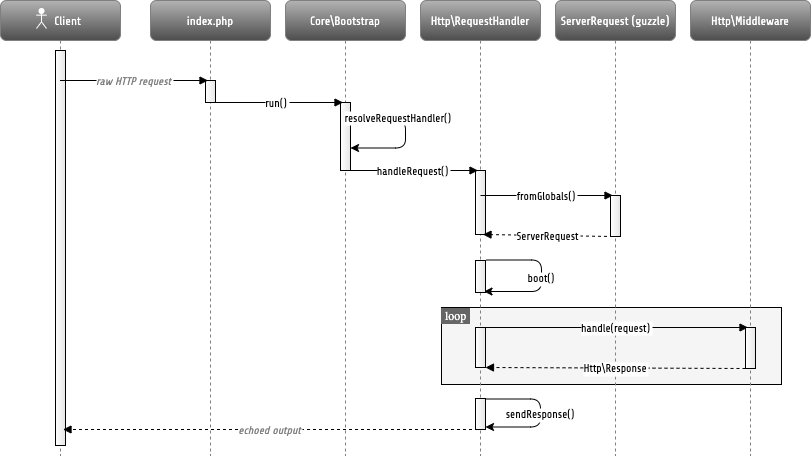
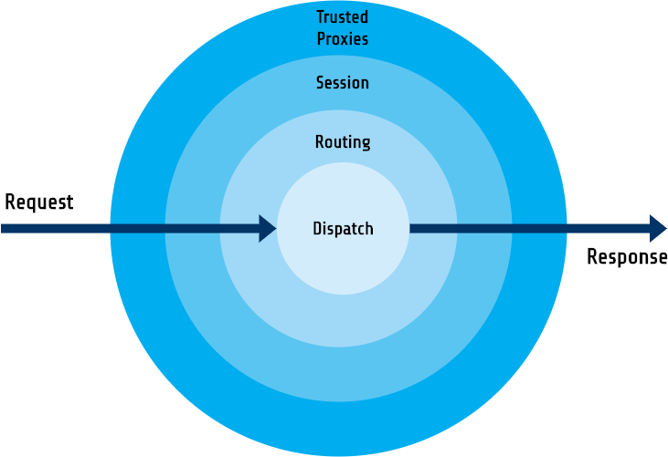

.. _ch-http:

HTTP Foundation
===============

Most applications which are based on Flow are web applications. As the HTTP protocol is the foundation of the
World Wide Web, it also plays an important role in the architecture of the Flow framework.

This chapter describes the mechanics behind Flow's request-response model, how it relates to the Model View
Controller framework and which API functions you can use to deal with specific aspects of the HTTP request and response.

The HTTP 1.1 Specification
--------------------------

Although most people using or even developing for the web are aware of the fact that the Hypertext Transfer Protocol is
responsible for carrying data around, considerably few of them have truly concerned themselves with the HTTP 1.1
specification.

The specification, `RFC 2616`_, has been published in 1999 already but it is relevant today more than ever. If you've
never fully read it, we recommend that you do so. Although it is a long read, it is important to understand the
intentions and rules of the protocol before you can send cache headers or response codes in good conscience, or even
claim that you developed a true `REST`_ service.

Application Flow
----------------

The basic walk through a Flow-based web application is as follows:

* the browser sends an HTTP request to a webserver
* the webserver calls Web/index.php and passes control over to Flow
* the :abbr:`Bootstrap (\\Neos\\Flow\\Core\\Bootstrap)` initializes the bare minimum and passes control to a suitable
  request handler
* by default, the :abbr:`HTTP Request Handler (\\Neos\\Flow\\Http\\RequestHandler)` takes over and runs a boot sequence
  which initializes all important parts of Flow
* the HTTP Request Handler builds an PSR-7 HTTP Request object. The
  :abbr:`Request object (\\Psr\\Http\\Message\\ServerRequestInterface)` contains all important properties of the real HTTP request.
* the HTTP Request Handler initializes the
  :abbr:`HTTP Middlewares chain (\\Neos\\Flow\\Http\\Middleware\\MiddlewaresChain)`, which is a PSR-15 RequestHandler
  implementation wrapping a configurable list of `PSR-15 Middlewares`_.
  The `Middlewares Chain`_ is fully configurable, but by default it consists of the following steps:
    * the ``standardsCompliance`` middleware tries to make the HTTP Response standards compliant by adding required HTTP
      headers and setting the correct status code (if not already the case)
    * the ``trustedProxies`` middleware verifies headers that override request information, like the host, port or client IP address to
      come from a server (reverse proxy) who's IP address is safe-listed in the settings.
    * the ``session`` middleware, which restores the session from a cookie and later sets the session cookie in the response.
    * the ``ajaxWidget`` middleware, which reacts to AJAX requests from Fluid widget view helpers before the default
      routing is invoked (only if the ``neos/fluid-adaptor`` package is installed)
    * the ``routing`` middleware invokes the :abbr:`Router (\\Neos\\Flow\\Mvc\\Routing\\Router)` to determine which
      controller and action is responsible for processing the request. This information (controller name, action name,
      arguments) is stored in the ``ServerRequest`` attribute named "routingResults"
    * the ``poweredByHeader`` middleware sets the ``X-Flow-Powered`` response header according to the ``Neos.Flow.http.applicationToken``
      configuration
    * the ``flashMessages`` middleware persists any pending Flash message in the configured storage
    * the ``parseBody`` middleware parses the incoming request according to its ``Content-Type`` so that the incoming data is
      available via ``ServerRequest::getParsedBody()``
    * the ``securityEntryPoint`` middleware initializes the :abbr:`Security Context (Neos\\Flow\\Security\\Context)` and
      starts the authentication flow
    * the ``dispatch`` middleware tries to invoke the corresponding controller action via the
      :abbr:`Dispatcher (Neos\\Flow\\Mvc\\Dispatcher)`. This middleware has to be the last one in the chain since it
      creates the :abbr:`Response (\\Psr\Http\\Message\\ResponseInterface)` and won't invoke other middlewares
* the controller, usually an :abbr:`Action Controller (\\Neos\\Flow\\Mvc\\Controller\\ActionController)`, processes the
  request and modifies the given HTTP Response object which will, in the end, contain the content to display (body) as
  well as any headers to be passed back to the client
* Finally the RequestHandler sends the HTTP Response back to the browser, after it was passed back through all of the middlewares

In practice, there are a few more intermediate steps being carried out, but in
essence, this is the path a request is taking.

	Simplified application flow

The Response is modified within the HTTP Middlewares Chain, visualized by the highlighted "loop" block above. The
chain is configurable. If no middleware were registered every request would result in a blank HTTP Response.

The next sections shed some light on the most important actors of this application flow.

Request Handler
---------------

The request handler is responsible for taking a request and responding in a manner the client understands. The default
HTTP Request Handler invokes the ``Bootstrap runtime sequence`` and initializes the ``HTTP Middlewares chain``. Other
request handlers may choose a completely different way to handle requests.
Although Flow also supports other types of requests (most notably, from the command line interface), this chapter
only deals with HTTP requests.

Flow comes with a very slim bootstrap, which results in few code being executed before control is handed over to
the request handler. This pays off in situations where a specialized request handler is supposed to handle specific
requests in a very effective way. In fact, the request handler is responsible for executing big parts of the
initialization procedures and thus can optimize the boot process by choosing only the parts it actually needs.

A request handler must implement the :abbr:`RequestHandler interface (\\Neos\\Flow\\Core\\RequestHandlerInterface)`
interface which, among others, contains the following methods::

	public function handleRequest();

	public function canHandleRequest();

	public function getPriority();

On trying to find a suitable request handler, the bootstrap asks each registered request handler if it can handle the
current request using ``canHandleRequest()`` – and if it can, how eager it is to do so through ``getPriority()``.
Request handlers responding with a high number as their priority, are preferred over request handlers reporting a lower
priority. Once the bootstrap has identified a matching request handler, it passes control to it by calling its
``handleRequest()`` method.

Request handlers must first be registered in order to be considered during the resolving phase. Registration is done in
the ``Package`` class of the package containing the request handler::

	class Package extends BasePackage {

		public function boot(\Neos\Flow\Core\Bootstrap $bootstrap) {
			$bootstrap->registerRequestHandler(new \Acme\Foo\BarRequestHandler($bootstrap));
		}

	}

Middlewares Chain
-----------------

Instead of registering a new RequestHandler the application workflow can also be altered by a custom ``PSR-15 Middleware``.
A HTTP middleware must implement the :abbr:`Middleware interface (\\Psr\\Http\\Server\\MiddlewareInterface)`
that defines the ``process($request, $next)`` method::

  use Psr\Http\Message\ResponseInterface;
  use Psr\Http\Message\ServerRequestInterface;
  use Psr\Http\Server\MiddlewareInterface;
  use Psr\Http\Server\RequestHandlerInterface;

  /**
   * A sample HTTP middleware that adds a custom header to the response
   */
  final class SomeMiddleware implements MiddlewareInterface
  {
    public function process(ServerRequestInterface $request, RequestHandlerInterface $next): ResponseInterface;
      $response = $next->handle($httpRequest);
      return $response->withAddedHeader('X-MyHeader', '123');
    }
  }

To activate a middleware, it must be configured in the ``Settings.yaml``::

  Neos:
    Flow:
      http:
        middlewares:
          'custom':
            position: 'before dispatch'
            middleware: 'Some\Package\Http\SomeMiddleware'

With the ``position`` directive the order of a middleware within the chain can be defined. In this case the new component
will be handled before the ``dispatch`` middleware that is configured in the Neos.Flow package. Note though, that any middleware
will always be able to act on the request, so *before* any following middleware and also on the response, hence *after*
the following middleware. A middleware chain basically works like a onion ring, where each middleware is a single layer
of the onion around the inner core of the application. Each request passes inside through the layer and a response passes
outside through the layer.

..note::

  By default, the ``dispatch`` middleware represents the inner most onion layer since it creates the :abbr:`Response (\\Psr\Http\\Message\\ResponseInterface)`
  and won't invoke any further middlewares.
  For this reason no middleware must be configured to be executed _after_ the "dispatch" middleware

CLI
~~~

The ``middleware:list`` command can be used to list active middlewares::

  ./flow middleware:list

this will return the all middlewares in the order they are configured, by default::

  Currently configured middlewares:
  +----+---------------------+---------------------------------------------------------+
  | #  | Name                | Class name                                              |
  +----+---------------------+---------------------------------------------------------+
  | 1  | standardsCompliance | Neos\Flow\Http\Middleware\StandardsComplianceMiddleware |
  | 2  | trustedProxies      | Neos\Flow\Http\Middleware\TrustedProxiesMiddleware      |
  | 3  | session             | Neos\Flow\Http\Middleware\SessionMiddleware             |
  | 4  | ajaxWidget          | Neos\FluidAdaptor\Core\Widget\AjaxWidgetMiddleware      |
  | 5  | routing             | Neos\Flow\Mvc\Routing\RoutingMiddleware                 |
  | 6  | poweredByHeader     | Neos\Flow\Http\Middleware\PoweredByMiddleware           |
  | 7  | flashMessages       | Neos\Flow\Mvc\FlashMessage\FlashMessageMiddleware       |
  | 8  | parseBody           | Neos\Flow\Http\Middleware\RequestBodyParsingMiddleware  |
  | 9  | securityEntryPoint  | Neos\Flow\Http\Middleware\SecurityEntryPointMiddleware  |
  | 10 | dispatch            | Neos\Flow\Mvc\DispatchMiddleware                        |
  +----+---------------------+---------------------------------------------------------+

Interrupting the chain
~~~~~~~~~~~~~~~~~~~~~~

Sometimes it is necessary to stop processing of a chain in order to prevent successive middlewares to be executed.
For example if one wants to handle an AJAX request and prevent the default dispatching. This can be done by returning
a response instead of invoking the next middleware::

	final class SomeAjaxMiddleware implements MiddlewareInterface
	{
		public function process(ServerRequestInterface $request, RequestHandlerInterface $next): ResponseInterface;
			parse_str($request->getUri()->getQuery(), $queryArguments);
			if (!isset($queryArguments['__ajax'])) {
				return $next->handle($request);
			}
			return new Response(200, ['Content-Type' => 'application/json'], json_encode(['success' => true]));
		}
	}

This would interrupt the request and return a JSON response of ``{"success": true}`` if the request URI contains a query of ``?__ajax``.
For this to work as expected, the component should be registered relatively early for example before the routing component::

  Neos:
    Flow:
      http:
        middlewares:
          'customAjaxResponse':
            position: 'before routing'
            middleware: 'Some\Package\Http\SomeAjaxMiddleware'

Communicating between middlewares
~~~~~~~~~~~~~~~~~~~~~~~~~~~~~~~~~

In order to share data between multiple middleware components, request attributes can be used::

	final class SomeRoutingMiddleware implements MiddlewareInterface
	{
		public function process(ServerRequestInterface $request, RequestHandlerInterface $next): ResponseInterface;
			// access previously specified attributes via $request->getAttribute('attributeName');
			return $next->handle($request->withAttribute('someAttribute', 'someAttributeValue'));
		}
	}

This can be used to specify Routing parameters for example, see :ref:`ch-routing`.

Custom middleware options
~~~~~~~~~~~~~~~~~~~~~~~~~

There is no (PSR-15 compatible) way to specify middleware options via Settings. However, options can be realized with the use of :ref:`ch-object-management`.
For example, in order to extend the AJAX middleware of the example above so that the argument name can be configured, we can add a constructor argument::

	final class SomeAjaxMiddleware implements MiddlewareInterface
	{
		private string $queryArgumentName;

		public function __construct(string $queryArgumentName)
		{
			$this->queryArgumentName = $queryArgumentName;
		}

		public function process(ServerRequestInterface $request, RequestHandlerInterface $next): ResponseInterface;
			// ...
			if (!isset($queryArguments[$this->queryArgumentName])) {
				return $next->handle($request);
			}
			// ...
		}
	}

...and add a few lines of ``Objects.yaml`` configuration::

  Some\Package\Http\SomeAjaxMiddleware:
    arguments:
      1:
        value: '__ajax'

Besides, :ref:`sect-virtual-objects` can be used in order to re-use the same middleware with different options::

  'Some.Package:AjaxMiddleware1':
    className: Some\Package\Http\SomeAjaxMiddleware
    arguments:
      1:
        value: 'custom1'

  'Some.Package:AjaxMiddleware2':
    className: Some\Package\Http\SomeAjaxMiddleware
    arguments:
      1:
        value: 'custom2'

With that, the two pre-configured virtual objects can be referred to individually in the ``Settings.yaml``::

  Neos:
    Flow:
      http:
        middlewares:
          'customAjax1':
            position: 'before routing'
            middleware: 'Some.Package:AjaxMiddleware1'
          'customAjax2':
            position: 'before routing'
            middleware: 'Some.Package:AjaxMiddleware2'

Request
-------

In the PSR-7 specification, a distinction is made between two different types of requests - incoming (``ServerRequest``)
and outgoing (``Request``). Whenever you want to make an outgoing request, you can easily use the Guzzle
``Request`` class constructor for example with the respective arguments for method, uri, etc. and then pass that to e.g. a PSR-18
Http Client implementation.
On the other side the incoming request is something you should never try to create an instance of yourself, as it is
provided by the framework. In theory, you could also call the ``ServerRequestFactory::createServerRequest`` or
the Guzzle ``ServerRequest::fromGlobals()`` convenience method, but this does not have any relation to the current request
object handled by the framework. It will not have any of the processing from middlewares applied and might therefore lead
to unexpected results, like the trusted proxy headers ``X-Forwarded-*`` not being applied and the ``ServerRequest`` providing
wrong protocol, host or client IP address.
If you need access to the **current** HTTP ``Request``, either create a :ref:`Http Middleware<Middlewares Chain>` or only access it inside the
controller through the ``ActionRequest`` for inspecting::

	public function myAction(): void
	{
		$requestBody = $this->request->getHttpRequest()->getParsedBody();
		...
	}

To create a new ServerRequest instance (for example in CLI context) the ``ServerRequestFactory`` can be used::

	public function __construct(ServerRequestFactoryInterface $serverRequestFactory)
	{
		$this->httpRequest = $serverRequestFactory->createServerRequest('GET', 'http://localhost');
	}

Creating an ActionRequest
~~~~~~~~~~~~~~~~~~~~~~~~~

Normally, you should not need to create an ``ActionRequest`` yourself. It only has meaning inside the ``MVC`` layer of
the framework and is created before invoking the MVC dispatcher. If you do need to create an ``ActionRequest`` yourself
to dispatch, such a request is always bound to an HTTP ``ServerRequest``::

    use Neos\Flow\Core\Bootstrap;
    use Neos\Flow\Http\HttpRequestHandlerInterface;
    use Neos\Flow\Mvc\ActionRequest;

    // ...

    /**
     * @var Bootstrap
     * @Flow\Inject
     */
    protected $bootstrap;

    // ...

    $requestHandler = $this->bootstrap->getActiveRequestHandler();
    if ($requestHandler instanceof HttpRequestHandlerInterface) {
        $actionRequest = ActionRequest::fromHttpRequest($requestHandler->getHttpRequest());
        // ...
    }

Arguments
~~~~~~~~~

The ``ActionRequest`` features a few methods for retrieving and setting arguments. These arguments are the result of merging any
GET, POST and PUT arguments and even the information about uploaded files. Note that these arguments have already been processed
by the validation and property mapping layerns and thus are suitable for being used in controller actions. If you, however, need to
access the raw data, you can access these via the ``getCookieParams()``, ``getQueryParams()``, ``getUploadedFiles()`` and ``getParsedBody()``
methods of the ``HttpRequest``  respectively.

Arguments provided by POST or PUT requests are usually encoded in one or the other way. Flow detects the encoding
through the ``Content-Type`` header and decodes the arguments and their values automatically into the parsed body.

getParsedBody()
~~~~~~~~~~~~~~~

You can access the request body easily by calling the ``getParsedBody()`` method. For performance reasons you may also
retrieve the content as a stream instead of a parsed structure by calling ``getBody()`` before the ``RequestBodyParsingMiddleware``.
Please be aware though that, due to how input streams work in PHP, it is not possible to retrieve the content as a stream a second
time, so the ``RequestBodyParsingMiddleware`` will not be able to parse the request body then.

Media Types
~~~~~~~~~~~

The best way to determine the media types mentioned in the ``Accept`` header of a request is to call the
``\Neos\Flow\Http\Helper\MediaTypeHelper::determineAcceptedMediaTypes()`` method.
There is also a method implementing content negotiation in a convenient way: just pass a list of supported
formats to ``\Neos\Flow\Http\Helper\MediaTypeHelper::negotiateMediaType()`` and in return you'll get the
media type best fitting according to the preferences of the client::

	$preferredType = \Neos\Flow\Http\Helper\MediaTypeHelper::negotiateMediaType(
		\Neos\Flow\Http\Helper\MediaTypeHelper::determineAcceptedMediaTypes($request),
		array('application/json', 'text/html') // These are the accepted media types
	);

Request Methods
~~~~~~~~~~~~~~~

Flow supports all valid request methods, namely ``CONNECT``, ``DELETE``, ``GET``, ``HEAD``, ``OPTIONS``, ``PATCH``,
``POST``, ``PUT`` and ``TRACE``.
Due to limited browser support and restrictive firewalls one sometimes need to tunnel request methods:
By sending a ``POST`` request and specifying the ``__method`` argument, the request method can be overridden::

	<form method="POST">
		<input type="hidden" name="__method" value="DELETE" />
	</form>

Additionally Flow respects the ``X-HTTP-Method`` respectively ``X-HTTP-Method-Override`` header.

Trusted Proxies
~~~~~~~~~~~~~~~

If your server is behind a reverse proxy or a CDN, some of the request information like the the host name, the port,
the protocol and the original client IP address are provided via additional request headers.
Since those headers can also easily be sent by an adversary, possibly bypassing security measurements, you should make
sure that those headers are only accepted from trusted proxies.

For this, you can configure a list of proxy IP address ranges in CIDR notation that are allowed to provide such headers,
and which headers specifically are accepted for overriding those request information::

	Neos:
	  Flow:
	    http:
	      trustedProxies:
	        proxies:
	          - '216.246.40.0/24'
	          - '216.246.100.0/24'

	        headers:
	          clientIp: 'X-Forwarded-For'
	          host: 'X-Forwarded-Host'
	          port: 'X-Forwarded-Port'
	          proto: 'X-Forwarded-Proto'

This would mean that only the ``X-Forwarded-*`` headers are accepted and only as long as those come from one of the
IP ranges ``216.246.40.0-255`` or ``216.246.100.0-255``. If you are using the standardized `Forwarded Header`_, you
can also simply set ``trustedProxies.headers`` to ``'Forwarded'``, which is the same as setting all four properties to
this value.
By default, no proxies are trusted (unless the environment variable ``FLOW_HTTP_TRUSTED_PROXIES`` is set) and only the
direct request informations will be used.
If you specify trusted proxy addresses, by default only the ``X-Forwarded-*`` headers are accepted.

.. note::

	On some container environments like ddev, the container acts as a proxy to provide port mapping and hence needs
	to be allowed in this setting. Otherwise the URLs generated will likely not work and end up with something along
	the lines of 'https://flow.ddev.local:80'. Therefore you probably need to set ``Neos.Flow.http.trustedProxies.proxies``
	setting to '*' in your Development environment ``Settings.yaml``.

You can also specify the list of IP addresses or address ranges in comma separated format, which is useful for using in the
environment variable ``FLOW_HTTP_TRUSTED_PROXIES``::

	Neos:
	  Flow:
	    http:
	      trustedProxies:
	        proxies: '216.246.40.0/24,216.246.100.0/24'

Also, for backwards compatibility the following headers are trusted for providing the client IP address:

	Client-Ip, X-Forwarded-For, X-Forwarded, X-Cluster-Client-Ip, Forwarded-For, Forwarded

Those headers will be checked from left to right and the first set header will be used for determining the client address.

Response
--------

Being the counterpart to the request, the ``Response`` class represents the HTTP response. Its most important function
is to contain the response body and the response status. Again, it is recommended to take a closer look at the actual
class before you start using the API in earnest.

The ``Response`` class features a few specialities, we'd like to mention at this point:

Dates
~~~~~

The dates passed to one of the date-related methods must either be a RFC 2822 parsable date string or a PHP ``DateTime``
object. Please note that all methods returning a date will do so in form of a ``DateTime`` object.

According to `RFC 2616`_ all dates must be given in `Coordinated Universal Time`_, also known as ``UTC``. UTC is also
sometimes referred to as ``GMT``, but in fact `Greenwich Mean Time`_ is not the correct time standard to use. Just to
complicate things a bit more, according to the standards the HTTP headers will contain dates with the timezone declared
as ``GMT`` – which in reality refers to ``UTC``.

Flow will always return dates related to HTTP as UTC times. Keep that in mind if you pass dates from a different
standard and then retrieve them again: the ``DateTime`` objects will mark the same point in time, but have a different
time zone set.

Headers
-------

Both classes, ``Request`` and ``Response`` inherit methods from the ``Message`` class. Among them are functions for
retrieving and setting headers. If you need to deal with headers, please have a closer look at the ``Headers`` class
which not only contains setters and getters but also some specialized cookie handling and cache header support.

In general, ``Cache-Control`` directives can be set through the regular ``set()`` method. However, a more convenient way
to tweak single directives without overriding previously set values is the ``setCacheControlDirective()`` method. Here
is an example – from the context of an Action Controller – for setting the ``max-age`` directive one hour::

	$headers = $this->request->getHttpRequest()->getHeaders();
	$headers->setCacheControlDirective('max-age', 3600);

Cookies
-------

The HTTP foundation provides a very convenient way to deal with cookies. Instead of calling the PHP cookie functions
(like ``setcookie()``), we recommend using the respective methods available in the ``ActionResponse`` class.

Like requests and responses, a cookie also is represented by a PHP class. Instead of working on arrays with values,
instances of the ``Cookie`` class are used.
In order to set a cookie, just create a new ``Cookie`` object and add it to the HTTP response::

	public function myAction(): void
	{
		$cookie = new Cookie('myCounter', 1);
		$this->response->setCookie($cookie);
	}

As soon as the response is sent to the browser, the cookie is sent as part of it. With the next request, the user agent
will send the cookie through the ``Cookie`` header. These headers are parsed automatically and can be retrieved from the
``HttpRequest`` object::

	public function myAction(): void
	{
		$httpRequest = $this->request->getHttpRequest();
		$cookieParams = $httpRequest->getCookieParams();
		if (isset($cookieParams['myCounter']) {
			$this->view->assign('counter', (int)$cookieParams['myCounter']);
		}
	}

The cookie value can be updated and re-assigned to the response::

	public function myAction(): void
	{
		$httpRequest = $this->request->getHttpRequest();
		$counter = $httpRequest->getCookieParams()['myCounter'] ?? 0;
		$this->view->assign('counter', $counter);

		$cookie = new Cookie('myCounter', $counter + 1);
		$this->response->setCookie($cookie);
	}

Finally, a cookie can be deleted by calling the ``deleteCookie()`` method::

	public function myAction(): void
	{
		$this->response->deleteCookie('myCounter');
	}

Uri
---

The ``Http`` sub package also provides a class representing a ``Unified Resource Identifier``, better known as ``URI``.
The difference between a URI and a URL is not as complicated as you might think. "URI" is more generic, so URLs are URIs
but not the other way around. A URI identifies a resource by its name or location.
But it does not have to specify the representation of that resource – URLs do that.
Consider the following examples:

A URI specifying a resource:

* http://flow.neos.io/images/logo

A URL specifying two different representations of that resource:

* http://flow.neos.io/images/logo.png
* http://flow.neos.io/images/logo.gif

Throughout the framework we use the term ``URI`` instead of ``URL`` because it is more generic and more often than not,
the correct term to use.

All methods in Flow returning a URI will do so in form of a URI object. Most methods requiring a URI will also
accept a string representation.

You are encouraged to use the ``Uri`` class for your own purposes – you'll get a nice API and validation for free!

Virtual Browser
---------------

The HTTP foundation comes with a virtual browser which allows for sending and receiving HTTP requests and responses.
The browser's API basically follows the functions of a typical web browser. The requests and responses are used in form
of ``Http\Request`` and ``Http\Response`` instances, similar to the requests and responses used by Flow's request
handling mechanism.

Request Engines
~~~~~~~~~~~~~~~

The engine responsible for actually sending the request is pluggable. Currently there are two engines delivered with
Flow:

* ``InternalRequestEngine`` simulates requests for use in functional tests
* ``CurlEngine`` uses the cURL extension to send real requests to other servers

Sending a request and processing the response is a matter of a few lines::

	/**
	 * A sample controller
	 */
	class MyController extends ActionController
	{

		/**
		 * @Flow\Inject
		 * @var \Neos\Flow\Http\Client\Browser
		 */
		protected $browser;

		/**
		 * @Flow\Inject
		 * @var \Neos\Flow\Http\Client\CurlEngine
		 */
		protected $browserRequestEngine;

		/**
		 * Some action
		 */
		public function testAction(): string
		{
			$this->browser->setRequestEngine($this->browserRequestEngine);
			$response = $this->browser->request('https://www.flowframework.io');
			return ($response->hasHeader('X-Flow-Powered') ? 'yes' : 'no');
		}
	}

As there is no default engine selected for the browser, you need to set one yourself. Of course you can use the advanced
Dependency Injection techniques (through Objects.yaml) for injecting an engine into the browser you use.

Also note that the virtual browser is of scope Prototype in order to support multiple browsers with possibly different
request engines.

Automatic Headers
~~~~~~~~~~~~~~~~~

The virtual browser allows for automatically sending specified headers along with every request. Simply pass the header
to the browser as follows::

	$browser->addAutomaticRequestHeader('Accept-Language', 'lv');

You can remove automatic headers likewise::

	$browser->removeAutomaticRequestHeader('Accept-Language');

Functional Testing
~~~~~~~~~~~~~~~~~~

The base test case for functional test cases already provides a browser which you can use for testing controllers and
other application parts which are accessible via HTTP. This browser has the ``InternalRequestEngine`` set by default::

	/**
	 * Some functional tests
	 */
	class SomeTest extends \Neos\Flow\Tests\FunctionalTestCase
	{

		/**
		 * @var bool
		 */
		protected $testableHttpEnabled = true;

		/**
		 * Send a request to a controller of my application.
		 * Hint: The host name is not evaluated by Flow and thus doesn't matter
		 *
		 * @test
		 */
		public function someTest(): void
		{
			$response = $this->browser->request('http://localhost/Acme.Demo/Foo/bar.html');
			$this->assertContains('it works', $response->getContent());
		}

	}

.. _RFC 2616: http://tools.ietf.org/html/rfc2616
.. _REST: http://en.wikipedia.org/wiki/Representational_state_transfer
.. _Coordinated Universal Time: http://en.wikipedia.org/wiki/Coordinated_Universal_Time
.. _Greenwich Mean Time: http://en.wikipedia.org/wiki/Greenwich_Mean_Time
.. _Forwarded Header: https://developer.mozilla.org/en-US/docs/Web/HTTP/Headers/Forwarded
.. _Middlewares chain: https://github.com/neos/flow-development-collection/blob/7.0/Neos.Flow/Configuration/Settings.Http.yaml#L28-L57
.. _PSR-15 Middlewares: https://www.php-fig.org/psr/psr-15/#22-psrhttpservermiddlewareinterface
