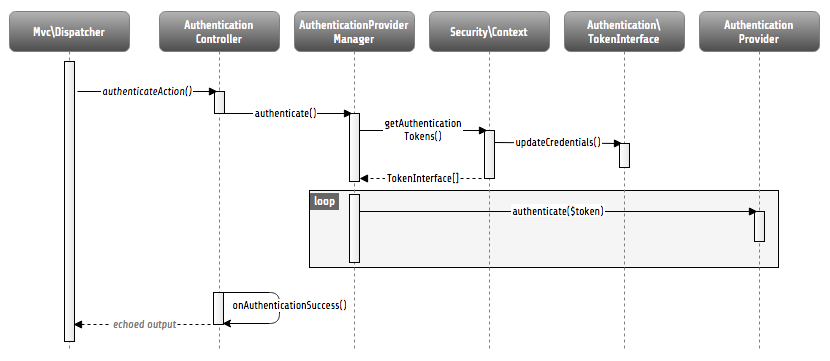
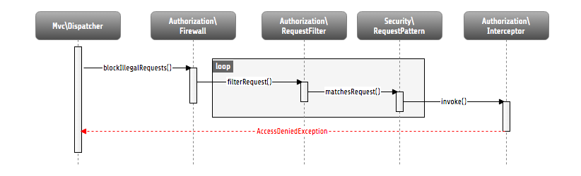

.. _ch-security:

========
Security
========

.. sectionauthor:: Andreas Förthner, Bastian Waidelich

Security Framework
==================

All tasks related to security of a Flow application are handled centrally by the security
framework. Besides other functionality, this includes especially features like
authentication, authorization, channel security and a powerful policy component. This
chapter describes how you can use Flow's security features and how they work internally.

Security context
----------------

The :abbr:`Security Context (\\Neos\\Flow\\Security\\Context)` is initialized as soon as an HTTP request is being
dispatched. It lies in session scope and holds context data like the current authentication status. That means, if you
need data related to security, the security context (you can get it easily with dependency injection) will be your main
information source. The details of the context's data will be described in the next chapters.

Authentication
==============

One of the main things people associate with security is authentication. That means to
identify your communication partner - the one sending a request to Flow. Therefore the
framework provides an infrastructure to easily use different mechanisms for such a
plausibility proof. The most important achievement of the provided infrastructure is its
flexible extensibility. You can easily write your own authentication mechanisms and
configure the framework to use them without touching the framework code itself. The
details are explained in the section  :ref:`Implementing your own authentication mechanism`.

.. _Using the authentication controller:

Using the authentication controller
-----------------------------------

First, let's see how you can use Flow's authentication features. There is a base
controller in the security package: the
:abbr:`AbstractAuthenticationController (\\Neos\\Flow\\Security\\Authentication\\Controller\\AbstractAuthenticationController)`,
which already contains almost everything you need to authenticate an account. This controller has
three actions, namely ``loginAction()``, ``authenticateAction()`` and ``logoutAction()``. To use authentication in your
project you have to inherit from this controller, provide a template for the login action (e.g. a login form) and
implement at least the abstract method ``onAuthenticationSuccess()``. This method is called if authentication
succeeded and will be passed the intercepted request, which triggered authentication. This can be used to resume the
original request in order to send the user to the protected area he had tried to access.
You may also want to override ``onAuthenticationFailure()`` to react on login problems appropriately.

*Example: Simple authentication controller* ::

	<?php
	namespace Acme\YourPackage\Controller;

	use Neos\Flow\Annotations as Flow;
	use Neos\Flow\Mvc\ActionRequest;
	use Neos\Flow\Security\Authentication\Controller\AbstractAuthenticationController;

	class AuthenticationController extends AbstractAuthenticationController {

		/**
		 * Displays a login form
		 *
		 * @return void
		 */
		public function indexAction() {
		}

		/**
		 * Will be triggered upon successful authentication
		 *
		 * @param ActionRequest $originalRequest The request that was intercepted by the security framework, NULL if there was none
		 * @return string
		 */
		protected function onAuthenticationSuccess(ActionRequest $originalRequest = NULL) {
			if ($originalRequest !== NULL) {
				$this->redirectToRequest($originalRequest);
			}
			$this->redirect('someDefaultActionAfterLogin');
		}

		/**
		 * Logs all active tokens out and redirects the user to the login form
		 *
		 * @return void
		 */
		public function logoutAction() {
			parent::logoutAction();
			$this->addFlashMessage('Logout successful');
			$this->redirect('index');
		}
	}

The mechanism that is eventually used to authenticate is implemented in a so
called authentication provider. The most common provider (``PersistedUsernamePasswordProvider``) authenticates a user
account by checking a username and password against accounts stored in the database. [#]_

*Example: Configuration of a username/password authentication mechanism in Settings.yaml*

.. code-block:: yaml

  Neos:
    Flow:
      security:
        authentication:
          providers:
            'SomeAuthenticationProvider':
              provider: 'PersistedUsernamePasswordProvider'

This registers the
:abbr:`PersistedUsernamePasswordProvider (\\Neos\\Flow\\Security\\Authentication\\Provider\\PersistedUsernamePasswordProvider)`
authentication provider under the name "``SomeAuthenticationProvider``" as the only, global authentication mechanism. To
successfully authenticate an account with this provider, you'll obviously have to
provide a username and password. This is done by sending two POST variables to the
authentication controller.
Given there is a route that resolves “your/app/authenticate” to the ``authenticateAction()`` of the custom
``AuthenticationController``, users can be authenticated with a simple login form like the following:

*Example: A simple login form*

.. code-block:: html

  <form action="your/app/authenticate" method="post">
     <input type="text"
        name="__authentication[Neos][Flow][Security][Authentication][Token][UsernamePassword][username]" />
     <input type="password"        name="__authentication[Neos][Flow][Security][Authentication][Token][UsernamePassword][password]" />
     <input type="submit" value="Login" />
  </form>

After submitting the form the internal authentication process will be triggered and if
the provided credentials are valid an account will be authenticated afterwards. [#]_

The internal workings of the authentication process
---------------------------------------------------

Now that you know, how you can authenticate, let's have a look at the internal process.
The following sequence diagram shows the participating components and their interaction:

  Internal authentication process

As already explained, the security framework is initialized in the ``Neos\Flow\Mvc\Dispatcher``.
It intercepts the request dispatching before any controller is called. Regarding
authentication, you can see, that a so called authentication token will be stored in the
security context and some credentials will be updated in it.

Authentication tokens
~~~~~~~~~~~~~~~~~~~~~

An authentication token holds the status of a specific authentication mechanism, for
example it receives the credentials (e.g. a username and password) needed for
authentication and stores one of the following authentication states in the session. [#]_

These constants are defined in the authentication token interface
(``Neos\Flow\Security\Authentication\TokenInterface``) and the status can be obtained
from the ``getAuthenticationStatus()`` method of any token.

.. tip::

  If you only want to know, if authentication was successful, you can call the
  convenience method ``isAuthenticated()``.

``NO_CREDENTIALS_GIVEN``
  This is the default state. The token is not authenticated and holds no credentials,
  that could be used for authentication.
``WRONG_CREDENTIALS``
  It was tried to authenticate the token, but the credentials were wrong.
``AUTHENTICATION_SUCCESSFUL``
  The token has been successfully authenticated.
``AUTHENTICATION_NEEDED``
  This indicates, that the token received credentials, but has not been authenticated yet.

Now you might ask yourself, how a token receives its credentials. The simple answer
is: It's up to the token, to fetch them from somewhere. The ``UsernamePassword``
token for example checks for a username and password in the two POST parameters:
``__authentication[Neos][Flow][Security][Authentication][Token][UsernamePassword][username]`` and
``__authentication[Neos][Flow][Security][Authentication][Token][UsernamePassword][password]`` (see
:ref:`Using the authentication controller`). The framework only makes sure that
``updateCredentials()`` is called on every token, then the token has to set possibly
available credentials itself, e.g. from available headers or parameters or anything else
you can provide credentials with.

Sessionless authentication tokens
~~~~~~~~~~~~~~~~~~~~~~~~~~~~~~~~~

By default Flow assumes that a token which has been successfully authenticated needs
a session in order to keep being authenticated on the next HTTP request. Therefore,
whenever a user sends a ``UsernamePassword`` token for authentication, Flow will
implicitly start a session and send a session cookie.

For authentication mechanisms which don't require a session this process can be
optimized. Headers for HTTP Basic Authentication or an API key is sent on every
request, so there's no need to start a session for keeping the token. Especially
when dealing with REST services, it is not desirable to start a session.

Authentication tokens which don't require a session simply need to implement the
:abbr:`SessionlessTokenInterface (\\Neos\\Flow\\Security\\Authentication\\Token\\SessionlessTokenInterface)` marker
interface. If a token carries this marker, the Authentication Manager will refrain
from starting a session during authentication.

Authentication manager and provider
~~~~~~~~~~~~~~~~~~~~~~~~~~~~~~~~~~~

After the tokens have been initialized the original request will be processed by the
resolved controller. Usually this is done by your authentication controller inheriting the
AbstractAuthenticationController of Flow, which will call the authentication manager to authenticate the tokens.
In turn the authentication manager calls all authentication providers in the configured order. A
provider implements a specific authentication mechanism and is therefore responsible for
a specific token type. E.g. the already mentioned ``PersistedUsernamePasswordProvider``
provider is able to authenticate the ``UsernamePassword`` token.

After checking the credentials, it is the responsibility of an authentication provider to
set the correct authentication status (see above) and ``Roles`` in its corresponding token.
The role implementation resides in the ``Neos\Flow\Security\Policy`` namespace. (see the
Policy section for details).

.. note::

  Previously roles were entities, so they were stored in the database. This is no longer
  the case since Flow 3.0. Instead the active roles will be determined from the configured
  policies. Creating a new role is as easy as adding a line to your ``Policy.yaml``.
  If you do need to add roles during runtime, you can use the ``rolesInitialized`` Signal of
  the :abbr:`PolicyService (\\Neos\\Flow\\Security\\Policy\\PolicyService)`.

.. _Account management:

Account management
------------------

In the previous section you have seen, how accounts can be authenticated in Flow. What
was concealed so far is, how these accounts are created or what is exactly meant by the
word "account". First of all let's define what accounts are in Flow and how they are used
for authentication. Following the OASIS CIQ V3.0 [#]_ specification, an account used for
authentication is separated from a user or more
general a party. The advantage of this separation is the possibility of one user having
more than one account. E.g. a user could have an account for the ``UsernamePassword``
provider and one account connected to an LDAP authentication provider. Another scenario
would be to have different accounts for different parts of your Flow application. Read
the next section :ref:`Advanced authentication configuration` to see how this can be
accomplished.

As explained above, the account stores the credentials needed for authentication.
Obviously these credentials are provider specific and therefore every account is only
valid for a specific authentication provider. This provider to account connection is stored
in a property of the account object named ``authenticationProviderName``. Appropriate
getters and setters are provided. The provider name is configured in the *Settings.yaml*
file. If you look back to the default configuration, you'll find the name of the default
authentication provider: ``DefaultProvider``. Besides that, each account has another
property called ``credentialsSource``, which points to the place or describes the
credentials needed for this account. This could be an LDAP query string, or in case of the
``PersistedUsernamePasswordProvider``, the username, password hash and salt are
stored directly in this member variable.

It is the responsibility of the authentication provider to check the given credentials
from the authentication token, find the correct account for them [#]_ and to decide about
the authentication status of this token.

.. note::

  In case of a directory service, the real authentication will probably not take place
  in the provider itself, but the provider will pass the result of the directory service
  on to the authentication token.

.. note::

  The ``DefaultProvider`` authentication provider used in the examples is not shipped
  with Flow, you have to configure all available authentication providers in your application.

Creating accounts
~~~~~~~~~~~~~~~~~

Creating an account is as easy as creating a new account object and add it to the account
repository. Look at the following example, which uses the ``Neos\Flow\Security\AccountFactory``
to create a simple username/password account for the DefaultProvider:

*Example: Add a new username/password account* ::

  $identifier = 'andi';
  $password = 'secret';
  $roles = array('Acme.MyPackage:Administrator');
  $authenticationProviderName = 'DefaultProvider';

  $account = $this->accountFactory->createAccountWithPassword($identifier, $password, $roles, $authenticationProviderName);
  $this->accountRepository->add($account);

The way the credentials are stored internally is completely up to the authentication provider.
The ``PersistedUsernamePasswordProvider`` uses the
``Neos\Flow\Security\Cryptography\HashService`` to verify the given password. In the
example above, the given plaintext password will be securely hashed by the ``HashService``.
The hashing is the main magic happening in the ``AccountFactory`` and the reason why we don't
create  the account object directly. If you want to learn more about secure password hashing
in Flow, you should read the section about :ref:`Cryptography` below. You can also see, that there
is an array of roles added to the account. This is used by the policy system and will be
explained in the according section below.

.. note::

  This example expects the account factory and account repository to be available in
  ``$this->accountFactory`` and ``$this->accountRepository`` respectively. If you
  use this snippet in a command controller, these can be injected very easily by
  dependency injection.

.. _Advanced authentication configuration:

Advanced authentication configuration
-------------------------------------

Parallel authentication
~~~~~~~~~~~~~~~~~~~~~~~

Now that you have seen all components, taking part in the authentication process, it is
time to have a look at some advanced configuration possibilities. Just to remember, here is
again the configuration of an authentication provider:

.. code-block:: yaml

  security:
    authentication:
      providers:
        'DefaultProvider':
          provider: 'PersistedUsernamePasswordProvider'

If you have a closer look at this configuration, you can see, that the word providers is
plural. That means, you have the possibility to configure more than one provider and use
them in "parallel".

.. note::

  You will have to make sure, that each provider has a unique name. In the example above
  the provider name is ``DefaultProvider``.

*Example: Configuration of two authentication providers*

.. code-block:: yaml

  security:
    authentication:
      providers:
        'MyLDAPProvider':
          provider: 'Neos\MyCoolPackage\Security\Authentication\MyLDAPProvider'
          providerOptions: 'Some LDAP configuration options'
        'DefaultProvider':
          provider: 'PersistedUsernamePasswordProvider'

This will advice the authentication manager to first authenticate over the LDAP provider
and if that fails it will try to authenticate the default provider. So this configuration
can be seen as an authentication fallback chain, of course you can configure as many
providers as you like, but keep in mind that the order matters.

.. note::

  As you can see in the example, the LDAP provider is provided with some options. These
  are specific configuration options for each provider, have a look in the detailed
  description to know if a specific provider needs more options to be configured and
  which.

Multi-factor authentication strategy
~~~~~~~~~~~~~~~~~~~~~~~~~~~~~~~~~~~~

There is another configuration option to realize a multi-factor-authentication. It
defaults to ``oneToken``. A configurable authentication strategy of ``allTokens`` forces
the authentication manager to always authenticate all configured providers and to make
sure that every single provider returned a positive authentication status to one of its
tokens. The authentication strategy ``atLeastOneToken`` will try to authenticate as many
tokens as possible but at least one. This is helpful to realize policies with additional
security only for some resources (e.g. SSL client certificates for an admin backend).

.. code-block:: yaml

  configuration:
    security:
      authentication:
        authenticationStrategy: allTokens

Reuse of tokens and providers
~~~~~~~~~~~~~~~~~~~~~~~~~~~~~

There is another configuration option for authentication providers called ``token``,
which can be specified in the provider settings. By this option you can specify which
token should be used for a provider. Remember the token is responsible for the credentials
retrieval, i.e. if you want to authenticate let's say via username and password this setting
enables to to specify where these credentials come from. So e.g. you could reuse the one
username/password provider class and specify, whether authentication credentials are sent
in a POST request or set in an HTTP Basic authentication header.

*Example: Specifying a specific token type for an authentication provider*

.. code-block:: yaml

  security:
    authentication:
      providers:
        'DefaultProvider':
          provider: 'PersistedUsernamePasswordProvider'
          token: 'UsernamePasswordHttpBasic'

.. _Request Patterns:

Request Patterns
~~~~~~~~~~~~~~~~

Now that you know about the possibility of configuring more than one authentication
provider another scenario may come to your mind. Just imagine an application with two
areas: One user area and one administration area. Both must be protected, so we need some
kind of authentication. However for the administration area we want a stronger
authentication mechanism than for the user area. Have a look at the following provider
configuration:

*Example: Using request patterns*

.. code-block:: yaml

  security:
    authentication:
      providers:
        'LocalNetworkProvider':
          provider: 'FileBasedSimpleKeyProvider'
          providerOptions:
            keyName: 'AdminKey'
            authenticateRoles: ['Acme.SomePackage:Administrator']
          requestPatterns:
            'Acme.SomePackage:AdministrationArea':
              pattern: 'ControllerObjectName'
              patternOptions:
                'controllerObjectNamePattern': 'Acme\SomePackage\AdministrationArea\.*'
            'Acme.SomePackage:LocalNetwork':
              pattern: 'Ip'
              patternOptions:
                'cidrPattern': '192.168.178.0/24'
        'MyLDAPProvider':
          provider: 'Neos\MyCoolPackage\Security\Authentication\MyLDAPProvider'
          providerOptions: 'Some LDAP configuration options'
          requestPatterns:
            'Acme.SomePackage:AdministrationArea':
              pattern: 'ControllerObjectName'
              patternOptions:
                'controllerObjectNamePattern': 'Acme\SomePackage\AdministrationArea\.*'
        DefaultProvider:
          provider: 'PersistedUsernamePasswordProvider'
          requestPatterns:
            'Acme.SomePackage:UserArea':
              pattern: 'ControllerObjectName'
              patternOptions:
                'controllerObjectNamePattern': 'Acme\SomePackage\UserArea\.*'

Look at the new configuration option ``requestPatterns``. This enables or disables an
authentication provider, depending on given patterns. The patterns will look into the
data of the current request and tell the authentication system, if they match or not.
The patterns in the example above will match, if the controller object name of the current
request (the controller to be called) matches on the given regular expression. If a
pattern does not match, the corresponding provider will be ignored in the whole
authentication process. In the above scenario this means, all controllers responsible for
the administration area will use the LDAP authentication provider unless the
user is on the internal network, in which case he can use a simple password. The user area
controllers will be authenticated by the default username/password provider.

.. note::

  You can use more than one pattern in the configuration. Then the provider will only be
  active, if all patterns match on the current request.

.. tip::

  There can be patterns that match on different data of the request. Just imagine an IP
  pattern, that matches on the request IP. You could, e.g. provide different
  authentication mechanisms for people coming from your internal network, than for
  requests coming from the outside.

.. tip::

  You can easily implement your own pattern. Just implement the interface
  ``Neos\Flow\Security\RequestPatternInterface`` and configure the pattern with its
  full qualified class name.

:title:`Available request patterns`

+----------------------+-----------------------------------------------+------------------------------------------+------------------------------------------------------------------+
| Request Pattern      | Match criteria                                | Configuration options                    | Description                                                      |
+======================+===============================================+==========================================+==================================================================+
| ControllerObjectName | Matches on the object name of the controller  | ``controllerObjectNamePattern``          | A regular expression to match on the object name, for example:   |
|                      | that has been resolved by the MVC dispatcher  |                                          |                                                                  |
|                      | for the current request                       |                                          | ``controllerObjectNamePattern: 'My\Package\Controller\Admin\.*`` |
+----------------------+-----------------------------------------------+------------------------------------------+------------------------------------------------------------------+
| Uri                  | Matches on the URI of the current request     | ``uriPattern``                           | A regular expression to match on the URI, for example:           |
|                      | of the current request                        |                                          |                                                                  |
|                      |                                               |                                          | ``uriPattern: '/admin/.*``                                       |
+----------------------+-----------------------------------------------+------------------------------------------+------------------------------------------------------------------+
| Host                 | Matches on the host part of the current       | ``hostPattern``                          | A wildcard expression to match on the hostname, for example:     |
|                      | request                                       |                                          |                                                                  |
|                      |                                               |                                          | ``hostPattern: '*.mydomain.com'`` or                             |
|                      |                                               |                                          | ``hostPattern: 'www.mydomain.*'``                                |
+----------------------+-----------------------------------------------+------------------------------------------+------------------------------------------------------------------+
| Ip                   | Matches on the user IP address of the current | ``cidrPattern``                          | A CIDR expression to match on the source IP, for example:        |
|                      | request                                       |                                          |                                                                  |
|                      |                                               |                                          | ``cidrPattern: '192.168.178.0/24'`` or                           |
|                      |                                               |                                          | ``cidrPattern: 'fd9e:21a7:a92c:2323::/96'``                      |
+----------------------+-----------------------------------------------+------------------------------------------+------------------------------------------------------------------+

Authentication entry points
---------------------------

One question that has not been answered so far is: what happens if the authentication
process fails? In this case the authentication manager will throw an
``AuthenticationRequired`` exception. It might not be the best idea to let this exception
settle its way up to the browser, right? Therefore we introduced a concept called
authentication entry points. These entry points catch the mentioned exception and should
redirect the user to a place where she can provide proper credentials. This could be a
login page for the username/password provider or an HTTP header for HTTP authentication. An
entry point can be configured for each authentication provider. Look at the following
example, that redirects to a login page (Using the ``WebRedirect`` entry point).

*Example: Redirect an ``AuthenticationRequired`` exception to the login page*

.. code-block:: yaml

  security:
    authentication:
      providers:
        DefaultProvider:
          provider: PersistedUsernamePasswordProvider
          entryPoint: 'WebRedirect'
          entryPointOptions:
            routeValues:
              '@package': 'Your.Package'
              '@controller': 'Authenticate'
              '@action': 'login'

.. note::

  Prior to Flow version 1.2 the option ``routeValues`` was not supported by the WebRedirect
  entry point. Instead you could provide the option ``uri`` containing a relative or absolute
  URI to redirect to. This is still possible, but we recommend to use ``routeValues`` in
  order to make your configuration more independent from the routing configuration.

.. note::

  Of course you can implement your own entry point and configure it by using its full
  qualified class name. Just make sure to implement the
  ``Neos\Flow\Security\Authentication\EntryPointInterface`` interface.

.. tip::

  If a request has been intercepted by an ``AuthenticationRequired`` exception, this
  request will be stored in the security context. By this, the authentication process
  can resume this request afterwards. Have a look at the Flow authentication controller
  if you want to see this feature in action.

:title:`Available authentication entry points`

+--------------+---------------------------+---------------------------------------------+
| Entry Point  | Description               | Configuration options                       |
+==============+===========================+=============================================+
| WebRedirect  | Triggers an HTTP redirect | Expects an associative array with           |
|              | to a given uri or action. | either an entry ``uri`` (obsolete, see Note |
|              |                           | above), or an array ``routeValues``; for    |
|              |                           | example::                                   |
|              |                           |                                             |
|              |                           |   uri: login/                               |
|              |                           |                                             |
|              |                           | or ::                                       |
|              |                           |                                             |
|              |                           |   routeValues:                              |
|              |                           |     '@package': 'Your.Package'              |
|              |                           |     '@controller': 'Authenticate'           |
|              |                           |     '@action': 'login'                      |
+--------------+---------------------------+---------------------------------------------+
| HttpBasic    | Adds a WWW-Authenticate   | Optionally takes an option realm, which     |
|              | header to the response,   | will be displayed in the authentication     |
|              | which will trigger the    | prompt.                                     |
|              | browsers authentication   |                                             |
|              | form.                     |                                             |
+--------------+---------------------------+---------------------------------------------+

.. _Authentication mechanisms shipped with Flow:

Authentication mechanisms shipped with Flow
-------------------------------------------

This section explains the details of each authentication mechanism shipped with Flow.
Mainly the configuration options and usage will be exposed, if you want to know more about
the entire authentication process and how the components will work together, please have a
look in the previous sections.

Simple username/password authentication
~~~~~~~~~~~~~~~~~~~~~~~~~~~~~~~~~~~~~~~

*Provider*

The implementation of the corresponding authentication provider resides in the class
``Neos\Flow\Security\Authentication\Provider\PersistedUsernamePasswordProvider``.
It is able to authenticate tokens of the type
``Neos\Flow\Security\Authentication\Token\UsernamePassword``. It expects a credentials
array in the token which looks like that::

  array(
    'username' => 'admin',
    'password' => 'plaintextPassword'
  );

It will try to find an account in the ``Neos\Flow\Security\AccountRepository`` that has
the username value as account identifier and fetch the credentials source.

.. tip::

  You should always use the Flow hash service to generate hashes! This will make sure
  that you really have secure hashes.

The provider will try to authenticate the
token by asking the Flow hash service to verify the hashed password against the given
plaintext password from the token.
If you want to know more about accounts and how you can create them, look in the
corresponding section above.

*Token*

The username/password token is implemented in the class
``Neos\Flow\Security\Authentication\Token\UsernamePassword``. It fetches the credentials
from the HTTP POST data, look at the following program listing for details::

  $postArguments = $this->environment->getRawPostArguments();
  $username = \Neos\Utility\ObjectAccess::getPropertyPath($postArguments,
      '__authentication.Neos.Flow.Security.Authentication.Token.UsernamePassword.username');
  $password = \Neos\Utility\ObjectAccess::getPropertyPath($postArguments,
      '__authentication.Neos.Flow.Security.Authentication.Token.UsernamePassword.password');

.. note::

  The token expects a plaintext password in the POST data. That does not mean, you have
  to transfer plaintext passwords, however it is not the responsibility of the
  authentication layer to encrypt the transfer channel. Look in the section about
  :ref:`Channel security` for any details.

.. _Implementing your own authentication mechanism:

Implementing your own authentication mechanism
----------------------------------------------

One of the main goals for the authentication architecture was to provide an easily
extensible infrastructure. Now that the authentication process has been explained, you'll
here find the steps needed to implement your own authentication mechanism:

*Authentication token*

You'll have to provide an authentication token, that implements the interface
``Neos\Flow\Security\Authentication\TokenInterface``:

#. The most interesting method is ``updateCredentials()``. There you'll get the current
request and you'll have to make sure that credentials sent from the client will be
fetched and stored in the token.

#. Implement the remaining methods of the interface. These are  mostly getters and setters,
have a look in one of the existing  tokens (for example
``Neos\Flow\Security\Authentication\Token\UsernamePassword``), if you need more
information.

.. tip::

  You can inherit from the ``AbstractToken`` class, which will most likely have a lot of the
  methods already implemented in a way you need them.

*Authentication provider*

After that you'll have to implement your own authentication mechanism by providing a class,
that implements the interface
``Neos\Flow\Security\Authentication\AuthenticationProviderInterface``:

#. In the constructor you will get the name, that has been configured for the provider and
   an optional options array. Basically you can decide on your own which options you need
   and how the corresponding yaml configuration will look like.

#. Then there has to be a ``canAuthenticate()`` method, which gets an authentication token
   and returns a boolean value whether your provider can authenticate that token or not.
   Most likely you will call ``getAuthenticationProviderName()`` on the token and check,
   if it matches the provider name given to you in your provider's constructor. In
   addition to this, the method ``getTokenClassNames()`` has to return an array with all
   authentication token classes, your provider is able to authenticate.

#. All the magic will happen in the ``authenticate()`` method, which will get an appropriate
   authentication token. Basically you could do whatever you want in this method, the
   only thing you'll have to make sure is to set the correct status (possible values are
   defined as constants in the token interface and explained above). If authentication
   succeeds you might also want to set an account in the given token, to add some roles
   to the current security context. However, here is the recommended way of what should
   be done in this method and if you don't have really good reasons, you shouldn't
   deviate from this procedure.

#. Get the credentials provided by the client from the authentication token
   (``getCredentials()``)

#. Retrieve the corresponding account object from the account repository, which
   you should inject into your provider by dependency injection. The repository
   provides a convenient find method for this task:
   ``findActiveByAccountIdentifierAndAuthenticationProviderName()``.

#. The ``credentialsSource`` property of the account will hold the credentials
   you'll need to compare or at least the information, where these credentials lie.

#. Start the authentication process (e.g. compare credentials/call directory service/...).

#. Depending on the authentication result, set the correct status in the
   authentication token, by ``calling setAuthenticationStatus()``.

#. Set the account in the authentication token, if authentication succeeded. This
   will add the roles of this token to the security context.

.. tip::

  You can inherit from the ``AbstractProvider`` class, which will most likely have a lot of the
  methods already implemented in a way you need them.

Authorization
=============

This section covers the authorization features of Flow and how those can be leveraged in
order to configure fine grained access rights.

.. note::

  With version 3.0 of Flow the security framework was subject to a major refactoring.
  In that process the format of the policy configuration was adjusted in order to gain
  flexibility.
  Amongst others the term ``resource`` has been renamed to ``privilege`` and ACLs are
  now configured directly with the respective role.
  All changes are covered by code migrations, so make sure to run the ``./flow core:migrate``
  command when upgrading from a previous version.

Privileges
----------

In a complex web application there are different elements you might want to protect.
This could be the permission to execute certain actions or the retrieval of certain data that has been
stored in the system.
In order to distinguish between the different types the concept of ``Privilege Types`` has been introduced.
Privilege Types are responsible to protect the different parts of an application. Flow provides the two
generic types ``MethodPrivilege`` and ``EntityPrivilege``, which will be explained in detail in the sections
below.

.. _Access Control Lists:

Defining Privileges (Policies)
==============================

This section will introduce the recommended and default way of connecting authentication
with authorization. In Flow policies are defined in a declarative way. This is very powerful and gives
you the possibility to change the security policy of your application without touching any PHP code.
The policy system deals with two major objects, which are explained below: ``Roles`` and ``Privilege Targets``.
All policy definitions are configured in the ``Policy.yaml`` files.

*Privilege Targets*

In general a Privilege Target is the definition pointing to something you want to protect.
It consists of a **Privilege Type**, a **unique name** and a **matcher expression** defining which
things should be protected by this target.

The privilege type defines the nature of the element to protect. This could be the execution of a certain action in your
system, the retrieval of objects from the database, or any other kind of action you want to supervise in your
application.
The following example defines a Privilege Target for the ``MethodPrivilege`` type to protect the execution of some
methods.

*Example: privilege target definition in the Policy.yaml file*

.. code-block:: yaml

  privilegeTargets:

    'Neos\Flow\Security\Authorization\Privilege\Method\MethodPrivilege':

      'Acme.MyPackage:RestrictedController.customerAction':
        matcher: 'method(Acme\MyPackage\Controller\RestrictedController->customerAction())'

      'Acme.MyPackage:RestrictedController.adminAction':
        matcher: 'method(Acme\MyPackage\Controller\RestrictedController->adminAction())'

      'Acme.MyPackage:editOwnPost':
        matcher: 'method(Acme\MyPackage\Controller\PostController->editAction(post.owner == current.userService.currentUser))'

Privilege targets are defined in the ``Policy.yaml`` file of your package and are grouped by their respective types,
which are define by the fully qualified classname of the privilege type to be used (e.g.
``Neos\Flow\Security\Authorization\Privilege\Method\MethodPrivilege``). Besides the type each privilege target is given
a unique name [#]_ and a so called matcher expression, which would be a pointcut expression in case of the Method
Privilege.

.. note:

  Practically a pointcut expression is a regular expression that matches on certain methods.
  There are more pointcut expressions you can use to describe the methods addressed by a
  specific privilege target, the whole syntax is described in detail in the chapter about AOP.

Looking back to the example above, there are three privilege targets defined, matching different methods, which should
be protected. You even can use runtime evaluations to specify method arguments, which have to match when the method is
called.

*Roles and privileges*

In the section about authentication roles have been introduced. Roles are
attached to a user's security context by the authentication system, to determine which privileges should be granted to
her. I.e. the access rights of a user are decoupled from the user object itself, making it
a lot more flexible, if you want to change them. In Flow roles are defined in the
``Policy.yaml`` files, and are unique within your package namespace. The full identifier
for a role would be ``<PackageKey>:<RoleName>``.

For the following examples the context is the ``Policy.yaml`` file of the ``Acme.MyPackage`` package.

Following is an example of a simple policy configuration, that will proclaim the roles
``Acme.MyPackage:Administrator``, ``Acme.MyPackage:Customer``, and
``Acme.MyPackage:PrivilegedCustomer`` to the system and assign certain
privileges to them.

*Example: Simple roles definition in the Policy.yaml file*

.. code-block:: yaml

  roles:
    'Acme.MyPackage:Administrator':
      privileges: []

    'Acme.MyPackage:Customer':
      privileges: []

    'Acme.MyPackage:PrivilegedCustomer':
      parentRoles: ['Acme.MyPackage:Customer']
      privileges: []

The role ``Acme.MyPackage:PrivilegedCustomer`` is configured as a sub role of
``Acme.MyPackage:Customer``, for example it will inherit the privileges from the
``Acme.MyPackage:Customer`` role.

Flow will always add the magic ``Neos.Flow:Everybody`` role, which you don't have to
configure yourself. This role will also be present, if no account is authenticated.

Likewise, the magic role ``Neos.Flow:Anonymous`` is added to the security context if no user
is authenticated and ``Neos.Flow:AuthenticatedUser`` if there is an authenticated user.

*Defining Privileges and Permissions*

The last step is to connect privilege targets with roles by assigning permissions. Let's
extends our roles definition accordingly:

*Example: Defining privileges and permissions*

.. code-block:: yaml

  roles:
    'Acme.MyPackage:Administrator’:
      privileges:
        -
          privilegeTarget: 'Acme.MyPackage:RestrictedController.customerAction'
          permission: GRANT
        -
          privilegeTarget: 'Acme.MyPackage:RestrictedController.adminAction'
          permission: GRANT
        -
          privilegeTarget: 'Acme.MyPackage:RestrictedController.editOwnPost'
          permission: GRANT

    'Acme.MyPackage:Customer':
      privileges:
        -
          privilegeTarget: 'Acme.MyPackage:RestrictedController.customerAction'
          permission: GRANT

    'Acme.MyPackage:PrivilegedCustomer':
      parentRoles: ['Acme.MyPackage:Customer']
      privileges:
        -
          privilegeTarget: 'Acme.MyPackage:RestrictedController.editOwnPost'
          permission: GRANT

This will end up in ``Administrators`` being able to call all the methods matched by the
three privilege targets from above. However, ``Customers`` are only able to call the ``customerAction``, while
``PrivilegedCustomers`` are also allowed to edit their own posts.
And all this without touching one line of PHP code, isn't that convenient?

*Privilege evaluation*

Privilege evaluation is a really complex task, when you think carefully about it. However,
if you remember the following two rules, you will have no problems or unexpected behaviour
when writing your policies:

1. If a DENY permission is configured for one of the user's roles, access will be denied
   no matter how many grant privileges there are in other roles.

2. If no privilege has been defined for any of the user's roles, access will be denied implicitly.

This leads to the following best practice when writing policies: Use the implicit deny feature as much as possible!
By defining privilege targets, all matched subjects (methods, entities, etc.) will be denied implicitly. Use GRANT
permissions to whitelist access to them for certain roles. The use of a DENY permission should be the ultimate last
resort for edge cases. Be careful, there is no way to override a DENY permission, if you use it anyways!

Using privilege parameters
--------------------------

To explain the usage of privilege parameters, imagine the following scenario: there is an invoice service which requires
the approval of invoices with an amount greater than 100 Euros. Depending on the invoice amount different roles are
allowed to approve an invoice or not. The respective MethodPrivilege could look like the following:

.. code-block:: yaml

  privilegeTargets:

    'Neos\Flow\Security\Authorization\Privilege\Method\MethodPrivilege':

      'Acme.MyPackage:InvoiceService.ApproveInvoiceGreater100Euros':
        matcher: 'method(Acme\MyPackage\Controller\InvoiceService->approve(invoice.amount > 100))'

      'Acme.MyPackage:InvoiceService.ApproveInvoiceGreater1000Euros':
        matcher: 'method(Acme\MyPackage\Controller\InvoiceService->approve(invoice.amount > 1000))'

  roles:
    'Acme.MyPackage:Employee':
      privileges:
        -
          privilegeTarget: 'Acme.MyPackage:InvoiceService.ApproveInvoiceGreater100Euros'
          permission: GRANT
        -
          privilegeTarget: 'Acme.MyPackage:InvoiceService.ApproveInvoiceGreater1000Euros'
          permission: DENY

    'Acme.MyPackage:CEO':
      privileges:
        -
          privilegeTarget: 'Acme.MyPackage:InvoiceService.ApproveInvoiceGreater100Euros'
          permission: GRANT
        -
          privilegeTarget: 'Acme.MyPackage:InvoiceService.ApproveInvoiceGreater1000Euros'
          permission: GRANT

While this example policy is pretty straight forward, you can imagine, that introducing further approval levels will end
up in a lot of specific privilege targets to be created. For this we introduced a concept called privilege parameters.
The following Policy expresses the exact same functionality as above:

.. code-block:: yaml

  privilegeTargets:

    'Neos\Flow\Security\Authorization\Privilege\Method\MethodPrivilege':

      'Acme.MyPackage:InvoiceService.ApproveInvoice':
        matcher: 'method(Acme\MyPackage\Controller\InvoiceService->approve(invoice.amount > {amount}))'
        parameters:
          amount:
            className: 'Neos\Flow\Security\Authorization\Privilege\Parameter\StringPrivilegeParameter'

    roles:
      'Acme.MyPackage:Employee':
        privileges:
          -
            privilegeTarget: 'Acme.MyPackage:InvoiceService.ApproveInvoice'
            parameters:
              amount: 100
            permission: GRANT
          -
            privilegeTarget: 'Acme.MyPackage:InvoiceService.ApproveInvoice'
            parameters:
              amount: 1000
            permission: DENY

      'Acme.MyPackage:CEO':
        privileges:
          -
            privilegeTarget: 'Acme.MyPackage:InvoiceService.ApproveInvoice'
            parameters:
              amount: 100
            permission: GRANT
          -
            privilegeTarget: 'Acme.MyPackage:InvoiceService.ApproveInvoice'
            parameters:
              amount: 1000
            permission: GRANT

As you can see we saved one privilege target definition. The specific amount will not be defined in the privilege target
anymore, but is passed along as parameter with the permission for a specific role. Of course, a privilege target can
have an arbitrary number of parameters, which can be filled by their names within the roles’ privilege configuration.

Internal workings of method invocation authorization (MethodPrivilege)
----------------------------------------------------------------------

One of the generic privilege types shipped with Flow is the MethodPrivilege,
which protects the invocation of certain methods. By controlling, which
methods are allowed to be called and which not, it can be globally
ensured, that no unprivileged action will be executed at any time. This
is what you would usually do, by adding an access check at the beginning
of your privileged method. In Flow, there is the opportunity to enforce
these checks without touching the actual method at all. Obviously
Flow's AOP features are used to realize this completely new perspective
on authorization. If you want to learn more about AOP, please refer to
the corresponding chapter in this reference.

First, let's have a look at the following sequence diagram to get an overview of what is
happening when an authorization decision is formed and enforced:

.. figure:: Images/Security_BasicAuthorizationProcess.png
  :alt: How an authorization decision is formed and enforced in Flow
  :class: screenshot-fullsize

  How an authorization decision is formed and enforced in Flow

As already said, the whole authorization starts with an intercepted method, or in other
words with a method that should be protected and only be callable by privileged users. In
the chapter about AOP you've already read, that every method interception is implemented
in a so called advice, which resides in an aspect class. Here we are: the
``Neos\Flow\Security\Aspect\PolicyEnforcementAspect``. Inside this aspect there is the
``enforcePolicy()`` advice, which hands over to Flow's authorization components.

The next thing to be called is a security interceptor. This interceptor calls the
authentication manager before it continues with the authorization process, to make sure
that the authentication status is up to date. Then the privilege manager is called,
which has to decide, if calling the intercepted method is granted. If not an
access denied exception is thrown by the security interceptor.

The privilege manager simply checks all MethodPrivileges matching the respective method invocation and evaluates the
permissions according to the privilege evaluation strategy explained in the previous section.

.. _Content security:

Content security (EntityPrivilege)
==================================

To restrict the retrieval of Doctrine entities stored in the database, Flow ships the generic EntityPrivilege.
This privilege type enables you to hide certain entities from certain users. By rewriting the queries issued by the
Doctrine ORM, persisted entities a users is not granted to read, are simply not returned from the database. For the
respective user it looks like these entities are not existing at all.

The following example shows the matcher syntax used for entity privilege targets:

.. code-block:: yaml

  'Neos\Flow\Security\Authorization\Privilege\Entity\Doctrine\EntityPrivilege':

    'Acme.MyPackage.RestrictableEntity.AllEntitiesOfTypeRestrictableEntity':
      matcher: 'isType("Acme\MyPackage\RestrictableEntity")'

    'Acme.MyPackage.HiddenEntities':
      matcher: 'isType("Acme\MyPackage\RestrictableEntity") && TRUE == property("hidden")'

    'Acme.MyPackage.OthersEntities':
      matcher: 'isType("Acme\MyPackage\RestrictableEntity") && !(property("ownerAccount").equals("context.securityContext.account")) && property("ownerAccount") != NULL'

EEL expressions are used to target the respective entities. You have to define the entity type, can match on property
values and use global objects for comparison. Global objects (e.g. the currently authenticated account) are registered
in the Settings.yaml file in section aop. You also can walk over entity associations to compare properties of related
entities. The following examples, taken from the functional tests, show some more advanced matcher statements:

.. code-block:: yaml

  'Neos\Flow\Security\Authorization\Privilege\Entity\Doctrine\EntityPrivilege':

    'Acme.MyPackage.RelatedStringProperty':
      matcher: 'isType("Acme\MyPackage\EntityA") && property("relatedEntityB.stringValue") == "Admin"'

    'Acme.MyPackage.RelatedPropertyComparedWithGlobalObject:
     matcher: 'isType("Acme\MyPackage\EntityA") && property("relatedEntityB.ownerAccount") != "context.securityContext.account" && property("relatedEntityB.ownerAccount") != NULL'

    'Acme.MyPackage.CompareStringPropertyWithCollection':
      matcher: 'isType("Acme\MyPackage\EntityC") && property("simpleStringProperty").in(["Andi", "Robert", "Karsten"])'

    'Acme.MyPackage.ComparingWithObjectCollectionFromGlobalObjects':
      matcher: 'isType("Acme\MyPackage\EntityC") && property("relatedEntityD").in("context.someGloablObject.someEntityDCollection")'

.. warning:: When using class inheritance for your entities, entity privileges will only work with the root entity type.
   For example, if your entity ``Acme\MyPackage\EntityB`` extends ``Acme\MyPackage\EntityA``, the expression
   ``isType("Acme\MyPackage\EntityB")`` will never match. This is a limitation of the underlying Doctrine filter API.

.. warning:: Custom Global Objects should implement CacheAwareInterface

  If you have custom global objects (as exposed through `Neos.Flow.aop.globalObjects`) which depend on the current
  user (security context), ensure they implement `CacheAwareInterface` and change depending on the relevant access
  restrictions you want to provide.

  The cache identifier for the global object will be included in the Security Context Hash, ensuring that the Doctrine
  query cache and all other places caching with security in mind will correctly create separate cache entries for the
  different access restrictions you want to create.

  As an example, if your user has a "company" assigned, and depending on the company, your should only see your
  "own" records, you need to: Implement a custom context object, register it in `Neos.Flow.aop.globalObjects`
  and make it implement `CacheAwareInterface`::

    /**
     * @Flow\Scope("singleton")
     */
    class UserInformationContext implements CacheAwareInterface
    {
        /**
         * @Flow\Inject
         * @var Context
         */
        protected $securityContext;

        /**
         * @Flow\Inject
         * @var PersistenceManagerInterface
         */
        protected $persistenceManager;

        /**
         * @return Company
         */
        public function getCompany() {
            $account = $this->securityContext->getAccount();
            $company = // find your $company depending on the account;
            return $company;
        }

        /**
         * @return string
         */
        public function getCacheEntryIdentifier()
        {
            $company = $this->getCompany();

            return $this->persistenceManager->getIdentifierByObject($company);
        }

Internal workings of entity restrictions (EntityPrivilege)
----------------------------------------------------------

Internally the Doctrine filter API is used to add additional SQL constraints to all queries issued by the ORM against
the database. This also ensures to rewrite queries done while lazy loading objects, or DQL statements. The responsible
filter class ``Neos\Flow\Security\Authorization\Privilege\Entity\Doctrine\SqlFilter`` uses various
``ConditionGenerators`` to create the needed SQL. It is registered als Doctrine filter with the name
``Flow_Security_Entity_Filter`` in Flow’s Settings.yaml file.

The evaluation of entity restrictions is analog to the MethodPrivilege from above. This means entities matched by a
privilege target are implicitly denied and are therefore hidden from the user. By adding a grant permission for a
privilege target, this role will be able to retrieve the respective objects from the database. A DENY permission will
override any GRANT permission, nothing new here. Internally we add SQL where conditions excluding matching entities for
all privilege targets that are not granted to the current user.

.. warning:: Custom SqlFilter implementations - watch out for data privacy issues!

  If using custom SqlFilters, you have to be aware that the SQL filter is cached by doctrine, thus your SqlFilter might
  not be called as often as you might expect. This may lead to displaying data which is not normally visible to the user!

  Basically you are not allowed to call `setParameter` inside `addFilterConstraint`; but setParameter must be called *before*
  the SQL query is actually executed. Currently, there's no standard Doctrine way to provide this; so you manually can receive
  the filter instance from `$entityManager->getFilters()->getEnabledFilters()` and call `setParameter()` then.

  Alternatively, you can use the mechanism from above, where you register a global context object in `Neos.Flow.aop.globalObjects`
  and use it to provide additional identifiers for the caching; effectively seggregating the Doctrine cache some more.

Creating your custom privilege
==============================

Creating your own privilege type usually has one of the two purposes:
# You want to define the existing privileges with your own domain specific language (DSL).
# There is a completely new privilege target (neither method calls, nor persisted entities) that needs to be protected.

The first use case can be implemented by inheriting from one of the existing privilege classes. The first step to change
the expression syntax is to override the method ``matchesSubject(...)``. This method gets a privilege subject object
(e.g. a JoinPoint for method invocations) and decides whether this privilege (defined by the matcher expression) matches
this subject by returning a boolean. In this method you can therefore implement your custom matching logic, working with
your very own domain specific matcher syntax. Of course the existing EEL parser can be used to realize DSLs, but in the
end thats totally up to you what to use here.

.. tip::

  To use privilege parameters (see section above), you can use ``getParsedMatcher()`` from
  the ``AbstractPrivilege``.

The second step is dependant on the privilege type you are extending. This is the implementation of the actual
enforcement of the permissions defined by this type.

In case of the MethodPrivilege, you’ll also have to override ``getPointcutFilterComposite()`` to provide the AOP
framework with the needed information about which methods have to be  intercepted during compile time.

In case of the EntityPrivilege permissions are not enforced directly with the entities, but by changing SQL queries.
One could says the database is responsible to enforce the rules by evaluating the SQL. The additional SQL is returned
by the EnitiyPrivilege’s method ``getSqlConstraint()``, which of course can be overriden to support an alternative
matcher syntax.

.. tip::

  You might still want to use the existing SQL generators, as this is where the hard lowlevel
  magic is happening. You can compose your constraint logic by these generator objects in a
  nice programmatical way.

Coming back to the second use case to create your completely custom privilege type, you also have to implement a
privilege class with the two functionalities from above:
# Create your custom privilege subject as a wrapper object for whatever things you want to protect. Corresponding to
this object you’ll have to implement the ``matchesSubject(...)`` method of your custom privilege class.
# Additionally the permissions have to be enforced. This is totally up to your privilege type, or in other words your
use case. Feel free to add custom methods to your privilege class to help you enforcing the new privilege (equivalent
to generation of SQL or pointcut filters in the entity or method privilege type, respectively).

Retrieving permission and status information
============================================

Besides enforcing the policy it is also important to find out about permissions beforehand, to be able to react on not
permitted actions before permissions are actually enforced. To find out about permissions, the central privilege
manager (``Neos\Flow\Security\Authorization\PrivilegeManager``) can be asked for different things:

#. If the user with the currently authenticated roles is granted for a given subject: ``isGranted(...)``. The subject
depends on the privilege type, which bring their specific privilege subject implementations. In case of the
MethodPrivilege this would be the concrete method invocation (``JoinPoint``).

#. If the user with the currently authenticated roles is granted for a given privilege target (no matter which privilege
type it is): ``isPrivilegeTargetGranted(...)``

#. The privilege manager also provides methods to calculate the result for both types of information with different
roles. By this one can check what would happen if the user had different roles than currently authenticated:
``isGrantedForRoles(...)`` and ``isPrivilegeTargetGrantedForRoles(...)``

Fluid (view) integration
------------------------

As already stated it is desirable to reflect the policy rules in the view, e.g. a button or link to delete a customer
should not be shown, if the user has not the privilege to do so. If you are using the recommended Fluid templating
engine, you can simply use the security view helpers shipped with Fluid. Otherwise you would have to ask the privilege
manager - as stated above - for the current privilege situation and implement the view logic on your own. Below you'll
find a short description of the available Fluid view helpers.

``ifAccess`` view helper
~~~~~~~~~~~~~~~~~~~~~~~~

This view helper implements an ifAccess/else condition, have a look at the following
example, which should be more or less self-explanatory:

*Example: the ifAccess view helper*

.. code-block:: xml

  <f:security.ifAccess privilegeTarget="somePrivilegeTargetIdentifier">
     This is being shown in case you have access to the given privilege target
  </f:security.ifAccess>

  <f:security.ifAccess privilegeTarget="somePrivilegeTargetIdentifier">
     <f:then>
        This is being shown in case you have access.
     </f:then>
     <f:else>
        This is being displayed in case you do not have access.
     </f:else>
  </f:security.ifAccess>

As you can imagine, the main advantage is, that the view will automatically reflect the
configured policy rules, without the need of changing any template code.

``ifHasRole`` view helper
~~~~~~~~~~~~~~~~~~~~~~~~~

This view helper is pretty similar to the ``ifAccess`` view helper, however it does not
check the access privilege for a given privilege target, but the availability of a certain role.
For example you could check, if the current user has the ``Administrator`` role assigned:

*Example: the ifHasRole view helper*

.. code-block:: xml

  <f:security.ifHasRole role="Administrator">
     This is being shown in case you have the Administrator role (aka role).
  </f:security.ifHasRole>

  <f:security.ifHasRole role="Administrator">
     <f:then>
        This is being shown in case you have the role.
     </f:then>
     <f:else>
        This is being displayed in case you do not have the role.
     </f:else>
  </f:security.ifHasRole>

The ``ifHasRole`` view helper will automatically add the package key from the current controller
context. This means that the examples above will only render the 'then part' if the user has the
``Administrator`` role of the package your template belongs to.
If you want to check for a role from a different package you can use the full role identifier or
specify the package key with the ``packageKey`` attribute:

*Example: check for a role from a different package*

.. code-block:: xml

  <f:security.ifHasRole role="Acme.SomeOtherPackage:Administrator">
     This is being shown in case you have the Administrator role (aka role).
  </f:security.ifHasRole>

  <f:security.ifHasRole role="Administrator" packageKey="Acme.SomeOtherPackage">
     This is being shown in case you have the Administrator role (aka role).
  </f:security.ifHasRole>

``ifAuthenticated`` view helper
~~~~~~~~~~~~~~~~~~~~~~~~~~~~~~~

There are cases where it doesn’t matter which permissions or roles a user has, it is simply needed to differentiate
between authenticated users and anonymous users in general. In these cases the ``ifAuthenticated`` view helper will be
the method of choice:

*Example: check if a user is authenticated*

.. code-block:: xml

  <f:security.ifAuthenticated>
    <f:then>
      This is being shown in case a user is authenticated
    </f:then>
    <f:else>
      This is being displayed in case no user is authenticated
    </f:else>
  </f:security.ifAuthenticated>
  </code>

Commands to analyze the policy
------------------------------

Flow ships different commands to analyze the configured policy:

#. security:showunprotectedactions: This command lists all controller actions not covered by any privilege target in the
system. It helps to find out which actions will be publicly available without any security interception in place.

#. security:showmethodsforprivilegetarget: To test matchers for method privilege, this command lists all methods covered
by a given privilege target. Of course this command can only be used with privilege targets of type MethodPrivilege.

#. security:showeffectivepolicy: This command lists the effective permissions for all available privilege targets of the
given type (entity or method) in the system. To evaluate these permission the respective roles have to be passed to the
command.

.. _Channel security:

Application firewall
====================

Besides the privilege powered authorization, there is another line of defense: the filter
firewall. This firewall is triggered directly when a request arrives in the MVC dispatcher.
The request is analyzed and can be blocked/filtered out. This adds a second
level of security right at the beginning of the whole framework run, which means
that a minimal amount of potentially insecure code will be executed before that.

  Blocking request with Flow's filter firewall

Blocking requests with the firewall is not a big thing at all, basically a request filter object is
called, which consists of a request pattern and a security interceptor. The simple rule
is: if the pattern matches on the request, the interceptor is invoked.
:ref:`Request Patterns` are also used by the authentication components and are explained
in detail there. Talking about security interceptors: you already know the policy
enforcement interceptor, which triggers the authorization process. Here is a table of
available interceptors, shipped with Flow:

.. note::

  Of course you can implement your own interceptor. Just make sure to implement the
  interface: ``Neos\Flow\Security\Authorization\InterceptorInterface``.

:title:`Flow's built-in security interceptors`

+-----------------------+---------------------------------------+
| Security interceptor  | Invocation action                     |
+=======================+=======================================+
| PolicyEnforcement     | Triggers the authorization process as |
|                       | described one section above.          |
+-----------------------+---------------------------------------+
| RequireAuthentication | Calls the authentication manager to   |
|                       | authenticate all active tokens for    |
|                       | the current request.                  |
+-----------------------+---------------------------------------+

Of course you are able to configure as many request filters as
you like. Have a look at the following example to get an idea how a
firewall configuration will look like:

*Example: Firewall configuration in the Settings.yaml file*

.. code-block:: yaml

  Neos:
    Flow:
      security:
        firewall:
          rejectAll: FALSE

          filters:
            'Some.Package:AllowedUris':
              pattern:  'Uri'
              patternOptions:
                'uriPattern': '\/some\/url\/.*'
              interceptor:  'AccessGrant'
            'Some.Package:BlockedUris':
              pattern:  'Uri'
              patternOptions:
                'uriPattern': '\/some\/url\/blocked.*'
              interceptor:  'AccessDeny'
            'Some.Package:BlockedHosts':
              pattern:  'Host'
              patternOptions:
                'hostPattern': 'static.mydomain.*'
              interceptor:  'AccessDeny'
            'Some.Package:AllowedIps':
              pattern:  'Ip'
              patternOptions:
                'cidrPattern': '192.168.178.0/24'
              interceptor:  'AccessGrant'
            'Some.Package:CustomPattern':
              pattern:  'Acme\MyPackage\Security\MyOwnRequestPattern'
              patternOptions:
                'someOption': 'some value'
                'someOtherOption': 'some other value'
              interceptor:  'Acme\MyPackage\Security\MyOwnSecurityInterceptor'

As you can see, you can easily use your own implementations for request patterns and
security interceptors.

.. note::

  You might have noticed the ``rejectAll`` option. If this is set to ``yes``,
  only request which are explicitly allowed by a request filter will be able
  to pass the firewall.

CSRF protection
---------------

A special use case for the filter firewall is CSRF protection. A custom csrf filter is installed and active by default.
It checks every non-safe request (requests are considered safe, if they do not manipulate any persistent data) for a
CSRF token and blocks the request if the token is invalid or missing.

.. note::

  Besides safe requests csrf protection is also skipped for requests with an anonyous
  authentication status, as these requests are considered publicly callable anyways.

The needed token is automatically added to all URIs generated in Fluid forms, sending data via POST, if any account is
authenticated. To add CSRF tokens to URIs, e.g. used for AJAX calls, Fluid provides a special view helper, called
``Security.CsrfTokenViewHelper``, which makes the currently valid token available for custom use in templates. In
general you can retrieve the token by callding ``getCsrfProtectionToken`` on the security context.

.. tip::

  There might be actions, which are considered non-safe by the framework but still cannot be
  protected by a CSRF token (e.g. authentication requests, send via HTTP POST). For these
  special cases you can tag the respective action with the ``@Flow\SkipCsrfProtection``
  annotation. Make sure you know what your are doing when using this annotation, it might
  decrease security for your application when used in the wrong place!

Channel security
================

Currently channel security is not a specific feature of Flow. Instead you have to make sure to transfer sensitive
data, like passwords, over a secure channel. This is e.g. to use an SSL connection.

.. _Cryptography:

Cryptography
============

Hash service
------------

Creating cryptographically secure hashes is a crucial part to many security related tasks. To make sure the hashes are
built correctly Flow provides a central hash service ``Neos\Flow\Security\Cryptography\HashService``, which
brings well tested hashing algorithms to the developer. We highly recommend to use this service to make sure hashes are
securely created.

Flow’s hash services provides you with functions to generate and validate HMAC hashes for given strings, as well as
methods for hashing passwords with different hashing strategies.

RSA wallet service
------------------

Flow provides a so called RSA wallet service, to manage public/private key encryptions. The idea behind this
service is to store private keys securely within the application by only exposing the public key via API. The default
implementation shipped with Flow is based on the openssl functions shipped with PHP:
``Neos\Flow\Security\Cryptography\RsaWalletServicePhp``.

The service can either create new key pairs itself, while returning the fingerprint as identifier for this keypair.
This identifier can be used to export the public key, decrypt and encrypt data or sign data and verify signatures.

To use existing keys the following commands can be used to import keys to be stored and used within the wallet:
* security:importpublickey
* security:importprivatekey

.. _http://www.oasis-open.org/committees/tc_home.php?wg_abbrev=ciq: http://www.oasis-open.org/committees/tc_home.php?wg_abbrev=ciq

-----

.. [#] The details about the ``PersistedUsernamePasswordProvider`` provider are explained
  below, in the section about :ref:`Authentication mechanisms shipped with Flow`.

.. [#] If you don't know any credentials, you'll have to read the section about
  :ref:`Account management`

.. [#] Well, it holds them in member variables, but lies itself in the security context,
  which is a class configured as scope session.

.. [#] The specification can be downloaded from
  `http://www.oasis-open.org/committees/tc_home.php?wg_abbrev=ciq`_. The implementation of
  this specification resides in the "Party" package, which is part of the official Neos
  distribution.

.. [#] The ``AccountRepository`` provides a convenient find method called
  ``findActiveByAccountIdentifierAndAuthenticationProviderName()``
  for this task.

.. [#] By convention the privilege target identifier is to be prefixed with the respective package key to avoid
  ambiguity.
