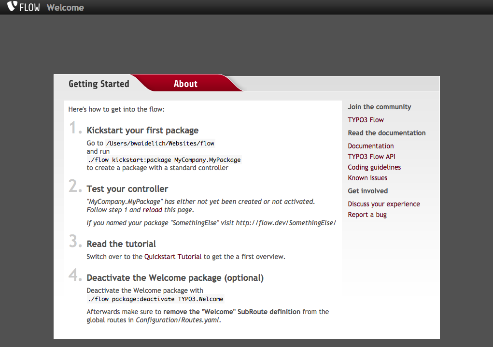
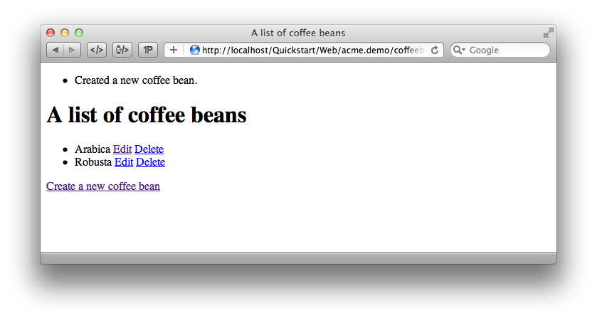

Quickstart
==========

.. sectionauthor:: Robert Lemke <robert@typo3.org>

What Is in This Guide?
----------------------

This guided tour gets you started with TYPO3 Flow by giving step-by-step instructions for the
development of a small sample application. It will give you a first overview of the basic
concepts and leaves the details to the full manual and more specific guides.

Be warned that your head will be buzzed with several new concepts. But after you made your
way through the whitewater you'll surely ride the wave in no time!

What Is TYPO3 Flow?
-------------------

TYPO3 Flow is a PHP-based application framework which is especially well-suited for
enterprise-grade applications. Its architecture and conventions keep your head clear and
let you focus on the essential parts of your application. Although stability, security and
performance are all important elements of the framework's design, the fluent user
experience is the one underlying theme which rules them all.

As a matter of fact, TYPO3 Flow is easier to learn for PHP beginners than for veterans. It
takes a while to leave behind old paradigms and open up for new approaches. That being
said, developing with TYPO3 Flow is very intuitive and the basic principles can be learned
within a few hours. Even if you don't decide to use TYPO3 Flow for your next project, there are
a lot of universal development techniques you can learn.

.. tip::

	This tutorial goes best with a Caffè Latte or, if it's afternoon or late night
	already, with a few shots of Espresso ...

Installing TYPO3 Flow
---------------------

Setting up TYPO3 Flow is pretty straight-forward. As a minimum requirement you will need:

* A web server (we recommend Apache with the *mod_rewrite* module enabled)
* PHP 5.5.0 or later
* A database supported by Doctrine DBAL, such as MySQL
* Command line access

Install Composer by following the `installation instructions <http://getcomposer.org/download/>`_
which boils down to this in the simplest case::

 curl -s https://getcomposer.org/installer | php

.. note::
	Feel free to install the composer command to a global location, by moving
	the phar archive to e.g. */usr/local/bin/composer* and making it executable.
	The following documentation assumes ``composer`` is installed globally.

.. tip::
	Running ``composer selfupdate`` from time to time keeps it up to date
	and can prevent errors caused by composer not understanding e.g. new
	syntax in manifest files.

Then use Composer in a directory which will be accessible by your web server to download
and install all packages of the TYPO3 Flow Base Distribution. The following command will
clone the latest version, include development dependencies and keep git metadata for future use::

 composer create-project --dev --keep-vcs typo3/flow-base-distribution Quickstart

You will end up with a directory structure like this:

.. code-block:: none

  htdocs/               <-- depending on your web server
    Quickstart/
      Build/
      Configuration/
        Settings.yaml.example
        ...
      Packages/
        Framework/
          TYPO3.Flow/
          ...
      Web/              <-- your virtual host root will point to this
        .htaccess
        index.php
      flow
      flow.bat

Setting File Permissions
------------------------

You will access TYPO3 Flow from both, the command line and the web browser. In order to provide
write access to certain directories for both, you will need to set the file permissions
accordingly. But don't worry, this is simply done by changing to the TYPO3 Flow base directory
(``Quickstart`` in the above example) and calling the following command:

*command line*::

	./flow core:setfilepermissions john www-data www-data

Please replace *john* by your own username. The second argument is supposed to be the
username of your web server and the last one specifies the web server's group. For most
installations on Mac OS X this would be both *_www* instead of *www-data*.

It can and usually will happen that TYPO3 Flow is launched from the command line by a different
user. All users who plan using TYPO3 Flow from the command line need to join the web server's
group. On a Linux machine this can be done by typing:

*command line*::

	sudo usermod -a -G _www john

On a Mac you can add a user to the web group with the following command:

*command line*::

	sudo dscl . -append /Groups/_www GroupMembership johndoe

You will have to exit your shell / terminal window and open it again for the
new group membership to take effect.

.. note::

	Setting file permissions is not necessary and not possible on Windows machines.
	For Apache to be able to create symlinks, you need to use Windows Vista (or
	newer) and Apache needs to be started with Administrator privileges.

Setting up a virtual host
-------------------------

It is very much recommended to create a virtual host configuration for Apache
that uses the *Web* folder as the document root. This has a number of reasons:

* it makes for nicer URLs
* it is **more secure** because that way access to anything else through the
  web is not possible

The latter point is really important!

For the rest of this tutorial we assume you have created a virtual host
that can be reached through ``http://quickstart/``.

Testing the Installation
------------------------

	The TYPO3 Flow Welcome Screen

If your system is configured correctly you should now be able to access the Welcome
screen:

.. code-block:: text

	http://quickstart/

If you did not follow our advice to create a virtual host, point your browser to the
``Web`` directory of your TYPO3 Flow installation throughout this tutorial, for example:

.. code-block:: text

	http://localhost/Quickstart/Web/

The result should look similar to the screen you see in the screenshot. If something went
wrong, it usually can be blamed on a misconfigured web server or insufficient file
permissions.

.. note::

	If all you get is a 404, you might need to edit the ``.htaccess`` file in the
	``Web`` folder to adjust the ``RewriteBase`` directive as needed.

.. note::

	Depending on your environment (especially on Windows systems) you might need to set the
	path to the PHP binary in ``Configuration/Settings.yaml``. If you copied the provided
	example Settings you only need to uncomment the corresponding lines and adjust the path.

.. tip::

	There are some friendly ghosts in our `IRC channel`_ and in the `users mailing list`_
	– they will gladly help you out if you describe your problem as precisely as possible.

.. rubric:: Some Note About Speed

The first request will usually take quite a while because TYPO3 Flow does a lot of heavy
lifting in the background. It analyzes code, builds up reflection caches and applies
security rules. During all the following examples you will work in the so called
*Development Context*. It makes development very convenient but feels a lot slower than
the *Production Context* – the one you will obviously use for the application in
production.

Kickstarting a Package
----------------------

The actual code of an application and its resources – such as images, style sheets and
templates – are bundled into *packages*. Each package is identified by a globally unique
package key, which consists of your company or domain name (the so called *vendor name*)
and further parts you choose for naming the package.

Let's create a *Demo* package for our fictive company *Acme*:

.. code-block:: none

	$ ./flow kickstart:package Acme.Demo
	Created .../Acme.Demo/Classes/Acme/Demo/Controller/StandardController.php
	Created .../Acme.Demo/Resources/Private/Templates/Standard/Index.html

The Kickstarter will create a new package directory in *Packages/Application/* resulting
in the following structure:

.. code-block:: text

	Packages/
	  Application/
	    Acme.Demo/
	      Classes/Acme/Demo/
	      Configuration/
	      Documentation/
	      Meta/
	      Resources/
	      Tests/

The :command:`kickstart:package` command also generates a sample controller which displays
some content. You should be able to access it through the following URL:

.. code-block:: text

	http://quickstart/Acme.Demo

.. tip::

	In case your web server lacks mod_rewrite, it could be that you need to call this to access
	the controller:

	.. code-block:: text

		http://quickstart/index.php/Acme.Demo

	If this the case, keep in mind to add ``index.php`` to the following URLs in this
	Quickstart tutorial.

Hello World
-----------

Let's use the *StandardController* for some more experiments. After opening the respective
class file in *Packages/Application/Acme.Demo/Classes/Acme/Demo/Controller/* you should find the
method *indexAction()* which is responsible for the output you've just seen in your web
browser::

	/**
	 * Index action
	 *
	 * @return void
	 */
	public function indexAction() {
		$this->view->assign('foos', array(
			'bar', 'baz'
		));
	}

Accepting some kind of user input is essential for most applications and TYPO3 Flow does a
great deal of processing and sanitizing any incoming data. Try it out – create a new
action method like this one::

	/**
	 * Hello action
	 *
	 * @param string $name Your name
	 * @return string The hello
	 */
	public function helloAction($name) {
		return 'Hello ' . $name . '!';
	}

.. important::

	For the sake of simplicity the above example does not contain any input/output sanitation.
	If your controller action directly returns something, make sure to filter the data!

.. tip::

	You should always properly document all your functions and class properties. This
	will not only help other developers to understand your code, but is also essential for
	TYPO3 Flow to work properly.

Now test the new action by passing it a name like in the following URL:

.. code-block:: text

	http://quickstart/Acme.Demo/Standard/hello?name=Robert

The path segments of this URL tell TYPO3 Flow to which controller and action the web request
should be dispatched to. In our example the parts are:

* *Acme.Demo* (package key)
* *Standard* (controller name)
* *hello* (action name)

If everything went fine, you should be greeted by a friendly "`Hello John!`" – if that's
the name you passed to the action. Also try leaving out the *name* parameter in the URL –
TYPO3 Flow will complain about a missing argument.

Database Setup
--------------

One important design goal for TYPO3 Flow was to let a developer focus on the business logic and
work in a truly object-oriented fashion. While you develop a TYPO3 Flow application, you will
hardly note that content is actually stored in a database. Your code won't contain any
SQL query and you don't have to deal with setting up table structures.

But before you can store anything, you still need to set up a database and tell TYPO3 Flow how
to access it. The credentials and driver options need to be specified in the global
TYPO3 Flow settings.

After you have created an empty database and set up a user with sufficient access
rights, copy the file *Configuration/Settings.yaml.example* to
*Configuration/Settings.yaml*. Open and adjust the file to your needs – for a common MySQL
setup, it would look similar to this:

.. code-block:: yaml

	TYPO3:
	  Flow:
	    persistence:
	      backendOptions:
	        driver: 'pdo_mysql'
	        dbname: 'quickstart' # adjust to your database name
	        user: 'root'         # adjust to your database user
	        password: 'password' # adjust to your database password
	        host: '127.0.0.1'    # adjust to your database host

.. note::

	If you are not familiar with the `YAML` format yet, there are two things you should
	know at least:

	* Indentation has a meaning: by different levels of indentation, a structure is
	  defined.
	* Spaces, not tabs: you must indent with exactly 2 spaces per level, don't use tabs.

If you configured everything correctly, the following command will create the initial
table structure needed by TYPO3 Flow:

.. code-block:: bash

	$ ./flow doctrine:migrate
	Migrating up to 2011xxxxx00 from 0

	++ migrating 2011xxxxx00
		-> CREATE TABLE flow_resource_resourcepointer (hash VARCHAR(255) NOT NULL, PRIMARY
		-> CREATE TABLE flow_resource_resource (persistence_object_identifier VARCHAR(40)
	...
	++ finished in 0.76

Storing Objects
---------------

Let's take a shortcut here – instead of programming your own controller, model and view
just generate some example with the kickstarter:

.. code-block:: bash

	$ ./flow kickstart:actioncontroller --generate-actions --generate-related Acme.Demo CoffeeBean
	Created .../Acme.Demo/Classes/Acme/Demo/Domain/Model/CoffeeBean.php
	Created .../Acme.Demo/Classes/Acme/Demo/Domain/Repository/CoffeeBeanRepository.php
	Created .../Acme.Demo/Classes/Acme/Demo/Controller/CoffeeBeanController.php
	Created .../Acme.Demo/Resources/Private/Layouts/Default.html
	Created .../Acme.Demo/Resources/Private/Templates/CoffeeBean/Index.html
	Created .../Acme.Demo/Resources/Private/Templates/CoffeeBean/New.html
	Created .../Acme.Demo/Resources/Private/Templates/CoffeeBean/Edit.html
	Created .../Acme.Demo/Resources/Private/Templates/CoffeeBean/Show.html

Whenever a model is created or modified, the database structure needs to be adjusted to
fit the new PHP code. This is something you should do consciously because existing data
could be altered or removed – therefore this step isn't taken automatically by TYPO3 Flow.

The kickstarter created a new model representing a coffee bean. For promoting the new
structure to the database, just run the :command:`doctrine:update` command:

.. code-block:: bash

	$ ./flow doctrine:update
	Executed a database schema update.

.. tip::

	In a real project you should avoid the :command:`doctrine:update` command and instead
	work with migrations. See the "Persistence" section of the
	:doc:`The Definitive Guide <../TheDefinitiveGuide/Index>` for more details

A quick glance at the table structure (using your preferred database management tool) will
reveal that a new table for coffee beans has been created.

The controller rendered by the kickstarter provides some very basic functionality for
creating, editing and deleting coffee beans. Try it out by accessing this URL:

.. code-block:: text

	http://quickstart/Acme.Demo/CoffeeBean

Create a few coffee beans, edit and delete them and take a look at the database tables
if you can't resist ...

	List and create coffee beans

A Closer Look at the Example
----------------------------

In case you have been programming PHP for a while, you might be used to tackle many
low-level tasks yourself: Rendering HTML forms, retrieving and validating input from the
superglobals ``$_GET``, ``$_POST`` and ``$_FILES``, validating the input, creating SQL
queries for storing the input in the database, checking for Cross-Site Scripting,
Cross-Site Request Forgery, SQL-Injection and much more.

With this background, the following complete code listing powering the previous example
may seem a bit odd, if not magical to you. Take a close look at each of the methods –
can you imagine what they do? ::

	/**
	 * CoffeeBean controller for the Acme.Demo package
	 */
	class CoffeeBeanController extends ActionController {

		/**
		 * @Flow\Inject
		 * @var \Acme\Demo\Domain\Repository\CoffeeBeanRepository
		 */
		protected $coffeeBeanRepository;

		/**
		 * Shows a list of coffee beans
		 */
		public function indexAction() {
			$this->view->assign('coffeeBeans', $this->coffeeBeanRepository->findAll());
		}

		/**
		 * Shows a single coffee bean object
		 *
		 * @param \Acme\Demo\Domain\Model\CoffeeBean $coffeeBean The coffee bean to show
		 */
		public function showAction(CoffeeBean $coffeeBean) {
			$this->view->assign('coffeeBean', $coffeeBean);
		}

		/**
		 * Shows a form for creating a new coffee bean object
		 */
		public function newAction() {
		}

		/**
		 * Adds the given new coffee bean object to the coffee bean repository
		 *
		 * @param \Acme\Demo\Domain\Model\CoffeeBean $coffeeBean A new coffee bean to add
		 */
		public function createAction(CoffeeBean $newCoffeeBean) {
			$this->coffeeBeanRepository->add($newCoffeeBean);
			$this->addFlashMessage('Created a new coffee bean.');
			$this->redirect('index');
		}

		/**
		 * Shows a form for editing an existing coffee bean object
		 *
		 * @param \Acme\Demo\Domain\Model\CoffeeBean $coffeeBean The coffee bean to edit
		 */
		public function editAction(CoffeeBean $coffeeBean) {
			$this->view->assign('coffeeBean', $coffeeBean);
		}

		/**
		 * Updates the given coffee bean object
		 *
		 * @param \Acme\Demo\Domain\Model\CoffeeBean $coffeeBean The coffee bean to update
		 */
		public function updateAction(CoffeeBean $coffeeBean) {
			$this->coffeeBeanRepository->update($coffeeBean);
			$this->addFlashMessage('Updated the coffee bean.');
			$this->redirect('index');
		}

		/**
		 * Removes the given coffee bean object from the coffee bean repository
		 *
		 * @param \Acme\Demo\Domain\Model\CoffeeBean $coffeeBean The coffee bean to delete
		 */
		public function deleteAction(CoffeeBean $coffeeBean) {
			$this->coffeeBeanRepository->remove($coffeeBean);
			$this->addFlashMessage('Deleted a coffee bean.');
			$this->redirect('index');
		}
	}

You will learn all the nitty-gritty details of persistence (that is storing and
retrieving objects in a database), Model-View Controller and validation in
:doc:`The Definitive Guide <../TheDefinitiveGuide/Index>`. With some hints
for each of the actions of this controller though, you'll get some first impression of
how basic operations like creating or deleting objects are handled in TYPO3 Flow.

Without further ado let's take a closer look at some of the actions:

indexAction
~~~~~~~~~~~

The ``indexAction`` displays a list of coffee beans. All it does is fetching
all existing coffee beans from a *repository* and then handing them over to the template
for rendering.

The ``CoffeeBeanRepository`` takes care of storing and finding stored coffee beans. The
simplest operation it provides is the ``findAll()`` method which returns a list of all
existing ``CoffeeBean`` objects.

For consistency reasons only one instance of the ``CoffeeBeanRepository`` class may
exist at a time. Otherwise there would be multiple repositories storing ``CoffeeBean``
objects – and which one would you then ask for retrieving a specific coffee bean back from
the database? The ``CoffeeBeanRepository`` is therefore tagged with an *annotation*
stating that only a single instance may exist at a time::

	/**
	 * A repository for CoffeeBeans
	 *
	 * @Flow\Scope("singleton")
	 */
	class CoffeeBeanRepository extends \TYPO3\Flow\Persistence\Repository {

Because PHP doesn't support the concept of annotations natively, we are using doc
comments which are parsed by an annotation parser in TYPO3 Flow.

TYPO3 Flow's object management detects the ``Scope`` annotation and takes care of
all the details. All you need to do in order to get the right ``CoffeeBeanRepository``
instance is telling TYPO3 Flow to *inject* it into a class property you defined::

	/**
	 * @Flow\Inject
	 * @var \Acme\Demo\Domain\Repository\CoffeeBeanRepository
	 */
	protected $coffeeBeanRepository;

The ``Inject`` annotation tells TYPO3 Flow to set the ``$coffeeBeanRepository`` right
after the ``CoffeeBeanController`` class has been instantiated.

.. tip::

	This feature is called *Dependency Injection* and is an important feature of TYPO3 Flow.
	Although it is blindingly easy to use, you'll want to read some more about it later
	in the :doc:`related section <../TheDefinitiveGuide/PartIII/ObjectManagement>` of
	the main manual.

TYPO3 Flow adheres to the Model-View-Controller pattern – that's why the actual output is not
generated by the action method itself. This task is delegated to the *view*, and that is,
by default, a *Fluid* template (Fluid is the name of the templating engine TYPO3 Flow uses).
Following the conventions, there should be a directory structure in the
:file:`Resources/Private/Templates/` folder of a package which corresponds to the
controllers and actions. For the ``index`` action of the ``CoffeeBeanController`` the
template :file:`Resources/Private/Templates/CoffeeBean/Index.html` will be used for
rendering.

Templates can display content which has been assigned to *template variables*. The
placeholder ``{name}`` will be replaced by the actual value of the template variable
``name`` once the template is rendered. Likewise ``{coffeeBean.name}`` is substituted
by the value of the coffee bean's ``name`` attribute.

The coffee beans retrieved from the repository are assigned to the template variable
``coffeeBeans``. The template in turn uses a for-each loop for rendering a list of coffee
beans:

.. code-block:: html

	<ul>
		<f:for each="{coffeeBeans}" as="coffeeBean">
			<li>
				{coffeeBean.name}
			</li>
		</f:for>
	</ul>

showAction
~~~~~~~~~~

The ``showAction`` displays a single coffee bean::

	/**
	 * Shows a single coffee bean object
	 *
	 * @param \Acme\Demo\Domain\Model\CoffeeBean $coffeeBean The coffee bean to show
	 */
	public function showAction(CoffeeBean $coffeeBean) {
		$this->view->assign('coffeeBean', $coffeeBean);
	}

The corresponding template for this action is stored in this file:

.. code-block:: text

	Acme.Demo/Resources/Private/Templates/CoffeeBean/Show.html`

This template produces a simple representation of the ``coffeeBean`` object.
Similar to the ``indexAction`` the coffee bean object is assigned to a Fluid variable::

	$this->view->assign('coffeeBean', $coffeeBean);

The ``showAction`` method requires a ``CoffeeBean`` object as its method argument.
But we need to look into the template of the ``indexAction`` again to understand how
coffee beans are actually passed to the ``showAction``.

In the list of coffee beans, rendered by the ``indexAction``, each entry links to the
corresponding ``showAction``. The links are rendered by a so-called *view helper* in the
Fluid template :file:`Index.html`:

.. code-block:: html

	<f:link.action action="show" arguments="{coffeeBean: coffeeBean}">…</f:link.action>

The interesting part is the ``{coffeeBean: coffeeBean}`` argument assignment:
It makes sure that the ``CoffeeBean`` object, stored in the ``coffeeBean``
template variable, will be passed to the ``showAction`` through a GET parameter.

Of course you cannot just put a PHP object like the coffee bean into a URL. That's why
the view helper will render an address like the following:

.. code-block:: text

	http://quickstart/acme.demo/coffeebean/show?
		coffeeBean%5B__identity%5D=910c2440-ea61-49a2-a68c-ee108a6ee429

Instead of the real PHP object, its *Universally Unique Identifier* (UUID) was included as
a GET parameter.

.. note::

	That certainly is not a beautiful URL for a coffee bean – but you'll learn how to
	create nice ones in the main manual.

Before the ``showAction`` method is actually called, TYPO3 Flow will analyze the GET and POST
parameters of the incoming HTTP request and convert identifiers into real objects
again. By its UUID the coffee bean is retrieved from the ``CoffeeBeanRepository`` and
eventually passed to the action method::

	public function showAction(CoffeeBean $coffeeBean) {

newAction
~~~~~~~~~

The ``newAction`` contains no PHP code – all it does is displaying the corresponding
Fluid template which renders a form.

createAction
~~~~~~~~~~~~

The ``createAction`` is called when a form displayed by the ``newAction`` is submitted.
Like the ``showAction`` it expects a ``CoffeeBean`` as its argument::

	/**
	 * Adds the given new coffee bean object to the coffee bean repository
	 *
	 * @param \Acme\Demo\Domain\Model\CoffeeBean $coffeeBean A new coffee bean to add
	 */
	public function createAction(CoffeeBean $newCoffeeBean) {
		$this->coffeeBeanRepository->add($newCoffeeBean);
		$this->addFlashMessage('Created a new coffee bean.');
		$this->redirect('index');
	}

This time the argument contains not an existing coffee bean but a new one. TYPO3 Flow knows
that the expected type is ``CoffeeBean`` (by the type hint in the method and the comment)
and thus tries to convert the POST data sent by the form into a new ``CoffeeBean`` object.
All you need to do is adding it to the Coffee Bean Repository.

editAction
~~~~~~~~~~~~

The purpose of the ``editAction`` is to render a form pretty much like that one shown by
the ``newAction``. But instead of empty fields, this form contains all the data from an
existing coffee bean, including a hidden field with the coffee bean's UUID.

The edit template uses Fluid's form view helper for rendering the form. The important bit
for the edit form is the form object assignment:

.. code-block:: html

	<f:form action="update" object="{coffeeBean}" name="coffeeBean">
		...
	</f:form>

The ``object="{coffeeBean}"`` attribute assignment tells the view helper to use the
``coffeeBean`` template variable as its subject. The individual form elements, such
as the text box, can now refer to the coffee bean object properties:

.. code-block:: html

	<f:form.textbox property="name" id="name" />

On submitting the form, the user will be redirected to the ``updateAction``.

updateAction
~~~~~~~~~~~~

The ``updateAction`` receives the modified coffee bean through its ``$coffeeBean``
argument::

	/**
	 * Updates the given coffee bean object
	 *
	 * @param \Acme\Demo\Domain\Model\CoffeeBean $coffeeBean The coffee bean to update
	 */
	public function updateAction(CoffeeBean $coffeeBean) {
		$this->coffeeBeanRepository->update($coffeeBean);
		$this->addFlashMessage('Updated the coffee bean.');
		$this->redirect('index');
	}

Although this method looks quite similar to the ``showAction``, there is an important
difference you should be aware of: The parameter passed to the ``showAction``
is an already existing (that is, already *persisted*) coffee bean object with the
modifications submitted by the user already applied.

Any modifications to the ``CoffeBean`` object will be lost at the end of the request
unless you tell TYPO3 Flow explicitly to apply the changes::

	$this->coffeeBeanRepository->update($coffeeBean);

This allows for a very efficient dirty checking and is a safety measure - as it leaves
control over the changes in your hands.

Speaking about safety measures: it's important to know that Flow supports the notion
of "safe request methods". According to the HTTP 1.1 specification, GET and HEAD
requests should not modify data on the sever side. Since we consider this a good
principle, Flow will not persist any changes automatically if the request method
is "safe". So ... don't use regular links for deleting your coffee beans - send
a POST or DELETE request instead.

Next Steps
----------

Congratulations! You already learned the most important concepts of TYPO3 Flow development.

Certainly this tutorial will have raised more questions than it answered. Some of
these concepts – and many more you will learn – take some time to get used to.
The best advice I can give you is to expect things to be rather simple and
not look out for the complicated solution (you know, the *not to see the wood for
the trees* thing ...).

Next you should experiment a bit with TYPO3 Flow on your own. After you've collected
even more questions, I suggest reading the
:doc:`Getting Started Tutorial <../TheDefinitiveGuide/PartII/Index>`.

At the time of this writing, The Definitive Guide is not yet complete and still
contains a few rough parts. Also the Getting Started Tutorial needs some love
and restructuring. Still, it already may be a valuable source for further
information and I recommend reading it.

Get in touch with the growing TYPO3 Flow community and make sure to share your ideas
about how we can improve TYPO3 Flow and its documentation:

* `IRC channel`_
* `users mailing list`_

I am sure that, if you’re a passionate developer, you will love TYPO3 Flow – because it was
made with you, the developer, in mind.

Happy Flow Experience!

*Robert on behalf of the TYPO3 Flow team*

.. _TYPO3 Flow Base Distribution: http://flow.typo3.org/download
.. _IRC channel:             http://flow.typo3.org/support
.. _users mailing list:      http://flow.typo3.org/support
