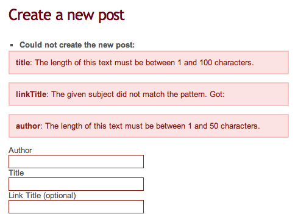
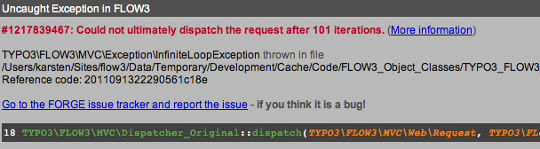

==========
Validation
==========

.. sectionauthor:: Robert Lemke <robert@typo3.org>

Hopefully the examples of the previous chapters made you shudder or at least
raised some questions. Although it's surely nice to have one-liners for actions
like ``create`` and ``update`` we need some more code to validate the incoming
values before they are eventually persisted. You need to make sure  that a post
title only consists of regular characters and spaces, at least 3 and at maximum
50 (depending on your preference) and doesn't contain any HTML or other
evil markup.

But do you really want all these checks in your action methods? Shouldn't we
rather separate the concerns [#]_ of the action methods (show, create,
update, ...) from others like validation, logging and security?

Fortunately TYPO3 Flow's validation framework doesn't ask you to add any additional
PHP code to your action methods. Validation has been extracted as a separated
concern which does it's job almost transparently to the developer.

Declaring Validation Rules
==========================

When we're talking about validation, we usually refer to validating **models**.
The rules defining how a model should be validated can be classified into
three types:

-	**Base Properties** – a set of rules defining the minimum requirements
	on the properties of a model which must be met before a model may
	be persisted.
-	**Base Model** – a set of rules or custom validator enforcing the
	minimum requirements on the combination of properties of a model which
	must be met before a model may be persisted.
-	**Supplemental** – a set of rules defining additional requirements on
	a model for a specific situation, for example for a certain
	action method.

.. note::
	Base model and supplemental rules are not covered by this tutorial.

Rules for the base properties are defined directly in the model in form
of annotations:

*Classes/TYPO3/Blog/Domain/Model/Post.php*:

.. code-block:: php

	/**
	 * @var string
	 * @Flow\Validate(type="NotEmpty")
	 * @Flow\Validate(type="StringLength", options={ "minimum"=5, "maximum"=100 })
	 */
	protected $title;

	...

	/**
	 * @var string
	 * @Flow\Validate(type="NotEmpty")
	 * @Flow\Validate(type="StringLength", options={ "minimum"=2, "maximum"=50 })
	 */
	protected $author;

The ``Validate`` annotations define one or more validation rules which should apply to a
property. Multiple rules can be defined in dedicated lines by further ``Validate``
annotations.

.. note::
	Per convention, every validator allows (passes) empty values, i.e. empty strings or
	NULL values. This is for achieving fields which are not mandatory, but if filled in,
	must satisfy a given validation. Consider an email address field for example which
	is not mandatory, but has to match an email pattern as soon as filled in.

	If you want to make a field mandatory at all, use the ``NotEmpty`` validator in addition,
	like in the example above.

	The technical background is the ``acceptsEmptyValues`` property of the AbstractValidator,
	being ``TRUE`` per default. When writing customized validators, it's basically possible
	to set this field to ``FALSE``, however this is not generally recommended due to the convention
	that every validator could principally be empty.

.. tip::
	TYPO3 Flow provides a range of built-in validators which can be found in the
	*Flow\Validation\Validator* sub package. The names used in the
	``type`` attributes are just the unqualified class names of these validators.

	It is possible and very simple to program custom validators by implementing
	the ``TYPO3\Flow\Validation\Validator\ValidatorInterface``.
	Such validators must, however, be referred to by their fully qualified
	class name (i.e. including the namespace).

Make sure the above validation rules are set in your ``Post`` model, click on the
plus sign above the list of posts and submit the empty form. If all went fine,
you should end up again in the **new post** form, with the tiny difference
that the text boxes for title and author are now framed in red:

.. figure:: Images/CreateNewPostValidationError1.png
	:alt: Validation errors shown in form
	:class: screenshot-detail

	Validation errors shown in form

Displaying Validation Errors
============================

The validation rules seem to be in effect but the output could be a bit more
meaningful. Please open the *New.html* template file again because we'd like
to display a list of error messages for exactly this case when the form has
been submitted but contained errors.

Fluid comes with a specialized view helper which allows for iterating over
validation errors. Just add the ``<f:form.errors>`` view helper to your
*New.html* template as shown in this example:

*Resources/Private/Templates/Post/New.html*:

.. code-block:: xml

	<f:layout name="Default" />

	<f:section name="mainbox">
		<h2 class="flow-firstHeader">Create a new post</h2>
		<f:flashMessages class="flashmessages"/>
		<f:form.validationResults for="newPost">
			<f:if condition="{validationResults.flattenedErrors}">
				

					<dl>
						<f:for each="{validationResults.flattenedErrors}" key="propertyPath" as="errors">
							<dt>{propertyPath}</dt>
							<dd>
								<ul>
									<f:for each="{errors}" as="error">
										<li>{error -> f:translate(id: error.code, arguments: error.arguments, package: 'TYPO3.Flow', source: 'ValidationErrors')}</li>
									</f:for>
								</ul>
							</dd>
						</f:for>
					</dl>
				

			</f:if>
		</f:form.validationResults>

	...

Similar to the ``<f:for>`` view helper ``<f:form.errors>`` defines a loop
iterating over validation errors. The attribute ``as`` is optional and if it's
not specified (like in the above example) ``as="error"`` is assumed.

To clearly understand this addition to the template you need to know that
errors can be nested: There is a global error object containing the errors of
the different domain objects (such as ``newPost``) which contain errors for
each property which in turn can be multiple errors per property.

After saving the modified template and submitting the empty form again you
should see some more verbose error messages:

	More verbose validation errors shown in form

Validating Updated Arguments
============================

Now that you know how validation errors can be displayed, you should add a
``<f:form.errors>`` view helper to the *Edit.html* template as well:

*Resources/Private/Templates/Post/Edit.html*:

.. code-block:: xml

	<f:layout name="Default" />

	<f:section name="mainbox">
		<h2 class="flow-firstHeader">Edit post &quot;{post.title}&quot;</h2>
		<f:flashMessages class="flashmessages"/>
		<f:form.validationResults for="post">
			<f:if condition="{validationResults.flattenedErrors}">
				

					<f:for each="{validationResults.flattenedErrors}" key="propertyPath" as="errors">{propertyPath}: <f:for each="{errors}" as="error">{error}</f:for></f:for>
				

			</f:if>
		</f:form.validationResults>

	...

Try updating a post with an empty title and you should see the following:

	Infinite loop in update action

Can you imagine what happened? Let's look at the ``editAction`` again:

*Classes/TYPO3/Blog/Controller/PostController.php*:

.. code-block:: php

	/**
	 * Shows a form for editing an existing post object
	 *
	 * @param \TYPO3\Blog\Domain\Model\Post $post The post to edit
	 * @return void
	 */
	public function editAction(Post $post) {
		$blog = $this->blogRepository->findActive();
		$this->view->assign('blog', $blog);
		$this->view->assign('post', $post);
	}

When you started to edit the post, the ``editAction`` received the original
``Post`` object as its argument. The object was assigned to the Fluid template
which displayed its current property values. Now you submitted the form with an
empty title resulting in a new request, this time with the ``updateAction`` as
its target.

Before the ``updateAction`` could be called, TYPO3 Flow analyzed the
incoming request. And because it recognized one argument as a ``Post`` object,
it invoked the respective validation rules – which failed due to the
empty title. In these cases TYPO3 Flow forwards the request to the referring action
which is, in this case, the ``editAction``.

The ``editAction`` expects a (valid) post as its argument but unfortunately the
post is not valid. Because for TYPO3 Flow this action call is like any other action
call it does not execute the ``editAction`` but instead tries to dispatch the
request to another action which can handle the error. This is, unfortunately,
still the ``editAction`` which in the end results in an infinite loop.

So the problem is that TYPO3 Flow tries to validate the ``$post`` argument for the
``editAction`` although we don't need a valid post at this point. What's
important is that the post submitted to``updateAction`` or ``createAction`` is
valid, but we don't really care about the ``editAction`` or ``newAction`` which
only displays the form.

There's a very simple remedy to this problem: don't validate the post. With one
additional annotation the whole mechanism works as expected:

*Classes/TYPO3/Blog/Controller/PostController.php*:

.. code-block:: php

	/**
	 * Shows a form for editing an existing post object
	 *
	 * @param \TYPO3\Blog\Domain\Model\Post $post The post to edit
	 * @Flow\IgnoreValidation("$post")
	 * @return void
	 */
	public function editAction(Post $post) {
		$blog = $this->blogRepository->findActive();
		$this->view->assign('blog', $blog);
		$this->view->assign('post', $post);
	}

Now the ``editAction`` can be called even though ``$post`` is not valid and the
error message is displayed above the edit form.

-----

.. [#]	See also: `Separation of Concerns (Wikipedia)
		<http://en.wikipedia.org/wiki/Separation_of_concerns>`_
