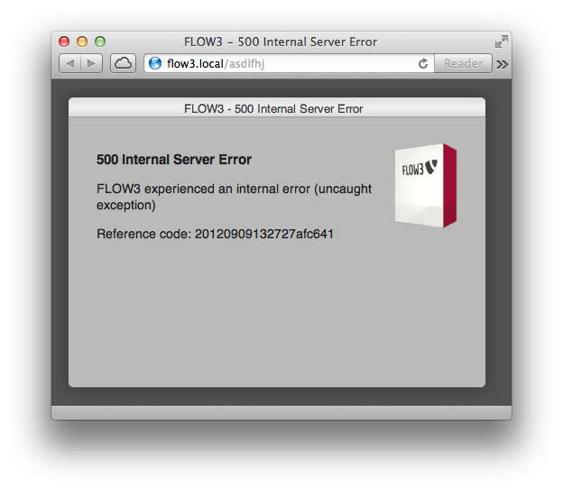

Error and Exception Handling
============================

TYPO3 Flow reports applications errors by throwing specific exceptions. Exceptions are
structured in a hierarchy which is based on base exception classes for each
component. By default, PHP catchable errors, warnings and notices are automatically
converted into exceptions in order to simplify the error handling.

In case an exception cannot be handled by the application, a central exception
handler takes over to display or log the error and shut down the application
gracefully.

Throwing Exceptions
-------------------

Applications should throw exceptions which are based on one of the exception classes
provided by TYPO3 Flow. Each exception should be identified by a unique error code which
is, by convention, the unix timestamp of the point in time when the developer
implemented the code throwing the exception::

	if ($somethingWentReallyWrong) {
		throw new SomethingWentWrongException('An exception message', 1347145643);
	}

Exceptions can contain an HTTP status code which is sent as a corresponding response
header. The status code is simply set by defining a property with the respective
value assigned::

	class SomethingWasNotFoundException extends \TYPO3\Flow\Exception {

		/**
   	 * @var integer
   	 */
   	protected $statusCode = 404;

	}

Exception Handlers
------------------

TYPO3 Flow comes with two different exception handlers:

* the ``DebugExceptionHandler`` displays a big amount of background information,
  including a call stack, in order to simplify debugging of the exception cause.
  The output might contain sensitive data because method arguments are displayed
  in the backtrace.

* the ``ProductionExceptionHandler`` displays a neutral message stating that an
  error occurred. Apart from a reference code no information about the nature of
  the exception or any parameters is disclosed.

By default, the ``DebugExceptionHandler`` is used in Development context and the
``ProductionExceptionHandler`` is in charge in the Production context.

The exception handler to be used can be configured through an entry in Settings.yaml:

.. code-block:: yaml

	TYPO3:
	  Flow:
	    error:
	      exceptionHandler:
	        # Defines the global, last-resort exception handler.
	        # The specified class must implement \TYPO3\Flow\Error\ExceptionHandlerInterface
	        className: TYPO3\Flow\Error\ProductionExceptionHandler

Reference Code
--------------

In a production context, the exception handler should, for security reasons, not
reveal any information about the inner workings and data of the application. In
order to be able to track down the root of the problem, TYPO3 Flow generates a unique
reference code when an exception is thrown. It is safe to display this reference
code to the user who can, in turn, contact the administrators of the application
to report the error. At the server side, detailed information about the exception
is stored in a file named after the reference code.

You will find report files for exceptions thrown in ``Data/Logs/Exceptions/``. In
some rare cases though, when TYPO3 Flow is not even able to write the respective log
file, no details about the exception can be provided.

	Exception screen with reference code

Error Handler
-------------

TYPO3 Flow provides a central error handler which jumps in if a PHP error, warning or
notice occurs. Instead of displaying or logging the error right away, it is
transformed into an ``ErrorException``.

A configuration option in Settings.yaml allows for deciding which error levels
should be converted into exceptions. All other errors are silently ignored:

.. code-block:: yaml

	TYPO3:
	  Flow:
	    error:
	      errorHandler:
	        # Defines which errors should result in an exception thrown - all other error
	        # levels will be silently ignored. Only errors that can be handled in an
	        # user-defined error handler are affected, of course.
	        exceptionalErrors: [%E_USER_ERROR%, %E_RECOVERABLE_ERROR%]

Custom Error Views
------------------

In order to allow customized, specifically looking error templates; even depending on the
nature of an error; Flow provides configurable rendering groups. Each such rendering group
holds information about what template to use, what text information should be provided,
and finally, what HTTP status codes or what Exception class names each rendering group is
responsible for.

An example configuration could look like in the following Settings.yaml excerpt:

.. code-block:: yaml

	TYPO3:
	  Flow:
	    error:
	      exceptionHandler:
	        defaultRenderingOptions: []

	        renderingGroups:

	          notFoundExceptions:
	            matchingStatusCodes: [404]
	            options:
	              templatePathAndFilename: 'resource://TYPO3.Flow/Private/Templates/Error/Default.html'
	              variables:
	                errorDescription: 'Sorry, the page you requested was not found.'

	          databaseConnectionExceptions:
	            matchingExceptionClassNames: ['TYPO3\Flow\Persistence\Doctrine\DatabaseConnectionException']
	            options:
	              templatePathAndFilename: 'resource://TYPO3.Flow/Private/Templates/Error/Default.html'
	              variables:
	                errorDescription: 'Sorry, the database connection couldn''t be established.'

``defaultRenderingOptions``:
	this carries default options which can be overridden by the ``options`` key of a particular
	rendering group; see below.

``notFoundExceptions`` and ``databaseConnectionExceptions`` are freely chosen, descriptive
key names, their actual naming has no further implications.

``matchingStatusCodes``:
	an array of integer values what HTTP status codes the rendering group is for

``matchingExceptionClassNames``:
	an array of string values what Exception types the rendering group is for. Keep in mind that, as always
	the class name must not contain a leading slash, but must be fully qualified, of course.

``options``:

	``logException``:
		a boolean telling Flow to log the exception and write a backtrace file. This is
		on by default but switched off for exceptions with a 404 status code

	``renderTechnicalDetails``:
		a boolean passed to the error template during rendering and used in the default error
		template to include more details on the error at hand. Defaults to FALSE but is set to TRUE
		for development context.

	``templatePathAndFilename``:
		a resource string to the (Fluid) filename to use

	``layoutRootPath``:
		a resource string to the layout root path

	``partialRootPath``:
		a resource string to the partial root path

	``format``:
		the format to use, for example ``html`` or ``json``, if appropriate

	``variables``
		an array of additional, arbitrary variables which can be accessed in the template

The following variables will be assigned to the template an can be used there:

``exception``:
	the Exception object which was thrown

``renderingOptions``:
	the complete rendering options array, as defined in the settings. This is a merge
	of ``TYPO3.Flow.error.exceptionHandler.defaultRenderingOptions`` and the ``options``
	array of the particular rendering group

``statusCode``:
	the integer value of the HTTP status code which has been thrown (``404``, ``503`` etc.)

``statusMessage``:
	the HTTP status message equivalent,  for example ``Not Found``, ``Service Unavailable`` etc.
	If no matching status message could be found, this value is ``Unknown Status``.

``referenceCode``:
	the reference code of the exception, if applicable.