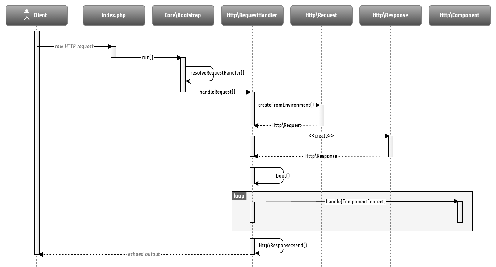

HTTP Foundation
===============

Most applications which are based on TYPO3 Flow are web applications. As the HTTP
protocol is the foundation of the World Wide Web, it also plays an important role in
the architecture of the TYPO3 Flow framework.

This chapter describes the mechanics behind TYPO3 Flow's request-response model, how it
relates to the Model View Controller framework and which API functions you can use
to deal with specific aspects of the HTTP request and response.

The HTTP 1.1 Specification
--------------------------

Although most people using or even developing for the web are aware of the fact that
the Hypertext Transfer Protocol is responsible for carrying data around, considerably
few of them have truly concerned themselves with the HTTP 1.1 specification.

The specification, `RFC 2616`_, has been published in 1999 already but it is
relevant today more than ever. If you've never fully read it, we recommend that you
do so. Although it is a long read, it is important to understand the intentions and
rules of the protocol before you can send cache headers or response codes in good
conscience, or even claim that you developed a true `REST`_ service.

Application Flow
----------------

The basic walk through a TYPO3 Flow-based web application is as follows:

* the browser sends an HTTP request to a webserver
* the webserver calls Web/index.php and passes control over to TYPO3 Flow
* the Bootstrap [#]_ initializes the bare minimum and passes control to a suitable
  request handler
* by default, the HTTP Request Handler [#]_ takes over and runs a boot sequence
  which initializes all important parts of TYPO3 Flow
* the HTTP Request Handler builds an HTTP Request and Response object. The Request
  object [#]_ contains all important properties of the real HTTP request. The
  Response object [#]_ in turn is empty and will be filled with information by a
  controller at a later point.
* the HTTP Request Handler invokes the Router [#]_ to determine which controller
  and action is responsible for processing the request. This information (controller
  name, action name, arguments) are returned in form of an Action Request [#]_
* the Dispatcher [#]_ tries to invoke the controller mentioned in the Action
  Request.
* the controller, usually an Action Controller [#]_, processes the request and
  modifies the given HTTP Response object which will, in the end, contain the
  content to display (body) as well as any headers to be passed back to the client.
* finally control reaches the HTTP Request Handler again which tries to make the
  HTTP Response standards compliant (if not already the case) and sends the response
  to the browser.

In practice, there are a few more intermediate steps being carried out, but in
essence, this is the path a request is taking.

	Simplified application flow

The next sections shed some light on the most important actors of this application
flow.

Request Handler
---------------

The request handler is responsible for taking a request and responding in a manner
the client understands. The default HTTP Request Handler routes requests to
controllers and their actions. Other request handlers may choose a completely
different way to handle requests. Although TYPO3 Flow also supports other types of
requests (most notably, from the comannd line interface), this chapter only deals
with HTTP requests.

TYPO3 Flow comes with a very slim bootstrap, which resulst in  few code being executed
before control is handed over to the request handler. This pays off in situations
where a specialized request handler is supposed to handle specific requests in a
very effective way. In fact, the request handler is responsible for executing big
parts of the initialization procedures and thus can optimize the boot process by
choosing only the parts it actually needs.

A request handler must implement the ``\TYPO3\Flow\Core\RequestHandlerInterface``
interface which, among others, contains the following methods::

	public function handleRequest();

	public function canHandleRequest();

	public function getPriority();

On trying to find a suitable request handler, the bootstrap asks each registered
request handler if it can handle the current request using ``canHandleRequest()``
– and if it can, how eager it is to do so through ``getPriority()``. Request
handlers responding with a high number as their priority, are preferred over request
handlers reporting a lower priority. Once the boostrap has identified a matching
request handler, it passes control to it by calling its ``handleRequest()`` method.

Request handlers must first be registered in order to be considered during the
resolving phase. Registration is done in the ``Package`` class of the package
containing the request handler::

	class Package extends BasePackage {

		public function boot(\TYPO3\Flow\Core\Bootstrap $bootstrap) {
			$bootstrap->registerRequestHandler(new \Acme\Foo\BarRequestHandler($bootstrap));
		}

	}

Request
-------

The ``TYPO3\Flow\Http\Request`` class is, like most other classes in the ``Http``
sub package, a relatively close match of a request according to the HTTP 1.1
specification. You'll be best off studying the API of the class and reading the
respective comments for getting an idea about the available functions. That being
said, we'll pick a few important methods which may need some further explanation.

Constructing a Request
~~~~~~~~~~~~~~~~~~~~~~

You can, in theory, create a new ``Request`` instance by simply using the ``new``
operator and passing the required arguments to the constructor. However, there are
two static factory methods which make life much easier. We recommend using these
instead of the low-level constructor method.

create()
~~~~~~~~

The method ``create()`` accepts an URI, the request method, arguments and a few more
parameters and returns a new ``Request`` instance with sensible default properties
set. This method is best used if you need to create a new ``Request`` object from
scratch without taking any real HTTP request into account.

createFromEnvironment()
~~~~~~~~~~~~~~~~~~~~~~~

The second method, ``createFromEnvironment()``, take the environment provided
by PHP's superglobals and specialized functions into account. It creates a
``Request`` instance which reflects the current HTTP request received from the
web server. This method is best used if you need a ``Request`` object with all
properties set according to the current server environment and incoming HTTP request.

createActionRequest()
~~~~~~~~~~~~~~~~~~~~~

In order to dispatch a request to a controller, you need an ``ActionRequest``.
Such a request is always bound to an ``Http\Request``. The easiest way to create
one and binding it at the same time, is using the ``createActionRequest()`` method::

	$httpRequest = Request::createFromEnvironment();
	$actionRequest = $httpRequest->createActionRequest();

Arguments
~~~~~~~~~

The request features a few methods for retrieving and setting arguments. These
arguments are the result of merging any GET, POST and PUT arguments and even the
information about uploaded files. Be aware that these arguments have not been
sanitized or further processed and thus are not suitable for being used in controller
actions. If you, however, need to access the raw data, these API function are the right way
to retrieve them.

Arguments provided by POST or PUT requests are usually encoded in one or the other
way. TYPO3 Flow detects the encoding through the ``Content-Type`` header and decodes the
arguments and their values automatically.

getContent()
~~~~~~~~~~~~

You can access the request body easily by calling the ``getContent()`` method. For
performance reasons you may also retrieve the content as a stream instead of a
string. Please be aware though that, due to how input streams work in PHP, it is not
possible to retrieve the content as a stream a second time.

Media Types
~~~~~~~~~~~

The best way to determine the media types mentioned in the ``Accept`` header of a
request is to call the ``getAcceptedMediaTypes()`` method. There is also a method
implementing content negotiation in a convenient way: just pass a list of supported
formats to ``getNegotiatedMediaType()`` and in return you'll get the media type
best fitting according to the preferences of the client::

	$preferredType = $request->getNegotiatedMediaType(array('application/json', 'text/html'));

Request Methods
~~~~~~~~~~~~~~~

Flow supports all valid request methods, namely ``CONNECT``, ``DELETE``, ``GET``, ``HEAD``, ``OPTIONS``, ``PATCH``,
``POST``, ``PUT`` and ``TRACE``.
Due to limited browser support and restrictive firewalls one sometimes need to tunnel request methods:
By sending a ``POST`` request and specifying the ``__method`` argument, the request method can be overridden::

	<form method="POST">
		<input type="hidden" name="__method" value="DELETE" />
	</form>

Additionally Flow respects the ``X-HTTP-Method`` respectively ``X-HTTP-Method-Override`` header.

Response
--------

Being the counterpart to the request, the ``Response`` class represents the HTTP
response. Its most important function is to contain the response body and the
response status. Again, it is recommended to take a closer look at the actual
class before you start using the API in earnest.

The ``Response`` class features a few specialities, we'd like to mention at this
point:

Dates
~~~~~

The dates passed to one of the date-related methods must either be a RFC 2822
parsable date string or a PHP ``DateTime`` object. Please note that all methods
returning a date will do so in form of a ``DateTime`` object.

According to `RFC 2616`_ all dates must be given in `Coordinated Universal Time`_,
also known as ``UTC``. UTC is also sometimes referred to as ``GMT``, but in fact
`Greenwich Mean Time`_ is not the correct time standard to use. Just to complicate
things a bit more, according to the standards the HTTP headers will contain dates
with the timezone declared as ``GMT`` – which in reality refers to ``UTC``.

TYPO3 Flow will always return dates related to HTTP as UTC times. Keep that in mind if
you pass dates from a different standard and then retrieve them again: the
``DateTime`` objects will mark the same point in time, but have a different time
zone set.

Headers
-------

Both classes, ``Request`` and ``Response`` inherit methods from the ``Message``
class. Among them are functions for retrieving and setting headers. If you need to
deal with headers, please have a closer look at the ``Headers`` class which not
only contains setters and getters but also some specialized cookie handling and
cache header support.

In general, ``Cache-Control`` directives can be set through the regular ``set()``
method. However, a more convenient way to tweak single directives without overriding
previously set values is the ``setCacheControlDirective()`` method. Here is an
example – from the context of an Action Controller – for setting the ``max-age``
directive one hour::

	$headers = $this->request->getHttpRequest()->getHeaders();
	$headers->setCacheControlDirective('max-age', 3600);

Cookies
-------

The HTTP foundation provides a very convenient way to deal with cookies. Instead of
calling the PHP cookie functions (like ``setcookie()``), we recommend using the
respective methods available in the ``Request`` and ``Response`` classes.

Like requests and responses, a cookie also is represented by a PHP class. Instead
of working on arrays with values, instances of the ``Cookie`` class are used.
In order to set a cookie, just create a new ``Cookie`` object and add it to the
HTTP response::

	public function myAction() {
		$cookie = new Cookie('myCounter', 1);
		$this->response->setCookie($cookie);
	}

As soon as the response is sent to the browser, the cookie is sent as part of it.
With the next request, the user agent will send the cookie through the ``Cookie``
header. These headers are parsed automatically and can be retrieved from the
``Request`` object::

	public function myAction() {
		$httpRequest = $this->request->getHttpRequest();
		if ($httpRequest->hasCookie('myCounter')) {
			$cookie = $httpRequest->getCookie('myCounter');
			$this->view->assign('counter', $cookie->getValue());
		}
	}

The cookie value can be updated and re-assigned to the response::

	public function myAction() {
		$httpRequest = $this->request->getHttpRequest();
		if ($httpRequest->hasCookie('myCounter')) {
			$cookie = $httpRequest->getCookie('myCounter');
		} else {
			$cookie = new Cookie('myCounter', 1);
		}
		$this->view->assign('counter', $cookie->getValue());

		$cookie->setValue((integer)$cookie->getValue() + 1);
		$this->response->setCookie($cookie);
	}

Finally, a cookie can be deleted by calling the ``expire()`` method::

	public function myAction() {
		$httpRequest = $this->request->getHttpRequest();
		$cookie = $httpRequest->getCookie('myCounter');
		$cookie->expire();
		$this->response->setCookie($cookie);
	}

Uri
---

The ``Http`` sub package also provides a class representing a ``Unified Resource
Identifier``, better known as ``URI``.  The difference between a URI and a URL is
not as complicated as you might think. "URI" is more generic, so URLs are URIs but
not the other way around. A URI identifies a resource by its name or location.
But it does not have to specify the representation of that resource – URLs do that.
Consider the following examples:

A URI specifying a resource:

* http://flow.typo3.org/images/logo

A URL specifying two different representations of that resource:

* http://flow.typo3.org/images/logo.png
* http://flow.typo3.org/images/logo.gif

Throughout the framework we use the term ``URI`` instead of ``URL`` because it is
more generic and more often than not, the correct term to use.

All methods in TYPO3 Flow returning a URI will do so in form of a URI object. Most
methods requiring a URI will also accept a string representation.

You are encouraged to use the ``Uri`` class for your own purposes – you'll get a
nice API and validation for free!

Virtual Browser
---------------

The HTTP foundation comes with a virtual browser which allows for sending and
receiving HTTP requests and responses. The browser's API basically follows the
functions of a typical web browser. The requests and responses are used in form of
``Http\Request`` and ``Http\Response`` instances, similar to the requests and
responses used by TYPO3 Flow's request handling mechanism.

Request Engines
~~~~~~~~~~~~~~~

The engine responsible for actually sending the request is pluggable. Currently
there are two engines delivered with TYPO3 Flow:

* ``InternalRequestEngine`` simulates requests for use in functional tests
* ``CurlEngine`` uses the cURL extension to send real requests to other servers

Sending a request and processing the response is a matter of a few lines::

	/**
	 * A sample controller
	 */
	class MyController extends ActionController {

		/**
		 * @Flow\Inject
		 * @var \TYPO3\Flow\Http\Client\Browser
		 */
		protected $browser;

		/**
		 * @Flow\Inject
		 * @var \TYPO3\Flow\Http\Client\CurlEngine
		 */
		protected $browserRequestEngine;

		/**
		 * Some action
		 */
		public function testAction() {
			$this->browser->setRequestEngine($this->browserRequestEngine);
			$response = $this->browser->request('http://flow.typo3.org');
			return ($response->hasHeader('X-Flow-Powered') ? 'yes' : 'no');
		}

As there is no default engine selected for the browser, you need to set one
yourself. Of course you can use the advanced Dependency Injection techniques
(through Objects.yaml) for injecting an engine into the browser you use.

Also note that the virtual browser is of scope Prototype in order to support
multiple browsers with possibly different request engines.

Functional Testing
~~~~~~~~~~~~~~~~~~

The base test case for functional test cases already provides a browser which you
can use for testing controllers and other application parts which are accessible
via HTTP. This browser has the ``InternalRequestEngine`` set by default::

	/**
	 * Some functional tests
	 */
	class SomeTest extends \TYPO3\Flow\Tests\FunctionalTestCase {

		/**
		 * @var boolean
		 */
		protected $testableHttpEnabled = TRUE;

		/**
		 * Send a request to a controller of my application.
		 * Hint: The host name is not evaluated by TYPO3 Flow and thus doesn't matter
		 *
		 * @test
		 */
		public function someTest() {
			$response = $this->browser->request('http://localhost/Acme.Demo/Foo/bar.html');
			$this->assertContains('it works', $response->getContent());
		}

	}

.. _RFC 2616: http://tools.ietf.org/html/rfc2616
.. _REST: http://en.wikipedia.org/wiki/Representational_state_transfer
.. _Coordinated Universal Time: http://en.wikipedia.org/wiki/Coordinated_Universal_Time
.. _Greenwich Mean Time: http://en.wikipedia.org/wiki/Greenwich_Mean_Time

.. [#] TYPO3\Flow\Core\Bootstrap
.. [#] TYPO3\Flow\Http\RequestHandler
.. [#] TYPO3\Flow\Http\Request
.. [#] TYPO3\Flow\Http\Response
.. [#] TYPO3\Flow\Mvc\Routing\Router
.. [#] TYPO3\Flow\Mvc\ActionRequest
.. [#] TYPO3\Flow\Mvc\Dispatcher
.. [#] TYPO3\Flow\Mvc\Controller\ActionController
